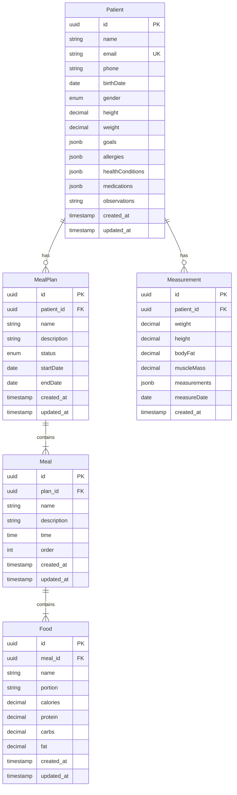

# Estrutura do Banco de Dados

Este documento descreve a estrutura do banco de dados do SmartNutri, incluindo tabelas, relacionamentos e índices.

## 📊 Diagrama ER

## 📝 Detalhamento das Tabelas

### Patients (Pacientes)

Armazena informações dos pacientes.

**Campos:**

- `id` (PK) - UUID, identificador único
- `name` - Nome do paciente (NOT NULL)
- `email` - Email do paciente (UNIQUE, nullable)
- `phone` - Telefone (nullable)
- `birthDate` - Data de nascimento (nullable)
- `gender` - Gênero (ENUM, nullable)
- `height` - Altura em metros (DECIMAL(5,2), nullable)
- `weight` - Peso em kg (DECIMAL(5,2), nullable)
- `goals` - Objetivos do paciente (JSONB, nullable)
- `allergies` - Alergias (JSONB, nullable)
- `healthConditions` - Condições de saúde (JSONB, nullable)
- `medications` - Medicamentos (JSONB, nullable)
- `observations` - Observações gerais (TEXT, nullable)
- `created_at` - Data de criação
- `updated_at` - Data de atualização

**Índices:**

- PK em `id`
- UNIQUE em `email`

### Measurements (Medidas)

Registra medidas e avaliações físicas dos pacientes.

**Campos:**

- `id` (PK) - UUID
- `patient_id` (FK) - Referência ao paciente
- `weight` - Peso atual (DECIMAL)
- `height` - Altura atual (DECIMAL)
- `bodyFat` - Percentual de gordura (DECIMAL)
- `muscleMass` - Massa muscular (DECIMAL)
- `measurements` - Outras medidas (JSONB)
- `measureDate` - Data da medição
- `created_at` - Data de criação

**Índices:**

- PK em `id`
- FK em `patient_id`
- INDEX em `measureDate`

### MealPlans (Planos Alimentares)

Planos alimentares criados para os pacientes.

**Campos:**

- `id` (PK) - UUID
- `patient_id` (FK) - Referência ao paciente
- `name` - Nome do plano
- `description` - Descrição do plano
- `status` - Status do plano (ENUM)
- `startDate` - Data de início
- `endDate` - Data de término
- `created_at` - Data de criação
- `updated_at` - Data de atualização

**Índices:**

- PK em `id`
- FK em `patient_id`
- INDEX em `status`

### Meals (Refeições)

Refeições que compõem um plano alimentar.

**Campos:**

- `id` (PK) - UUID
- `plan_id` (FK) - Referência ao plano
- `name` - Nome da refeição
- `description` - Descrição/observações
- `time` - Horário da refeição
- `order` - Ordem da refeição
- `created_at` - Data de criação
- `updated_at` - Data de atualização

**Índices:**

- PK em `id`
- FK em `plan_id`
- INDEX em `order`

### Foods (Alimentos)

Alimentos que compõem uma refeição.

**Campos:**

- `id` (PK) - UUID
- `meal_id` (FK) - Referência à refeição
- `name` - Nome do alimento
- `portion` - Porção/quantidade
- `calories` - Calorias
- `protein` - Proteínas (g)
- `carbs` - Carboidratos (g)
- `fat` - Gorduras (g)
- `created_at` - Data de criação
- `updated_at` - Data de atualização

**Índices:**

- PK em `id`
- FK em `meal_id`

## 🔄 Relacionamentos

1. **Patient -> Measurements**

   - Um paciente pode ter várias medições
   - Relacionamento 1:N
   - ON DELETE CASCADE

2. **Patient -> MealPlans**

   - Um paciente pode ter vários planos alimentares
   - Relacionamento 1:N
   - ON DELETE CASCADE

3. **MealPlan -> Meals**

   - Um plano tem várias refeições
   - Relacionamento 1:N
   - ON DELETE CASCADE

4. **Meal -> Foods**
   - Uma refeição tem vários alimentos
   - Relacionamento 1:N
   - ON DELETE CASCADE

## 📌 Notas Importantes

1. **Campos JSONB**

   - Utilizados para dados flexíveis (goals, allergies, etc.)
   - Permite consultas e indexação eficientes
   - Mantém flexibilidade para expansão futura

2. **Soft Delete**

   - Não implementado inicialmente
   - Considerar adição futura se necessário

3. **Timestamps**

   - Todas as tabelas têm `created_at`
   - Tabelas principais têm `updated_at`
   - Atualizados automaticamente

4. **Enums**
   - Gender: 'MALE', 'FEMALE', 'OTHER'
   - Status: 'DRAFT', 'ACTIVE', 'ARCHIVED'

## 🔒 Constraints e Validações

1. **Email**

   - Único quando presente
   - Formato válido

2. **Medidas**

   - Valores positivos
   - Precisão definida (2 casas decimais)

3. **Datas**

   - `endDate` >= `startDate` em MealPlans
   - `birthDate` não pode ser futura

4. **Ordem**
   - `order` em Meals deve ser único por plano
