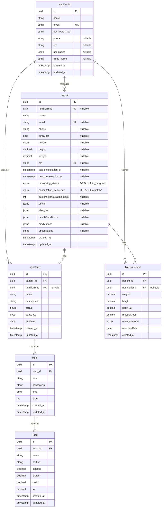

# Estrutura do Banco de Dados

Este documento descreve a estrutura do banco de dados do SmartNutri, incluindo tabelas, relacionamentos e índices.

## 📊 Diagrama ER

## 📝 Detalhamento das Tabelas

### Nutritionists (Nutricionistas)

Armazena informações dos nutricionistas cadastrados.

**Campos:**

- `id` (PK) - UUID, identificador único
- `name` - Nome do nutricionista (VARCHAR, NOT NULL)
- `email` - Email do nutricionista (VARCHAR, UNIQUE, NOT NULL)
- `password_hash` - Hash da senha (VARCHAR, NOT NULL)
- `phone` - Telefone (VARCHAR, nullable)
- `crn` - CRN do nutricionista (VARCHAR, nullable)
- `specialties` - Especialidades (JSONB, nullable)
- `clinic_name` - Nome da clínica (VARCHAR, nullable)
- `created_at` - Data de criação (TIMESTAMP, default now())
- `updated_at` - Data de atualização (TIMESTAMP, default now())

**Índices:**

- PK em `id`
- UNIQUE em `email`

### Patients (Pacientes)

Armazena informações dos pacientes.

**Campos:**

- `id` (PK) - UUID, identificador único
- `nutritionistId` (FK) - Referência ao nutricionista responsável (UUID, nullable)
- `name` - Nome do paciente (VARCHAR, NOT NULL)
- `email` - Email do paciente (VARCHAR, UNIQUE, nullable)
- `phone` - Telefone (VARCHAR, nullable)
- `birthDate` - Data de nascimento (DATE, nullable)
- `gender` - Gênero (ENUM, nullable)
- `height` - Altura em metros (DECIMAL(5,2), nullable)
- `weight` - Peso em kg (DECIMAL(5,2), nullable)
- `crn` - CRN (VARCHAR, UNIQUE, nullable) - _Nota: Atualmente na tabela de pacientes._
- `last_consultation_at` - Data da última consulta (TIMESTAMP, nullable)
- `next_consultation_at` - Data da próxima consulta (TIMESTAMP, nullable)
- `monitoring_status` - Status do acompanhamento (ENUM, NOT NULL, default 'in_progress')
- `consultation_frequency` - Frequência das consultas (ENUM, NOT NULL, default 'monthly')
- `custom_consultation_days` - Dias para frequência customizada (INTEGER, nullable)
- `goals` - Objetivos do paciente (JSONB, nullable)
- `allergies` - Alergias (JSONB, nullable)
- `healthConditions` - Condições de saúde (JSONB, nullable)
- `medications` - Medicamentos (JSONB, nullable)
- `observations` - Observações gerais (TEXT, nullable)
- `created_at` - Data de criação (TIMESTAMP, default now())
- `updated_at` - Data de atualização (TIMESTAMP, default now())

**Índices:**

- PK em `id`
- UNIQUE em `email` (quando não nulo)
- UNIQUE em `crn` (quando não nulo)
- FK em `nutritionistId` referenciando `nutritionists(id)`

### Measurements (Medidas)

Registra medidas e avaliações físicas dos pacientes.

**Campos:**

- `id` (PK) - UUID
- `patient_id` (FK) - Referência ao paciente (UUID, NOT NULL)
- `nutritionistId` (FK) - Referência ao nutricionista que registrou (UUID, nullable)
- `weight` - Peso atual (DECIMAL)
- `height` - Altura atual (DECIMAL)
- `bodyFat` - Percentual de gordura (DECIMAL)
- `muscleMass` - Massa muscular (DECIMAL)
- `measurements` - Outras medidas (JSONB)
- `measureDate` - Data da medição (DATE)
- `created_at` - Data de criação (TIMESTAMP, default now())

**Índices:**

- PK em `id`
- FK em `patient_id` referenciando `patients(id)`
- FK em `nutritionistId` referenciando `nutritionists(id)`
- INDEX em `measureDate`

### MealPlans (Planos Alimentares)

Planos alimentares criados para os pacientes.

**Campos:**

- `id` (PK) - UUID
- `patient_id` (FK) - Referência ao paciente (UUID, NOT NULL)
- `nutritionistId` (FK) - Referência ao nutricionista que criou (UUID, nullable)
- `name` - Nome do plano (VARCHAR)
- `description` - Descrição do plano (TEXT)
- `status` - Status do plano (ENUM)
- `startDate` - Data de início (DATE)
- `endDate` - Data de término (DATE)
- `created_at` - Data de criação (TIMESTAMP, default now())
- `updated_at` - Data de atualização (TIMESTAMP, default now())

**Índices:**

- PK em `id`
- FK em `patient_id` referenciando `patients(id)`
- FK em `nutritionistId` referenciando `nutritionists(id)`
- INDEX em `status`

### Meals (Refeições)

Refeições que compõem um plano alimentar.

**Campos:**

- `id` (PK) - UUID
- `plan_id` (FK) - Referência ao plano (UUID, NOT NULL)
- `name` - Nome da refeição (VARCHAR)
- `description` - Descrição/observações (TEXT)
- `time` - Horário da refeição (TIME)
- `order` - Ordem da refeição (INTEGER)
- `created_at` - Data de criação (TIMESTAMP, default now())
- `updated_at` - Data de atualização (TIMESTAMP, default now())

**Índices:**

- PK em `id`
- FK em `plan_id` referenciando `meal_plans(id)`
- INDEX em `order`

### Foods (Alimentos)

Alimentos que compõem uma refeição.

**Campos:**

- `id` (PK) - UUID
- `meal_id` (FK) - Referência à refeição (UUID, NOT NULL)
- `name` - Nome do alimento (VARCHAR)
- `portion` - Porção/quantidade (VARCHAR)
- `calories` - Calorias (DECIMAL)
- `protein` - Proteínas (g) (DECIMAL)
- `carbs` - Carboidratos (g) (DECIMAL)
- `fat` - Gorduras (g) (DECIMAL)
- `created_at` - Data de criação (TIMESTAMP, default now())
- `updated_at` - Data de atualização (TIMESTAMP, default now())

**Índices:**

- PK em `id`
- FK em `meal_id` referenciando `meals(id)`

## 🔄 Relacionamentos

1.  **Nutritionist -> Patients**

    - Um nutricionista pode gerenciar vários pacientes.
    - Relacionamento 1:N (FK `patients.nutritionistId`)
    - ON DELETE NO ACTION, ON UPDATE NO ACTION (ou SET NULL, a definir)

2.  **Nutritionist -> MealPlans**

    - Um nutricionista pode criar vários planos alimentares.
    - Relacionamento 1:N (FK `meal_plans.nutritionistId`)
    - ON DELETE NO ACTION, ON UPDATE NO ACTION (ou SET NULL, a definir)

3.  **Nutritionist -> Measurements**

    - Um nutricionista pode registrar várias medições.
    - Relacionamento 1:N (FK `measurements.nutritionistId`)
    - ON DELETE NO ACTION, ON UPDATE NO ACTION (ou SET NULL, a definir)

4.  **Patient -> Measurements**

    - Um paciente pode ter várias medições.
    - Relacionamento 1:N (FK `measurements.patient_id`)
    - ON DELETE CASCADE

5.  **Patient -> MealPlans**

    - Um paciente pode ter vários planos alimentares.
    - Relacionamento 1:N (FK `meal_plans.patient_id`)
    - ON DELETE CASCADE

6.  **MealPlan -> Meals**

    - Um plano tem várias refeições.
    - Relacionamento 1:N (FK `meals.plan_id`)
    - ON DELETE CASCADE

7.  **Meal -> Foods**
    - Uma refeição tem vários alimentos.
    - Relacionamento 1:N (FK `foods.meal_id`)
    - ON DELETE CASCADE

## 📌 Notas Importantes

1.  **Campos JSONB**

    - Utilizados para dados flexíveis (goals, allergies, specialties, etc.)
    - Permite consultas e indexação eficientes.
    - Mantém flexibilidade para expansão futura.

2.  **Soft Delete**

    - Não implementado inicialmente.
    - Considerar adição futura se necessário.

3.  **Timestamps**

    - Todas as tabelas têm `created_at`.
    - Tabelas principais têm `updated_at`.
    - Atualizados automaticamente ou via ORM.

4.  **Enums**

    - `gender`: 'MALE', 'FEMALE', 'OTHER' (definido no TypeORM Entity)
    - `status` (MealPlan): 'DRAFT', 'ACTIVE', 'ARCHIVED' (definido no TypeORM Entity)
    - `monitoring_status_enum` (Patient): 'in_progress', 'paused', 'completed' (definido no DB)
    - `consultation_frequency_enum` (Patient): 'weekly', 'biweekly', 'monthly', 'custom' (definido no DB)

5.  **Campo CRN em Patients**
    - O campo `crn` está atualmente localizado na tabela `patients` conforme a migração `1712432200000-AddCrnToPatients.ts`. Idealmente, este campo pertenceria à tabela `nutritionists`.

## 🔒 Constraints e Validações

1.  **Email**

    - Único quando presente (`patients.email`, `nutritionists.email`).
    - Formato válido (validação na aplicação).

2.  **CRN**

    - Único quando presente (`patients.crn`).

3.  **Medidas**

    - Valores positivos (validação na aplicação).
    - Precisão definida (e.g., 2 casas decimais).

4.  **Datas**

    - `endDate` >= `startDate` em MealPlans (validação na aplicação).
    - `birthDate` não pode ser futura (validação na aplicação).

5.  **Ordem**

    - `order` em Meals deve ser único por plano (validação na aplicação ou constraint).

6.  **Defaults**
    - `patients.monitoring_status` default 'in_progress'.
    - `patients.consultation_frequency` default 'monthly'.
