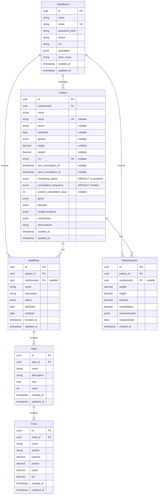

# Plan to Update `DATABASE.md`

1.  **Update Mermaid ER Diagram:**

    - Add a `Nutritionist` entity box with its columns (`id`, `name`, `email`, `password_hash`, `phone`, `crn`, `specialties`, `clinic_name`, `created_at`, `updated_at`).
    - Add the new fields to the `Patient` entity box (`crn`, `nutritionistId`, `last_consultation_at`, `next_consultation_at`, `monitoring_status`, `consultation_frequency`, `custom_consultation_days`).
    - Add the `nutritionistId` foreign key field to the `MealPlan` and `Measurement` entity boxes.
    - Draw the new relationships:
      - `Nutritionist ||--o{ Patient : manages`
      - `Nutritionist ||--o{ MealPlan : creates`
      - `Nutritionist ||--o{ Measurement : records`

2.  **Add "Nutritionists" Table Details:**

    - Insert a new subsection under "📝 Detalhamento das Tabelas" for the `nutritionists` table.
    - List all columns with their types (e.g., `id` UUID PK, `name` VARCHAR NOT NULL, `email` VARCHAR UNIQUE NOT NULL, `password_hash` VARCHAR NOT NULL, `crn` VARCHAR nullable, `specialties` JSONB nullable, etc.).
    - Specify primary key (`id`) and unique constraints (`email`).
    - Mention `created_at` and `updated_at` timestamps.

3.  **Update "Patients" Table Details:**

    - **Add New Fields:** Include `crn` (VARCHAR UNIQUE nullable), `nutritionistId` (UUID FK nullable), `last_consultation_at` (TIMESTAMP nullable), `next_consultation_at` (TIMESTAMP nullable), `monitoring_status` (ENUM NOT NULL, default 'in_progress'), `consultation_frequency` (ENUM NOT NULL, default 'monthly'), `custom_consultation_days` (INTEGER nullable).
    - **Update Nullability:** Modify the descriptions for `email`, `phone`, `birthDate`, `gender`, `height`, `weight` to indicate they are now `nullable`.
    - **Update Indices/Constraints:** Add the `UNIQUE` constraint on `crn` and the `FK` constraint on `nutritionistId` referencing `nutritionists(id)`.

4.  **Update "MealPlans" Table Details:**

    - **Add New Field:** Include `nutritionistId` (UUID FK nullable).
    - **Update Indices/Constraints:** Add the `FK` constraint on `nutritionistId` referencing `nutritionists(id)`.

5.  **Update "Measurements" Table Details:**

    - **Add New Field:** Include `nutritionistId` (UUID FK nullable).
    - **Update Indices/Constraints:** Add the `FK` constraint on `nutritionistId` referencing `nutritionists(id)`.

6.  **Update "🔄 Relacionamentos" Section:**

    - Add entries for the new relationships originating from `Nutritionist`:
      - `Nutritionist -> Patients` (1:N, FK `patients.nutritionistId`, ON DELETE NO ACTION, ON UPDATE NO ACTION)
      - `Nutritionist -> MealPlans` (1:N, FK `meal_plans.nutritionistId`, ON DELETE NO ACTION, ON UPDATE NO ACTION)
      - `Nutritionist -> Measurements` (1:N, FK `measurements.nutritionistId`, ON DELETE NO ACTION, ON UPDATE NO ACTION)

7.  **Update "📌 Notas Importantes" Section:**

    - **ENUMs:** Add a point detailing the new ENUM types and their values:
      - `monitoring_status_enum`: 'in_progress', 'paused', 'completed'
      - `consultation_frequency_enum`: 'weekly', 'biweekly', 'monthly', 'custom'
    - **(Optional but recommended):** Add a note clarifying that the `crn` field is currently located in the `patients` table as per the migration, even if conceptually linked to nutritionists.

8.  **Update "🔒 Constraints e Validações" Section:**
    - Add the `UNIQUE` constraint on `patients.crn`.
    - Mention the default values for `patients.monitoring_status` and `patients.consultation_frequency`.

---

## Updated ER Diagram (Mermaid)

