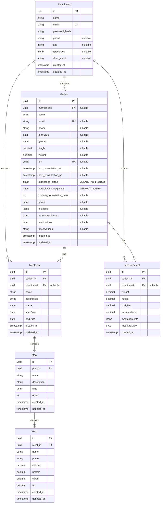

# SmartNutri Database Documentation

## 1. Database Schema

### 📊 ER Diagram



### 📝 Table Details

#### Nutritionists

- Stores nutritionist information.
- **Fields:** id (PK), name, email (unique), password_hash, phone, crn, specialties, clinic_name, created_at, updated_at

#### Patients

- Stores patient information.
- **Fields:** id (PK), nutritionistId (FK), name, email (unique), phone, birthDate, gender, height, weight, crn (unique), last_consultation_at, next_consultation_at, monitoring_status, consultation_frequency, custom_consultation_days, goals, allergies, healthConditions, medications, observations, created_at, updated_at

#### Measurements

- Records physical measurements and assessments.
- **Fields:**
  - id (PK): UUID
  - patient_id (FK): Referência ao paciente
  - nutritionistId (FK): Referência ao nutricionista
  - weight: Peso em kg
  - height: Altura em metros
  - bodyFat: Percentual de gordura corporal
  - muscleMass: Massa muscular em kg
  - measurements (JSONB): Medições detalhadas
    ```json
    {
      "skinfolds": {
        "triceps": 10.5,
        "subscapular": 12.3,
        "suprailiac": 8.7,
        "abdominal": 15.2
      },
      "circumferences": {
        "chest": 95.5,
        "waist": 80.2,
        "hip": 98.7,
        "thigh": 55.3
      }
    }
    ```
  - measureDate: Data da medição
  - created_at: Timestamp de criação

#### MealPlans

- Meal plans created for patients.
- **Fields:** id (PK), patient_id (FK), nutritionistId (FK), name, description, status, startDate, endDate, created_at, updated_at

#### Meals

- Meals that compose a meal plan.
- **Fields:** id (PK), plan_id (FK), name, description, time, order, created_at, updated_at

#### Foods

- Foods that compose a meal.
- **Fields:** id (PK), meal_id (FK), name, portion, calories, protein, carbs, fat, created_at, updated_at

### 🔄 Relationships

- Nutritionist manages Patients, creates MealPlans, records Measurements
- Patient has MealPlans and Measurements
- MealPlan contains Meals
- Meal contains Foods

### 📌 Important Notes

- **JSONB fields** for flexible data (goals, allergies, specialties, etc.)
- **Soft Delete:** Not implemented initially, consider for future
- **Timestamps:** All tables have created_at, main tables have updated_at
- **Enums:** gender, status, monitoring_status, consultation_frequency
- **CRN in Patients:** Currently in patients table, ideally belongs to nutritionists

### 🔒 Constraints & Validations

- Unique emails and CRNs when present
- Positive values for measurements
- Date constraints (e.g., endDate >= startDate)
- Unique order for meals per plan
- Defaults: monitoring_status ('in_progress'), consultation_frequency ('monthly')

### Exemplos de Queries

#### Buscar Evolução de Medições

```sql
-- Buscar evolução de peso e composição corporal
SELECT
    m.measureDate,
    m.weight,
    m.bodyFat,
    m.muscleMass,
    m.measurements->>'skinfolds' as skinfolds,
    m.measurements->>'circumferences' as circumferences
FROM measurements m
WHERE m.patient_id = :patientId
ORDER BY m.measureDate DESC;
```

#### Calcular Variação Percentual

```sql
-- Calcular variação percentual entre medições
WITH measurements_ordered AS (
    SELECT
        m.measureDate,
        m.weight,
        m.bodyFat,
        m.muscleMass,
        LAG(m.weight) OVER (ORDER BY m.measureDate) as prev_weight,
        LAG(m.bodyFat) OVER (ORDER BY m.measureDate) as prev_bodyFat,
        LAG(m.muscleMass) OVER (ORDER BY m.measureDate) as prev_muscleMass
    FROM measurements m
    WHERE m.patient_id = :patientId
)
SELECT
    measureDate,
    weight,
    bodyFat,
    muscleMass,
    ROUND((weight - prev_weight) / prev_weight * 100, 2) as weight_change_percent,
    ROUND((bodyFat - prev_bodyFat) / prev_bodyFat * 100, 2) as bodyFat_change_percent,
    ROUND((muscleMass - prev_muscleMass) / prev_muscleMass * 100, 2) as muscleMass_change_percent
FROM measurements_ordered
ORDER BY measureDate DESC;
```

---

### Photos

- Armazena metadados das fotos de avaliações de pacientes.
- **Fields:**
  - id (PK, uuid)
  - patient_id (FK, uuid, obrigatório)
  - assessment_id (FK, uuid, opcional)
  - type (enum: 'front', 'back', 'left', 'right', obrigatório)
  - url (string, obrigatório)
  - thumbnail_url (string, obrigatório)
  - storage_path (string, obrigatório)
  - created_at (timestamp, default now)
  - updated_at (timestamp, default now)
  - deleted_at (timestamp, nullable, para soft delete)

**Constraints:**

- FK para patients e assessments
- Soft delete via deleted_at
- Index em patient_id, assessment_id, created_at

**Exemplo de Query: Buscar fotos de um paciente por período**

```sql
SELECT * FROM photos
WHERE patient_id = :patientId
  AND (deleted_at IS NULL)
  AND (created_at >= :from OR :from IS NULL)
  AND (created_at <= :to OR :to IS NULL)
ORDER BY created_at DESC;
```

**Exemplo de Query: Buscar fotos de um tipo específico**

```sql
SELECT * FROM photos
WHERE patient_id = :patientId
  AND type = 'front'
  AND (deleted_at IS NULL)
ORDER BY created_at DESC;
```

---

## 2. Migrations

### Visão Geral

As migrations controlam mudanças no esquema do banco de dados de forma versionada e segura.

### Fluxo de Desenvolvimento Recomendado

#### 1. Desenvolvimento Local

- Sempre use migrations, mesmo em desenvolvimento:
  ```typescript
  // app.module.ts
  synchronize: false;
  ```
- Processo para mudanças no banco:
  1. Altere as entidades
  2. Gere a migration:
     ```bash
     npm run migration:generate -- src/migrations/NomeDaMigration
     ```
  3. Teste a migration localmente:
     ```bash
     npm run migration:run
     ```
  4. Se necessário, reverta e ajuste:
     ```bash
     npm run migration:revert
     ```

#### 2. Preparação para Deploy

- Mantenha um banco de teste igual ao de produção
- Execute todas as migrations neste banco antes do deploy
- Teste a aplicação com este banco
- Durante o deploy, execute:
  ```bash
  npm run migration:run
  ```

### Por que não usar `synchronize: true`?

- Garante consistência entre ambientes
- Controle total sobre mudanças
- Possibilidade de rollback e histórico
- Força a pensar e documentar mudanças

### Processo Detalhado de Criação de Migrations

1. Altere as entidades
2. Gere a migration:
   ```bash
   npm run migration:generate -- src/migrations/NomeDaMigration
   ```
3. Revise o arquivo gerado (SQL, comentários, método `down`)
4. Teste localmente:
   ```bash
   npm run migration:run
   npm run migration:revert
   npm run migration:run
   ```

### Boas Práticas

- Use nomes descritivos (ex: `AddInstagramToPatient`)
- Migrations atômicas (uma mudança lógica por migration)
- Sempre teste o rollback (`down`)
- Documente mudanças complexas

### Comandos Úteis

```bash
# Gerar uma nova migration
npm run migration:generate -- src/migrations/NomeDaMigration

# Executar migrations pendentes
npm run migration:run

# Reverter a última migration
npm run migration:revert

# Verificar status das migrations
npm run migration:show
```

### Checklist para Novas Migrations

- [ ] Nome descritivo
- [ ] Atômica
- [ ] Métodos `up` e `down` corretos e testados
- [ ] Documentada
- [ ] Testada localmente e no banco de teste
- [ ] Revisada por outro desenvolvedor

### Exemplos

#### Adicionar Nova Coluna

```typescript
public async up(queryRunner: QueryRunner): Promise<void> {
    await queryRunner.query(`
        ALTER TABLE "patients"
        ADD COLUMN "instagram" character varying
    `);
}

public async down(queryRunner: QueryRunner): Promise<void> {
    await queryRunner.query(`
        ALTER TABLE "patients"
        DROP COLUMN "instagram"
    `);
}
```

#### Criar Nova Tabela

```typescript
public async up(queryRunner: QueryRunner): Promise<void> {
    await queryRunner.query(`
        CREATE TABLE "consultations" (
            "id" uuid NOT NULL DEFAULT uuid_generate_v4(),
            "date" TIMESTAMP NOT NULL,
            "notes" text,
            "patient_id" uuid NOT NULL,
            CONSTRAINT "PK_consultations" PRIMARY KEY ("id"),
            CONSTRAINT "FK_consultations_patient" FOREIGN KEY ("patient_id")
            REFERENCES "patients"("id") ON DELETE CASCADE
        )
    `);
}

public async down(queryRunner: QueryRunner): Promise<void> {
    await queryRunner.query(`DROP TABLE "consultations"`);
}
```

#### Adicionar Índice

```typescript
public async up(queryRunner: QueryRunner): Promise<void> {
    await queryRunner.query(`
        CREATE INDEX "IDX_foods_name"
        ON "foods" ("name")
    `);
}

public async down(queryRunner: QueryRunner): Promise<void> {
    await queryRunner.query(`
        DROP INDEX "IDX_foods_name"
    `);
}
```
