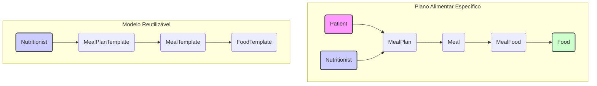

# Módulo de Planos Alimentares (Meal Plans)

## Visão Geral

Este módulo é responsável pelo gerenciamento completo de planos alimentares para pacientes e pela gestão de modelos (templates) reutilizáveis de planos alimentares dentro do sistema SmartNutri. Ele permite que nutricionistas criem, visualizem, atualizem e excluam tanto planos específicos para pacientes quanto modelos que podem ser usados como base para novos planos.

## Estrutura de Diretórios

```
meal-plan/
├── MEAL_PLAN_MODULE_BACKEND.md  # Esta documentação
├── controllers/                 # Controladores NestJS (endpoints da API)
│   ├── meal-plan-templates.controller.ts
│   └── meal-plans.controller.ts
├── dto/                         # Data Transfer Objects (estruturas de dados para API)
│   ├── create-meal-food.dto.ts
│   ├── create-meal-plan-template.dto.ts
│   ├── create-meal-plan.dto.ts
│   ├── create-meal.dto.ts
│   ├── meal-plan-template.response.dto.ts
│   ├── meal-plan.response.dto.ts
│   ├── update-meal-plan-template.dto.ts
│   └── update-meal-plan.dto.ts
├── entities/                    # Entidades TypeORM (mapeamento do banco de dados)
│   ├── food-template.entity.ts
│   ├── meal-food.entity.ts
│   ├── meal-plan-template.entity.ts
│   ├── meal-plan.entity.ts
│   ├── meal-template.entity.ts
│   └── meal.entity.ts
├── enums/                       # Enumerações reutilizáveis
│   ├── food-category.enum.ts
│   ├── meal-plan-status.enum.ts
│   └── meal-type.enum.ts
├── meal-plan-templates.module.ts # Módulo NestJS para Templates
├── meal-plans.module.ts          # Módulo NestJS para Planos Alimentares
├── services/                    # Serviços NestJS (lógica de negócio)
│   ├── meal-plan-templates.service.ts
│   └── meal-plans.service.ts
├── tests/                       # Testes unitários e e2e (a ser detalhado)
└── validators/                  # Validadores customizados
    └── date-range.validator.ts
```

## Conceitos Principais

- **Plano Alimentar (`MealPlan`)**: Um plano alimentar específico associado a um paciente e a um nutricionista. Contém refeições (`Meal`) e alimentos (`MealFood`) detalhados, com datas de início e fim. Inclui cálculos nutricionais totais e diários.
- **Modelo de Plano Alimentar (`MealPlanTemplate`)**: Um modelo reutilizável que pode ser público ou privado para um nutricionista. Contém modelos de refeições (`MealTemplate`) e modelos de alimentos (`FoodTemplate`). Serve como base para criar rapidamente novos `MealPlan` para pacientes.

## Entidades (Banco de Dados)



- **`MealPlan`**: Representa um plano alimentar específico para um paciente.
  - Relacionamentos: `Patient`, `Nutritionist`, `Meal` (OneToMany).
  - Campos Chave: `name`, `patientId`, `nutritionistId`, `startDate`, `endDate`, `dailyCalories`, `dailyProtein`, `dailyCarbs`, `dailyFat`.
- **`Meal`**: Representa uma refeição dentro de um `MealPlan`.
  - Relacionamentos: `MealPlan` (ManyToOne), `MealFood` (OneToMany).
  - Campos Chave: `name`, `time`, `description`, `totalCalories`, `totalProtein`, `totalCarbs`, `totalFat`.
- **`MealFood`**: Tabela de junção entre `Meal` e `Food`, especificando a quantidade de um alimento em uma refeição.
  - Relacionamentos: `Meal` (ManyToOne), `Food` (ManyToOne).
  - Campos Chave: `amount`, `unit`, `description`.
- **`MealPlanTemplate`**: Representa um modelo de plano alimentar.
  - Relacionamentos: `Nutritionist`, `MealTemplate` (OneToMany).
  - Campos Chave: `name`, `description`, `nutritionistId`, `isPublic`.
- **`MealTemplate`**: Representa um modelo de refeição dentro de um `MealPlanTemplate`.
  - Relacionamentos: `MealPlanTemplate` (ManyToOne), `FoodTemplate` (OneToMany).
  - Campos Chave: `name`, `time`, `description`.
- **`FoodTemplate`**: Representa um modelo de alimento dentro de um `MealTemplate`.
  - Campos Chave: `name`, `category`, `calories`, `protein`, `carbs`, `fat`.

_(Nota: A entidade `Food` pertence ao módulo `foods`)_

## Serviços (Lógica de Negócio)

- **`MealPlansService`**:

  - **Responsabilidades**: Gerencia a lógica de negócio para planos alimentares específicos de pacientes. Valida a propriedade do plano pelo nutricionista, calcula totais nutricionais para refeições e para o plano completo.
  - **Métodos Principais**:
    - `create(dto, nutritionistId)`: Cria um novo plano alimentar.
    - `findAll(nutritionistId)`: Lista todos os planos do nutricionista.
    - `findOne(id, nutritionistId)`: Busca um plano por ID.
    - `findByPatient(patientId, nutritionistId)`: Busca planos por ID do paciente.
    - `update(id, dto, nutritionistId)`: Atualiza um plano existente (recria refeições e alimentos).
    - `remove(id, nutritionistId)`: Remove um plano alimentar.
    - `addMeal(planId, dto, nutritionistId)`: Adiciona uma refeição a um plano.
    - `getMeals(id, nutritionistId)`: Lista as refeições de um plano.
    - `search(query, nutritionistId)`: Busca planos por nome.
    - `updateMealNutritionTotals(mealId)`: (Privado) Calcula e atualiza os totais nutricionais de uma refeição.
    - `updateMealPlanTotals(mealPlanId)`: (Privado) Calcula e atualiza os totais nutricionais diários de um plano.
  - **Dependências**: `MealPlanRepository`, `MealRepository`, `MealFoodRepository`, `PatientsService`.

- **`MealPlanTemplatesService`**:
  - **Responsabilidades**: Gerencia a lógica de negócio para modelos de planos alimentares. Permite criar planos alimentares (`MealPlan`) a partir de um modelo.
  - **Métodos Principais**:
    - `create(dto, nutritionistId)`: Cria um novo modelo.
    - `findAll(nutritionistId)`: Lista todos os modelos do nutricionista e os públicos.
    - `findOne(id, nutritionistId)`: Busca um modelo por ID (considera modelos públicos).
    - `update(id, dto, nutritionistId)`: Atualiza um modelo (apenas se o nutricionista for o dono).
    - `remove(id, nutritionistId)`: Remove um modelo (apenas se o nutricionista for o dono).
    - `searchFoodTemplates(query)`: Busca modelos de alimentos por nome ou descrição (usando busca textual).
    - `createMealPlanFromTemplate(templateId, patientId, nutritionistId)`: Cria um `MealPlan` para um paciente baseado em um `MealPlanTemplate`. _(Nota: A implementação atual cria entidades `Food` baseadas em `FoodTemplate`, o que pode precisar de revisão arquitetural)._
  - **Dependências**: `MealPlanTemplateRepository`, `MealTemplateRepository`, `FoodTemplateRepository`, `MealPlanRepository`, `MealRepository`, `FoodRepository`.

## Controladores (API Endpoints)

- **`MealPlansController` (`/meal-plans`)**:

  - **Autenticação**: Requer JWT (`JwtAuthGuard`).
  - **Endpoints**:
    - `POST /`: Cria um novo plano alimentar (`CreateMealPlanDto`).
    - `GET /`: Lista todos os planos do nutricionista (opcionalmente filtra por `patientId`).
    - `GET /patient/:patientId`: Lista planos de um paciente específico.
    - `GET /:id`: Busca um plano por ID.
    - `PATCH /:id`: Atualiza um plano (`UpdateMealPlanDto`).
    - `DELETE /:id`: Remove um plano.
    - `POST /:id/meals`: Adiciona uma refeição a um plano (`CreateMealDto`).
    - `GET /:id/meals`: Lista as refeições de um plano.
    - `GET /search?q={query}`: Busca planos por nome.
  - **Dependências**: `MealPlansService`.

- **`MealPlanTemplatesController` (`/meal-plan-templates`)**:
  - **Autenticação**: Requer JWT (`JwtAuthGuard`).
  - **Endpoints**:
    - `POST /`: Cria um novo modelo (`CreateMealPlanTemplateDto`). Retorna `MealPlanTemplateResponseDto`.
    - `GET /`: Lista modelos do nutricionista e públicos. Retorna `MealPlanTemplateResponseDto[]`.
    - `GET /search/foods?query={query}`: Busca modelos de alimentos. Retorna `FoodTemplateResponseDto[]`.
    - `GET /:id`: Busca um modelo por ID. Retorna `MealPlanTemplateResponseDto`.
    - `PATCH /:id`: Atualiza um modelo (`UpdateMealPlanTemplateDto`). Retorna `MealPlanTemplateResponseDto`.
    - `DELETE /:id`: Remove um modelo.
    - `POST /:id/create-plan/:patientId`: Cria um plano alimentar a partir do modelo para um paciente específico.
  - **Dependências**: `MealPlanTemplatesService`.

## DTOs (Data Transfer Objects)

- `CreateMealPlanDto`: Dados para criar um `MealPlan`.
- `UpdateMealPlanDto`: Dados para atualizar um `MealPlan`.
- `CreateMealDto`: Dados para criar um `Meal`.
- `CreateMealFoodDto`: Dados para criar um `MealFood`.
- `CreateMealPlanTemplateDto`: Dados para criar um `MealPlanTemplate`.
- `UpdateMealPlanTemplateDto`: Dados para atualizar um `MealPlanTemplate` (usa `PartialType`).
- `MealPlanResponseDto`: Estrutura de resposta para `MealPlan` na API.
- `MealPlanTemplateResponseDto`: Estrutura de resposta para `MealPlanTemplate` na API.
- `FoodTemplateResponseDto`: Estrutura de resposta para `FoodTemplate` na busca.

## Enums

- `FoodCategory`: Categorias de alimentos (ex: Fruta, Legume, Carne).
- `MealPlanStatus`: Status de um plano alimentar (ex: Ativo, Inativo, Rascunho). _(Atualmente não parece estar em uso ativo nas entidades/serviços lidos)_.
- `MealType`: Tipos de refeição (ex: Café da Manhã, Almoço, Jantar).

## Validadores

- `DateRangeValidator`: Validador customizado (provavelmente para garantir que `endDate` seja após `startDate` em `MealPlan`). _(Detalhes da implementação não lidos)_.

## Módulos NestJS

- **`MealPlansModule`**: Encapsula a funcionalidade de planos alimentares específicos.
  - **Imports**: `TypeOrmModule` (para `MealPlan`, `Meal`, `MealFood`, `Food`, `MealPlanTemplate`, `MealTemplate`, `FoodTemplate`), `PatientsModule`.
  - **Controllers**: `MealPlansController`, `MealPlanTemplatesController`. _(Nota: Inclui ambos os controllers, talvez por dependência do serviço de template?)_
  - **Providers**: `MealPlansService`, `MealPlanTemplatesService`.
  - **Exports**: `MealPlansService`, `MealPlanTemplatesService`.
- **`MealPlanTemplatesModule`**: Encapsula a funcionalidade de modelos de planos alimentares.
  - **Imports**: `TypeOrmModule` (para `MealPlanTemplate`, `MealTemplate`, `FoodTemplate`).
  - **Controllers**: `MealPlanTemplatesController`.
  - **Providers**: `MealPlanTemplatesService`.
  - **Exports**: `MealPlanTemplatesService`.

## Testes

O diretório `tests/` contém os testes unitários e de integração para este módulo. _(Conteúdo específico não analisado nesta documentação)_.

## Como Usar (Fluxo Básico)

1.  **Criar um Modelo (Opcional)**: Use o endpoint `POST /meal-plan-templates` para criar um modelo reutilizável.
2.  **Criar Plano para Paciente**:
    - **A partir de Modelo**: Use `POST /meal-plan-templates/:id/create-plan/:patientId`.
    - **Diretamente**: Use `POST /meal-plans` fornecendo todos os detalhes das refeições e alimentos.
3.  **Gerenciar Plano**: Use os endpoints de `MealPlansController` (`GET`, `PATCH`, `DELETE`, `/meals`) para visualizar e modificar o plano do paciente.

## Integração de Alimentos Externos e Personalizados

O backend aceita alimentos de diferentes origens (bases públicas, privadas ou personalizados) para prescrição em planos alimentares.

- O campo `foodId` em `MealFood` pode ser:
  - Um UUID (referência a um alimento cadastrado no backend)
  - Um ID string/número de uma base externa (ex: TACO, TBCA, etc)
- O payload de cada alimento deve incluir obrigatoriamente o campo `source`, indicando a origem do alimento:
  - Exemplos: `"taco"`, `"tbca"`, `"personalizado"`
- **Fluxo:**
  1. Se o alimento já existe no backend (UUID), use o UUID e `source: "backend"`.
  2. Se o alimento é de uma base externa, envie o `id` da base e `source` correspondente.
  3. Se o alimento não existe em nenhuma base, envie um novo ID (ex: UUID gerado no frontend) e `source: "personalizado"`.
- O backend garante unicidade pela combinação `source + foodId`.
- Se um alimento de base externa não existir ainda no backend, ele pode ser cadastrado automaticamente, marcando a origem.

### Exemplo de Payload

```json
{
  "mealFoods": [
    {
      "foodId": "3344",
      "source": "taco",
      "amount": 80,
      "unit": "Fatia(s) média(s)"
    },
    {
      "foodId": "uuid-gerado-no-frontend",
      "source": "personalizado",
      "amount": 50,
      "unit": "unidade"
    }
  ]
}
```

### Validações

- O backend valida que `foodId` e `source` estão presentes.
- Se `source` for `"personalizado"` e o alimento não existir, o backend cadastra automaticamente.
- Para alimentos de base externa, o backend pode buscar/atualizar os dados conforme necessário.

### Novos Endpoints (2024-06)

- `PATCH /meal-plans/:planId/meals/:mealId`: Atualiza uma refeição específica de um plano alimentar (alimentos, notas, nome, horário). Payload: `{ mealFoods, notes, name?, time? }`.

Exemplo de payload:

```json
{
  "mealFoods": [
    {
      "foodId": "3344",
      "source": "taco",
      "amount": 80,
      "unit": "Fatia(s) média(s)"
    }
  ],
  "notes": "Sem sal"
}
```

- O backend valida e substitui todos os alimentos da refeição pelo novo array enviado.
- Se a refeição não existir, retorna 404.
