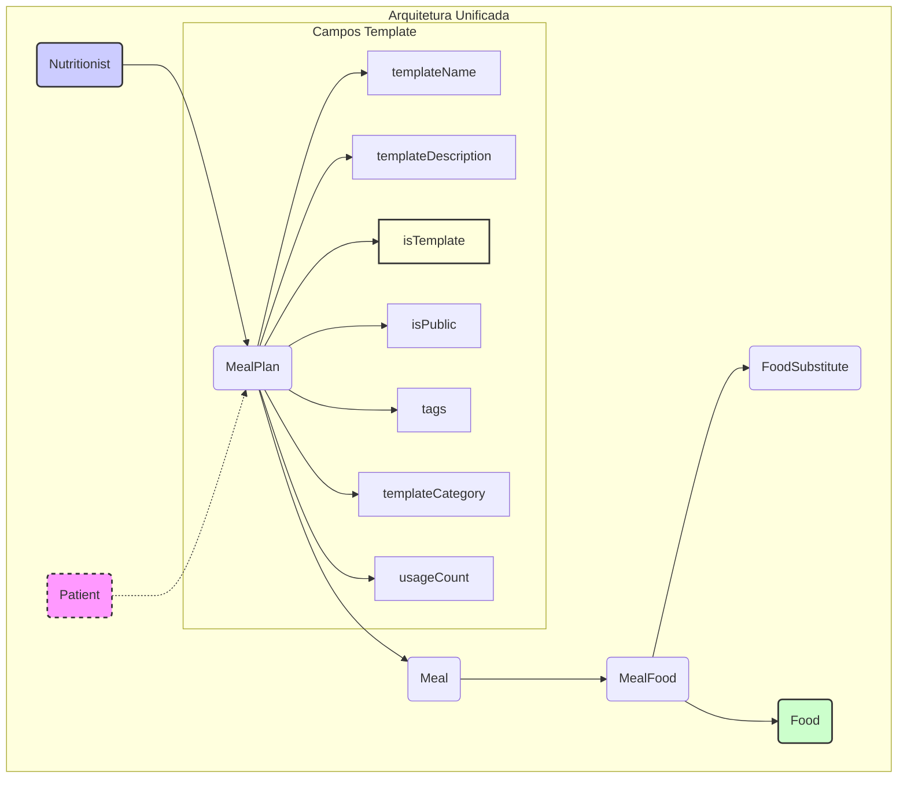

# Módulo de Planos Alimentares (Meal Plans)

## Visão Geral

Este módulo é responsável pelo gerenciamento completo de planos alimentares para pacientes e pela gestão de templates reutilizáveis de planos alimentares dentro do sistema SmartNutri. Utiliza uma **arquitetura unificada** onde templates são variações de planos alimentares regulares, permitindo que nutricionistas salvem planos existentes como templates e criem novos planos a partir de templates com facilidade.

## Estrutura de Diretórios

```
meal-plan/
├── MEAL_PLAN_MODULE_BACKEND.md  # Esta documentação
├── controllers/                 # Controladores NestJS (endpoints da API)
│   ├── meal-plan-templates.controller.ts
│   └── meal-plans.controller.ts
├── dto/                         # Data Transfer Objects (estruturas de dados para API)
│   ├── create-meal-food.dto.ts
│   ├── create-meal-plan.dto.ts
│   ├── create-meal.dto.ts
│   ├── meal-food.response.dto.ts
│   ├── meal-plan.response.dto.ts
│   ├── meal.response.dto.ts
│   ├── save-as-template.dto.ts
│   ├── template-filters.dto.ts
│   ├── update-meal-plan.dto.ts
│   └── update-meal.dto.ts
├── entities/                    # Entidades TypeORM (mapeamento do banco de dados)
│   ├── food-substitute.entity.ts
│   ├── meal-food.entity.ts
│   ├── meal-plan.entity.ts         # Entidade unificada (planos + templates)
│   └── meal.entity.ts
├── enums/                       # Enumerações reutilizáveis
│   ├── food-category.enum.ts
│   ├── meal-plan-status.enum.ts
│   └── meal-type.enum.ts
├── meal-plan-templates.module.ts # Módulo NestJS para Templates
├── meal-plans.module.ts          # Módulo NestJS principal
├── services/                    # Serviços NestJS (lógica de negócio)
│   ├── meal-plan-templates.service.ts
│   └── meal-plans.service.ts
├── tests/                       # Testes unitários e e2e (a ser detalhado)
└── validators/                  # Validadores customizados
    └── date-range.validator.ts
```

## Conceitos Principais

### Arquitetura Unificada de Templates

Este módulo utiliza uma **arquitetura unificada** onde templates e planos alimentares compartilham a mesma estrutura de dados, simplificando a manutenção e garantindo consistência.

- **Plano Alimentar (`MealPlan`)**: Um plano alimentar específico associado a um paciente e a um nutricionista. Contém refeições (`Meal`) e alimentos (`MealFood`) detalhados, com datas de início e fim. Inclui cálculos nutricionais totais e diários.
- **Template de Plano Alimentar**: Um plano alimentar marcado como template (`isTemplate: true`) que pode ser reutilizado. Templates não possuem paciente, datas específicas, e incluem metadados como tags, categoria, e visibilidade pública.
- **Refeição Ativa (`isActiveForCalculation`)**: Uma refeição pode ser marcada como ativa ou inativa para os cálculos nutricionais do plano. Apenas refeições ativas são consideradas no cálculo dos totais diários.

### Funcionalidades Principais

- **Salvar como Template**: Conversão de planos alimentares existentes em templates reutilizáveis
- **Criar a partir de Template**: Geração de novos planos alimentares baseados em templates
- **Biblioteca de Templates**: Sistema de busca e filtragem avançada de templates
- **Templates Públicos/Privados**: Compartilhamento opcional de templates entre nutricionistas
- **Tracking de Uso**: Contabilização de quantas vezes cada template foi utilizado

## Entidades (Banco de Dados)



### Entidade Unificada MealPlan

- **`MealPlan`**: Entidade unificada que representa tanto planos alimentares específicos quanto templates reutilizáveis.
  - **Relacionamentos**: `Patient` (opcional, null para templates), `Nutritionist`, `Meal` (OneToMany).
  - **Campos para Planos**: `patientId`, `startDate`, `endDate`, `dailyCalories`, `dailyProtein`, `dailyCarbs`, `dailyFat`.
  - **Campos para Templates**: `isTemplate`, `templateName`, `templateDescription`, `isPublic`, `tags`, `templateCategory`, `targetCalories`, `usageCount`, `lastUsedAt`.
  - **Campos Compartilhados**: `name`, `description`, `nutritionistId`, `meals`.

### Entidades Relacionadas

- **`Meal`**: Representa uma refeição dentro de um `MealPlan` (tanto planos quanto templates).
  - **Relacionamentos**: `MealPlan` (ManyToOne), `MealFood` (OneToMany).
  - **Campos Chave**: `name`, `time`, `description`, `totalCalories`, `totalProtein`, `totalCarbs`, `totalFat`, `isActiveForCalculation`.
  - O campo `isActiveForCalculation` determina se a refeição deve ser incluída nos cálculos nutricionais.

- **`MealFood`**: Representa um alimento prescrito em uma refeição com sua quantidade.
  - **Relacionamentos**: `Meal` (ManyToOne), `FoodSubstitute` (OneToMany).
  - **Campos Chave**: `foodId`, `source`, `amount`, `unit`.
  - Suporta alimentos de múltiplas origens (TACO, TBCA, personalizados, etc.).

- **`FoodSubstitute`**: Representa opções de substituição para alimentos prescritos.
  - **Relacionamentos**: Referencia o alimento original via `originalFoodId` e `originalSource`.
  - **Campos Chave**: `substituteFoodId`, `substituteSource`, `substituteAmount`, `substituteUnit`.

_(Nota: A entidade `Food` pertence ao módulo `foods`)_

## Serviços (Lógica de Negócio)

### MealPlansService

**Responsabilidades**: Gerencia planos alimentares específicos de pacientes, excluindo templates dos resultados de busca.

**Métodos Principais**:
- `create(dto, nutritionistId)`: Cria um novo plano alimentar.
- `findAll(nutritionistId)`: Lista todos os planos do nutricionista (filtra `isTemplate: false`).
- `findOne(id, nutritionistId)`: Busca um plano específico por ID (filtra templates).
- `findByPatient(patientId, nutritionistId)`: Busca planos por ID do paciente.
- `update(id, dto, nutritionistId)`: Atualiza um plano existente.
- `remove(id, nutritionistId)`: Remove um plano alimentar.
- `addMeal(planId, dto, nutritionistId)`: Adiciona uma refeição a um plano.
- `updateMeal(planId, mealId, dto, nutritionistId)`: Atualiza uma refeição específica.
- `deleteMeal(planId, mealId, nutritionistId)`: Remove uma refeição.
- `search(query, nutritionistId)`: Busca planos por nome (exclui templates).

**Métodos Privados**:
- `updateMealNutritionTotals(mealId)`: Calcula totais nutricionais de uma refeição.
- `updateMealPlanTotals(mealPlanId)`: Calcula totais diários do plano (apenas refeições ativas).

### MealPlanTemplatesService

**Responsabilidades**: Gerencia templates e operações de conversão entre planos e templates.

**Métodos Principais**:
- `saveAsTemplate(mealPlanId, dto, nutritionistId)`: Converte um plano existente em template.
- `findAll(nutritionistId)`: Lista templates do nutricionista e públicos.
- `searchTemplates(filters, nutritionistId)`: Busca templates com filtros avançados.
- `findOne(id, nutritionistId)`: Busca template por ID.
- `update(id, dto, nutritionistId)`: Atualiza metadados de template.
- `remove(id, nutritionistId)`: Remove template (apenas proprietário).
- `createMealPlanFromTemplate(templateId, patientId, nutritionistId)`: Cria plano a partir de template.

**Funcionalidades Especiais**:
- **Duplicação Inteligente**: Preserva toda a estrutura de refeições e alimentos ao converter.
- **Filtros Avançados**: Suporte a busca por categoria, tags, faixa de calorias, visibilidade.
- **Tracking de Uso**: Incrementa `usageCount` e atualiza `lastUsedAt` automaticamente.
- **Validação de Propriedade**: Apenas o criador pode editar/excluir templates privados.

## Controladores (API Endpoints)

### MealPlansController (`/meal-plans`)

**Autenticação**: Requer JWT (`JwtAuthGuard`).

**Endpoints para Planos Alimentares**:
- `POST /`: Cria um novo plano alimentar (`CreateMealPlanDto`).
- `GET /`: Lista todos os planos do nutricionista (opcionalmente filtra por `patientId`).
- `GET /patient/:patientId`: Lista planos de um paciente específico.
- `GET /:id`: Busca um plano por ID.
- `PATCH /:id`: Atualiza um plano (`UpdateMealPlanDto`).
- `DELETE /:id`: Remove um plano.

**Endpoints para Refeições**:
- `POST /:id/meals`: Adiciona uma refeição a um plano (`CreateMealDto`).
- `GET /:id/meals`: Lista as refeições de um plano.
- `PATCH /:planId/meals/:mealId`: Atualiza uma refeição específica (`UpdateMealDto`).
- `DELETE /:planId/meals/:mealId`: Remove uma refeição.

**Endpoints para Templates**:
- `POST /:id/save-as-template`: Converte plano em template (`SaveAsTemplateDto`).

**Outros**:
- `GET /search?q={query}`: Busca planos por nome (exclui templates).

### MealPlanTemplatesController (`/meal-plan-templates`)

**Autenticação**: Requer JWT (`JwtAuthGuard`).

**Endpoints Principais**:
- `GET /`: Lista todos os templates (próprios + públicos).
- `GET /search`: Busca templates com filtros avançados (`TemplateFiltersDto`).
- `GET /:id`: Busca template específico por ID.
- `PATCH /:id`: Atualiza metadados de template (`SaveAsTemplateDto` parcial).
- `DELETE /:id`: Remove template (apenas proprietário).
- `POST /:id/create-plan/:patientId`: Cria plano a partir de template.

**Parâmetros de Busca**:
- `category`: Filtra por categoria de template
- `tags`: Lista de tags separadas por vírgula
- `search`: Busca textual em nome/descrição
- `isPublic`: Filtra por visibilidade (público/privado)
- `minCalories`, `maxCalories`: Faixa de calorias alvo

## DTOs (Data Transfer Objects)

### DTOs para Planos Alimentares
- `CreateMealPlanDto`: Dados para criar um plano alimentar.
- `UpdateMealPlanDto`: Dados para atualizar um plano alimentar.
- `CreateMealDto`: Dados para criar uma refeição.
- `UpdateMealDto`: Dados para atualizar uma refeição.
- `CreateMealFoodDto`: Dados para adicionar alimento a uma refeição.

### DTOs para Templates
- `SaveAsTemplateDto`: Dados para converter plano em template ou criar template.
  - Campos: `templateName`, `templateDescription`, `isPublic`, `tags`, `templateCategory`, `targetCalories`.
- `TemplateFiltersDto`: Filtros para busca avançada de templates.
  - Campos: `category`, `tags`, `search`, `isPublic`, `minCalories`, `maxCalories`.

### DTOs de Resposta
- `MealPlanResponseDto`: Estrutura de resposta para planos na API.
- `MealResponseDto`: Estrutura de resposta para refeições.
- `MealFoodResponseDto`: Estrutura de resposta para alimentos com substitutos.

## Enums

- `FoodCategory`: Categorias de alimentos (ex: Fruta, Legume, Carne).
- `MealPlanStatus`: Status de um plano alimentar (ex: Ativo, Inativo, Rascunho). _(Atualmente não parece estar em uso ativo nas entidades/serviços lidos)_.
- `MealType`: Tipos de refeição (ex: Café da Manhã, Almoço, Jantar).

## Validadores

- `DateRangeValidator`: Validador customizado (provavelmente para garantir que `endDate` seja após `startDate` em `MealPlan`). _(Detalhes da implementação não lidos)_.

## Módulos NestJS

- **`MealPlansModule`**: Encapsula a funcionalidade de planos alimentares específicos.
  - **Imports**: `TypeOrmModule` (para `MealPlan`, `Meal`, `MealFood`, `Food`, `MealPlanTemplate`, `MealTemplate`, `FoodTemplate`), `PatientsModule`.
  - **Controllers**: `MealPlansController`, `MealPlanTemplatesController`. _(Nota: Inclui ambos os controllers, talvez por dependência do serviço de template?)_
  - **Providers**: `MealPlansService`, `MealPlanTemplatesService`.
  - **Exports**: `MealPlansService`, `MealPlanTemplatesService`.
- **`MealPlanTemplatesModule`**: Encapsula a funcionalidade de modelos de planos alimentares.
  - **Imports**: `TypeOrmModule` (para `MealPlanTemplate`, `MealTemplate`, `FoodTemplate`).
  - **Controllers**: `MealPlanTemplatesController`.
  - **Providers**: `MealPlanTemplatesService`.
  - **Exports**: `MealPlanTemplatesService`.

## Testes

O diretório `tests/` contém os testes unitários e de integração para este módulo. _(Conteúdo específico não analisado nesta documentação)_.

## Como Usar (Fluxos de Trabalho)

### 1. Fluxo Básico: Criar Plano do Zero
1. `POST /meal-plans`: Cria um novo plano alimentar
2. `POST /meal-plans/:id/meals`: Adiciona refeições ao plano
3. `PATCH /meal-plans/:planId/meals/:mealId`: Adiciona alimentos às refeições

### 2. Fluxo com Templates: Salvar Plano como Template
1. Criar/editar um plano alimentar normalmente
2. `POST /meal-plans/:id/save-as-template`: Converte o plano em template reutilizável
3. Template fica disponível na biblioteca para uso futuro

### 3. Fluxo com Templates: Criar Plano a partir de Template
1. `GET /meal-plan-templates/search`: Busca templates disponíveis
2. `POST /meal-plan-templates/:id/create-plan/:patientId`: Cria novo plano baseado no template
3. Plano criado mantém toda a estrutura do template, mas como instância independente

### 4. Gerenciamento de Templates
- `GET /meal-plan-templates`: Lista templates próprios e públicos
- `PATCH /meal-plan-templates/:id`: Atualiza metadados do template
- `DELETE /meal-plan-templates/:id`: Remove template (apenas proprietário)

## Integração de Alimentos Externos e Personalizados

O backend aceita alimentos de diferentes origens (bases públicas, privadas ou personalizados) para prescrição em planos alimentares.

- O campo `foodId` em `MealFood` pode ser:
  - Um UUID (referência a um alimento cadastrado no backend)
  - Um ID string/número de uma base externa (ex: TACO, TBCA, etc)
- O payload de cada alimento deve incluir obrigatoriamente o campo `source`, indicando a origem do alimento:
  - Exemplos: `"taco"`, `"tbca"`, `"personalizado"`
- **Fluxo:**
  1. Se o alimento já existe no backend (UUID), use o UUID e `source: "backend"`.
  2. Se o alimento é de uma base externa, envie o `id` da base e `source` correspondente.
  3. Se o alimento não existe em nenhuma base, envie um novo ID (ex: UUID gerado no frontend) e `source: "personalizado"`.
- O backend garante unicidade pela combinação `source + foodId`.
- Se um alimento de base externa não existir ainda no backend, ele pode ser cadastrado automaticamente, marcando a origem.

### Exemplo de Payload

```json
{
  "mealFoods": [
    {
      "foodId": "3344",
      "source": "taco",
      "amount": 80,
      "unit": "Fatia(s) média(s)"
    },
    {
      "foodId": "uuid-gerado-no-frontend",
      "source": "personalizado",
      "amount": 50,
      "unit": "unidade"
    }
  ]
}
```

### Validações

- O backend valida que `foodId` e `source` estão presentes.
- Se `source` for `"personalizado"` e o alimento não existir, o backend cadastra automaticamente.
- Para alimentos de base externa, o backend pode buscar/atualizar os dados conforme necessário.

## Arquitetura de Templates (2025-01)

### Migração da Arquitetura

O sistema foi refatorado para usar uma **arquitetura unificada** que elimina a complexidade de entidades separadas para templates:

**Antes**: `MealPlanTemplate` → `MealTemplate` → `FoodTemplate` (entidades separadas)
**Depois**: `MealPlan` unificado com flag `isTemplate` (entidade única)

### Vantagens da Arquitetura Unificada

1. **Simplicidade**: Uma única estrutura de dados para planos e templates
2. **Consistência**: Garantia de que templates sempre refletem a estrutura atual de planos
3. **Manutenibilidade**: Redução de código duplicado e sincronização de schemas
4. **Flexibilidade**: Conversão bidirecional entre planos e templates sem perda de dados

### Campos da Entidade Unificada

```typescript
// Campos compartilhados (planos + templates)
name: string
description?: string
nutritionistId: string
meals: Meal[]

// Campos específicos de planos (null para templates)
patientId?: string | null
startDate?: Date | null
endDate?: Date | null
dailyCalories?: number
dailyProtein?: number
dailyCarbs?: number
dailyFat?: number

// Campos específicos de templates (null para planos)
isTemplate: boolean = false
templateName?: string | null
templateDescription?: string | null
isPublic: boolean = false
tags?: string[] | null
templateCategory?: string | null
targetCalories?: number | null
usageCount: number = 0
lastUsedAt?: Date | null
```

### Endpoint de Conversão Salvar como Template

```json
POST /meal-plans/:id/save-as-template
{
  "templateName": "Plano Low Carb - Emagrecimento",
  "templateDescription": "Plano focado em redução de carboidratos para perda de peso",
  "isPublic": false,
  "tags": ["lowcarb", "emagrecimento", "ativo"],
  "templateCategory": "Emagrecimento",
  "targetCalories": 1600
}
```

**Resultado**: Cria uma nova instância de `MealPlan` com `isTemplate: true`, copiando toda a estrutura de refeições e alimentos do plano original.
