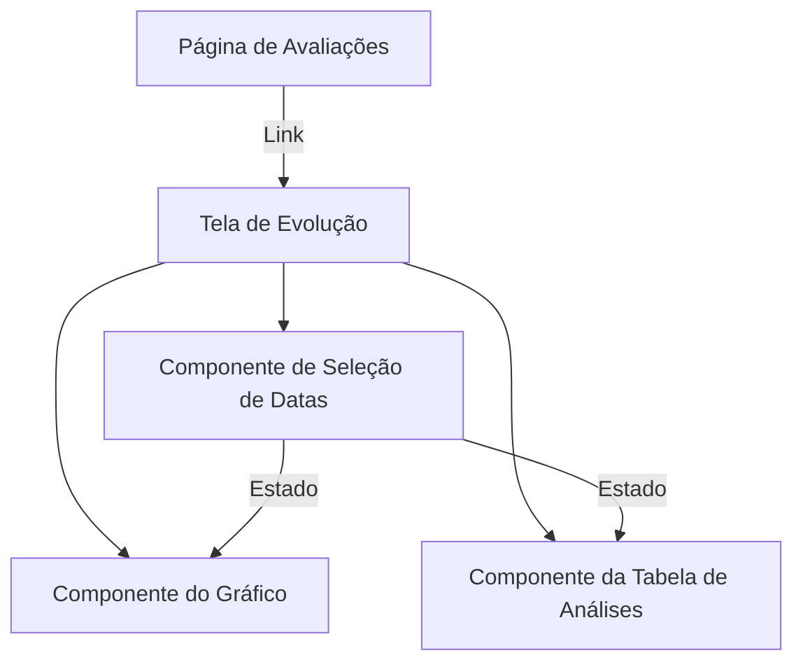
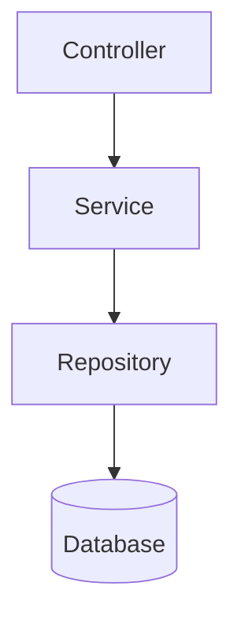

# Plano de Implementação - Evolução da Composição Corporal

## Visão Geral

Implementação de uma nova funcionalidade para visualização da evolução da composição corporal dos pacientes, permitindo a comparação de múltiplas avaliações em um período selecionável.

## Arquitetura

### Frontend

### Backend

## Fases de Implementação

### Fase 1: Backend

1. **Modelagem de Dados**

   - Verificar modelo existente de avaliações
   - Garantir que todos os campos necessários estejam presentes:
     - Massa corporal total
     - Massa gordurosa
     - Massa livre de gordura
     - Demais métricas da tabela de análises

2. **API Endpoints**
   - Criar endpoint para buscar múltiplas avaliações por período
   - Implementar filtros e ordenação por data
   - Limitar resultado a 5 avaliações conforme regra de negócio

### Fase 2: Frontend - Estrutura Base

1. **Componentes React**

   - Criar componente principal `EvolucaoComposicaoCorporal`
   - Desenvolver componente de seleção de datas
   - Implementar lógica de limitação (máximo 5 seleções)

2. **Integração com API**
   - Criar serviço para comunicação com endpoints
   - Implementar gerenciamento de estado
   - Desenvolver lógica de cache para otimização

### Fase 3: Frontend - Visualização

1. **Gráfico de Evolução**

   - Implementar gráfico usando biblioteca adequada (ex: Chart.js, Recharts)
   - Desenvolver legendas e tooltips
   - Garantir responsividade

2. **Tabela de Análises**
   - Criar componente de tabela comparativa
   - Implementar formatação condicional
   - Garantir alinhamento e espaçamento corretos

### Fase 4: Testes e Refinamento

1. **Testes Automatizados**

   - Implementar testes unitários backend
   - Desenvolver testes de integração
   - Criar testes E2E para fluxo completo

2. **Otimizações**

   - Implementar cache de dados
   - Otimizar queries do banco
   - Melhorar performance do gráfico

3. **UI/UX**
   - Refinar animações e transições
   - Garantir acessibilidade
   - Implementar feedback visual para ações do usuário

## Tecnologias e Bibliotecas

### Backend

- NestJS (existente)
- TypeORM
- PostgreSQL

### Frontend

- React
- TypeScript
- Biblioteca de gráficos (Chart.js/Recharts)
- Chakra UI (existente no projeto)

## Estimativa de Tempo

- Fase 1: 2-3 dias
- Fase 2: 2-3 dias
- Fase 3: 3-4 dias
- Fase 4: 2-3 dias

Total estimado: 9-13 dias úteis

## Considerações de Segurança

- Garantir que apenas usuários autorizados acessem os dados
- Implementar validação de entrada em todos os endpoints
- Sanitizar dados antes de renderização

## Métricas de Sucesso

- Tempo de carregamento < 2 segundos
- Funcionamento correto em diferentes navegadores
- Zero erros de console em produção
- Cobertura de testes > 80%
