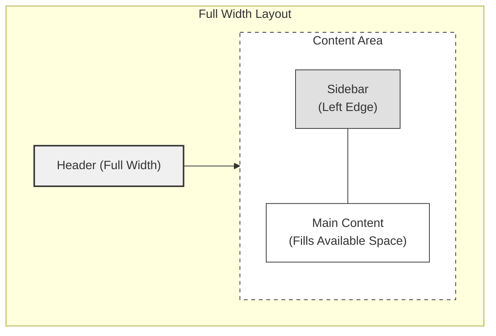
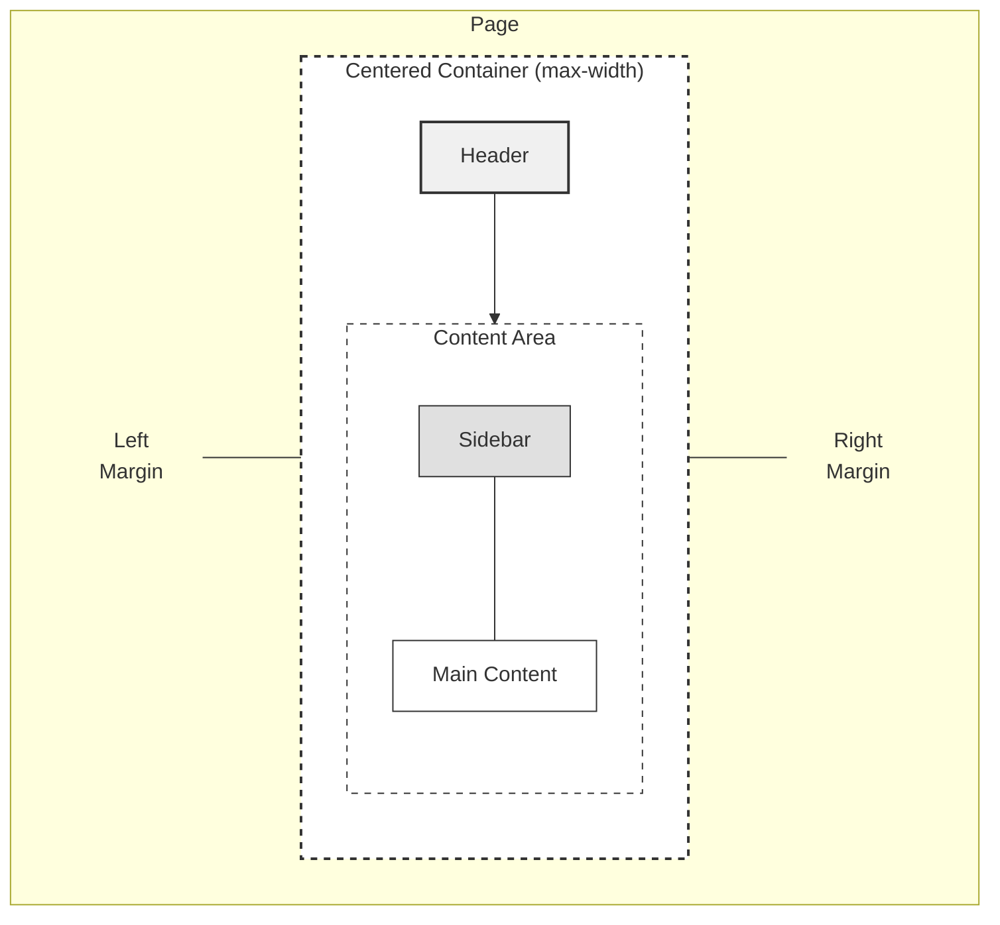
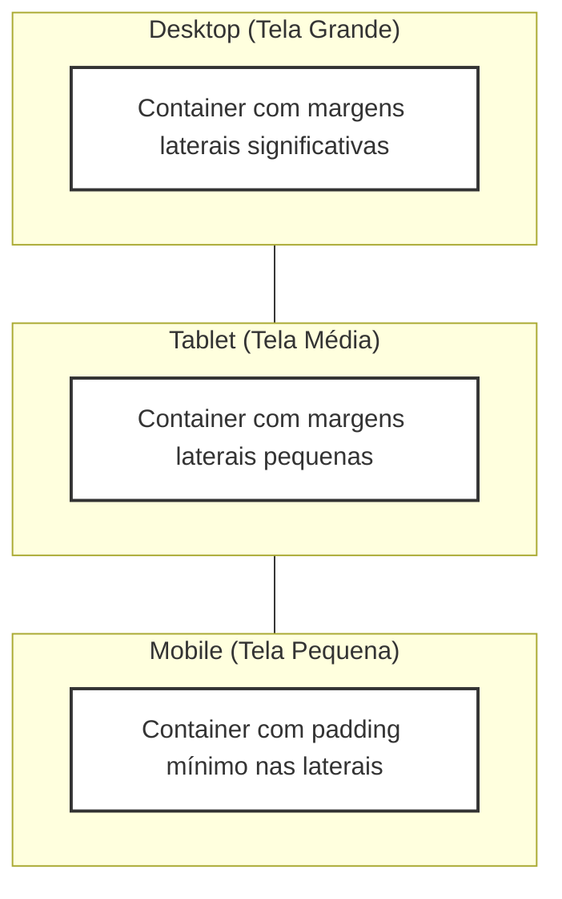
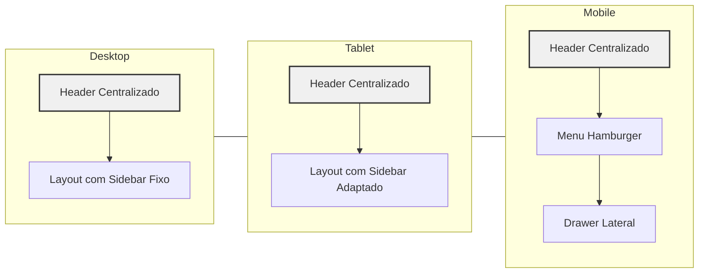

# Layout Refactoring Plan: Centered Container Design

## Objetivo

Refatorar o layout do sistema para que o header e o menu lateral não fiquem nas extremidades da tela, mas sim contidos em um container centralizado. Isso garantirá que os espaçamentos interiores tenham um tamanho semelhante independente do tamanho da tela.

## Análise do Layout Atual

Atualmente, o layout do sistema tem a seguinte estrutura:

1. O Header (`AppBar`) ocupa toda a largura da tela
2. O Sidebar (no `PatientLayout`) é posicionado na extremidade esquerda da tela
3. O conteúdo principal se adapta ao espaço disponível

Representação visual do layout atual:

```
┌─────────────────────────────────────────┐
│                 HEADER                  │
├───────────┬─────────────────────────────┤
│           │                             │
│  SIDEBAR  │         CONTENT             │
│           │                             │
│           │                             │
└───────────┴─────────────────────────────┘
```



## Design de Layout Proposto

O novo design terá:

1. Todos os elementos de layout (header, sidebar, conteúdo) contidos em um container centralizado com largura máxima
2. Espaçamento consistente ao redor do container, mesmo em telas maiores
3. Responsividade preservada para telas menores

Representação visual do novo layout:

```
┌─────────────────────────────────────────┐
│                                         │
│   ┌─────────────────────────────────┐   │
│   │             HEADER              │   │
│   ├─────────┬───────────────────────┤   │
│   │         │                       │   │
│   │ SIDEBAR │       CONTENT         │   │
│   │         │                       │   │
│   │         │                       │   │
│   └─────────┴───────────────────────┘   │
│                                         │
└─────────────────────────────────────────┘
```



## Plano de Implementação

### 1. Criar um Componente Container

Primeiro, vamos criar um componente container que será usado para envolver e centralizar o conteúdo:

```tsx
// frontend/src/components/Layout/Container.tsx
import { Box, BoxProps } from "@mui/material";
import { ReactNode } from "react";

type ContainerProps = BoxProps & {
  children: ReactNode;
  fullHeight?: boolean;
};

export const Container = ({
  children,
  fullHeight = false,
  sx,
  ...rest
}: ContainerProps) => {
  return (
    <Box
      sx={{
        width: "100%",
        maxWidth: "1200px", // Ajustar com base nas necessidades do design
        mx: "auto", // Centraliza o container
        px: { xs: 2, sm: 3, md: 4 }, // Padding responsivo
        height: fullHeight ? "100%" : "auto",
        ...sx,
      }}
      {...rest}
    >
      {children}
    </Box>
  );
};
```

### 2. Refatorar o Componente Header

Modificar o componente Header para trabalhar dentro do container:

```tsx
// Header.tsx atualizado
export const Header = () => {
  // Estados e funções existentes...

  return (
    <>
      <AppBar
        position="fixed"
        sx={{
          zIndex: (theme) => theme.zIndex.drawer + 1,
          backgroundColor: "white",
          color: "text.primary",
          // Remover props relacionadas à largura que forçam o header a ocupar toda a largura
        }}
      >
        <Box sx={{ width: "100%" }}>
          <Container>
            <Toolbar sx={{ px: { xs: 0 } }}>
              {" "}
              {/* Remover padding padrão do Toolbar */}
              {/* Logo/Título */}
              <Box
                sx={{
                  flexGrow: 1,
                  display: "flex",
                  alignItems: "center",
                  cursor: "pointer",
                }}
                onClick={() => navigate("/")}
              >
                
              </Box>
              {/* Ícones do lado direito */}
              <Box sx={{ display: "flex", alignItems: "center", gap: 1 }}>
                {/* Ícones existentes... */}
              </Box>
            </Toolbar>
          </Container>
        </Box>
      </AppBar>

      {/* Modais existentes... */}
    </>
  );
};
```

### 3. Atualizar o Layout Principal

Refatorar o componente Layout principal para usar o Container:

```tsx
// Layout.tsx atualizado
import { Box } from "@mui/material";
import { Header } from "../components/Layout/Header";
import { Outlet } from "react-router-dom";
import { Container } from "../components/Layout/Container";

export const Layout = () => {
  return (
    <Box sx={{ display: "flex", flexDirection: "column", minHeight: "100vh" }}>
      <Header />
      <Box
        component="main"
        sx={{
          flexGrow: 1,
          mt: "64px", // altura do header
          width: "100%",
        }}
      >
        <Container sx={{ py: 3 }}>
          <Outlet />
        </Container>
      </Box>
    </Box>
  );
};
```

### 4. Atualizar o PatientLayout

Refatorar o PatientLayout para incorporar o Container:

```tsx
// PatientLayout.tsx atualizado
export function PatientLayout() {
  // Estados e variáveis existentes...

  return (
    <Box sx={{ display: "flex" }}>
      {/* AppBar principal */}
      <AppBar position="fixed" elevation={1}>
        <Container>
          <Toolbar sx={{ px: { xs: 0 } }}>
            <Typography variant="h6">Header Principal</Typography>
          </Toolbar>
        </Container>
      </AppBar>

      {/* Header secundário com botão hamburger (visível apenas no mobile) */}
      {mobile && (
        <Paper
          sx={{
            position: "fixed",
            top: "64px",
            left: 0,
            right: 0,
            zIndex: theme.zIndex.appBar,
            height: "48px",
            display: "flex",
            alignItems: "center",
            bgcolor: theme.palette.background.paper,
            boxShadow: theme.shadows[1],
          }}
        >
          <Container>
            <Box sx={{ display: "flex", alignItems: "center" }}>
              <IconButton onClick={() => setDrawerOpen(true)}>
                <MenuIcon />
              </IconButton>
              <Typography variant="subtitle1">Menu Paciente</Typography>
            </Box>
          </Container>
        </Paper>
      )}

      {/* Drawer no mobile */}
      <Drawer open={drawerOpen} onClose={() => setDrawerOpen(false)}>
        {SidebarContent}
      </Drawer>

      {/* Sidebar fixa no desktop */}
      {!mobile && (
        <Container sx={{ display: "flex", pt: "64px" }}>
          <Paper
            elevation={3}
            sx={{
              width: 250,
              height: "calc(100vh - 64px)",
              overflowY: "auto",
              position: "fixed",
            }}
          >
            {SidebarContent}
          </Paper>
        </Container>
      )}

      {/* Conteúdo principal */}
      <Box
        component="main"
        sx={{
          flexGrow: 1,
          bgcolor: theme.palette.grey[100],
          ml: { xs: 0, md: "250px" },
          minHeight: mobile ? "calc(100vh - 112px)" : "calc(100vh - 64px)",
        }}
      >
        <Container
          sx={{
            pt: mobile ? "112px" : "64px",
            pb: { xs: 2, md: 4 },
          }}
        >
          <Outlet />
        </Container>
      </Box>
    </Box>
  );
}
```

### 5. Atualizar a Configuração do Tema

Você pode querer fazer alguns ajustes no tema para acomodar este novo layout:

```tsx
// frontend/src/theme/index.ts
// Adicionar ao tema existente em 'components'

MuiContainer: {
  styleOverrides: {
    root: {
      paddingLeft: 0,
      paddingRight: 0,
    },
  },
},
MuiAppBar: {
  styleOverrides: {
    root: {
      boxShadow: '0px 1px 3px rgba(0, 0, 0, 0.1)',
    },
  },
},
```

## Detalhes de Implementação

### Largura do Container

A largura máxima do container deve ser ajustada com base nos requisitos do seu design. Valores típicos variam de:

- 1200px para sites desktop padrão
- 1400px para aplicações com densidade de informação
- 1600px para dashboards de dados

### Comportamento Responsivo

1. **Em telas grandes**: O layout terá o header, sidebar e conteúdo todos contidos dentro do container centralizado com espaço em ambos os lados.

2. **Em telas médias**: O container ocupará a maior parte da largura da tela, mas ainda manterá algum espaçamento nas bordas.

3. **Em telas pequenas**: O container se estenderá quase até as bordas com padding mínimo, e os padrões de navegação mobile assumirão como funcionam atualmente.

### Opção de CSS Grid

Para layouts mais complexos, você pode considerar usar CSS Grid em vez de flexbox:

```tsx
<Box
  sx={{
    display: "grid",
    gridTemplateColumns: { xs: "1fr", md: "250px 1fr" },
    maxWidth: "1200px",
    mx: "auto",
  }}
>
  <Box sx={{ gridColumn: { xs: "1", md: "1" } }}>
    {/* Conteúdo da sidebar */}
  </Box>
  <Box sx={{ gridColumn: { xs: "1", md: "2" } }}>
    {/* Conteúdo principal */}
  </Box>
</Box>
```

## Desafios Potenciais

### 1. Posicionamento da Sidebar na Visualização Desktop

Um desafio potencial é garantir que a sidebar mantenha seu posicionamento fixo, mas agora dentro do container centralizado. Isso pode exigir ajustes no cálculo de posição com base na largura do container.

Solução:

- Em vez de usar `position: fixed` com coordenadas absolutas, você pode usar posicionamento relativo ao container
- Outra abordagem é manter o sidebar fixo, mas calcular dinamicamente sua posição com JavaScript baseado na posição do container

### 2. Modais e Elementos Flutuantes

Os modais e elementos flutuantes (como dropdowns) precisarão ser ajustados para alinhar corretamente com os elementos contidos.

Solução:

- Para modais, ajustar sua posição para corresponder aos elementos dentro do container
- Para dropdowns, garantir que eles permaneçam dentro dos limites do container

### 3. Transição Suave entre Layouts

A transição entre o layout atual e o novo layout deve ser suave para não afetar negativamente a experiência do usuário.

Solução:

- Implementar gradualmente as mudanças
- Considerar adicionar animações de transição suaves
- Testar extensivamente em diferentes tamanhos de tela

## Próximos Passos

1. Criar o componente Container
2. Refatorar o componente Header
3. Atualizar Layout.tsx
4. Atualizar PatientLayout.tsx
5. Testar em vários tamanhos de tela
6. Fazer ajustes de padding, margins e max-width conforme necessário

## Exemplos de Implementação - Screenshots

Inclua aqui screenshots do antes e depois da implementação quando disponíveis.

## Benefícios da Nova Abordagem

1. **Consistência visual**: O conteúdo centralizado cria uma experiência mais consistente em diferentes tamanhos de tela
2. **Melhor legibilidade**: Em telas muito grandes, o conteúdo não fica excessivamente espalhado
3. **Design moderno**: Esta abordagem segue tendências modernas de design web
4. **Adaptabilidade**: Facilita a adaptação do layout para diferentes tipos de conteúdo

## Comportamento Responsivo Visualizado

O diagrama abaixo ilustra como o container centralizado se comporta em diferentes tamanhos de tela:



### Adaptação dos Elementos em Diferentes Tamanhos de Tela



## Conclusão

Esta refatoração do layout proporcionará uma experiência visual mais consistente e moderna para o sistema, contendo o header e o menu lateral em um container centralizado em vez de estendê-los às extremidades da tela. Isso resultará em espaçamentos mais uniformes independentemente do tamanho da tela do usuário.
