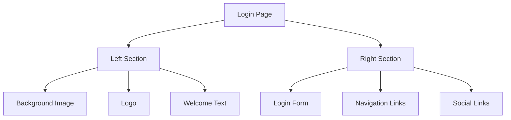

# Plano de Refatoração da Página de Login

## Visão Geral

Transformar a atual página de login em uma landing page moderna com login integrado, utilizando a imagem de fundo `nutri.jpg` e o logo horizontal da marca.

## Estrutura do Projeto



## Etapas de Implementação

### 1. Reestruturação do Layout

Dividir a página em duas seções principais usando Grid ou Flex layout.

```tsx
// Estrutura base do novo layout
<Grid container sx={{ height: "100vh" }}>
  {/* Seção Esquerda - Background e Branding */}
  <Grid item xs={12} md={7} sx={{ position: "relative" }}>
    {/* Conteúdo da seção esquerda */}
  </Grid>

  {/* Seção Direita - Formulário de Login */}
  <Grid item xs={12} md={5}>
    {/* Conteúdo da seção direita */}
  </Grid>
</Grid>
```

### 2. Implementação da Seção Esquerda

Configurar o background e elementos de branding.

```tsx
// Exemplo de implementação da seção esquerda
<Box
  sx={{
    backgroundImage: `url(${nutriBg})`,
    backgroundSize: "cover",
    backgroundPosition: "center",
    height: "100%",
    display: "flex",
    flexDirection: "column",
    justifyContent: "flex-start",
    padding: "2rem",
  }}
>
  
  <Typography variant="h2" sx={{ color: "white", mt: "auto", mb: 4 }}>
    Bem-vindo ao Smart Nutri
  </Typography>
</Box>
```

### 3. Reformulação do Formulário de Login

Redesenhar o formulário de login com um visual mais moderno.

```tsx
// Exemplo de estilização do novo formulário
<Box
  sx={{
    height: "100%",
    display: "flex",
    flexDirection: "column",
    justifyContent: "center",
    padding: "2rem",
    backgroundColor: "background.paper",
  }}
>
  <Typography variant="h4" sx={{ mb: 4 }}>
    Login
  </Typography>

  <TextField fullWidth label="Email" variant="outlined" sx={{ mb: 2 }} />

  <TextField
    fullWidth
    label="Senha"
    type="password"
    variant="outlined"
    sx={{ mb: 3 }}
  />

  <Button fullWidth variant="contained" size="large" sx={{ mb: 2 }}>
    Entrar
  </Button>
</Box>
```

### 4. Implementação de Responsividade

Definir breakpoints e comportamentos responsivos.

```tsx
// Exemplo de configurações responsivas
const styles = {
  container: {
    height: {
      xs: "auto",
      md: "100vh",
    },
  },
  leftSection: {
    minHeight: {
      xs: "300px",
      md: "100%",
    },
  },
  rightSection: {
    padding: {
      xs: "2rem",
      md: "4rem",
    },
  },
};
```

### 5. Melhorias de UX/UI

#### Animações e Transições

```tsx
// Exemplo de animações com MUI
<Fade in timeout={1000}>
  <Box>{/* Conteúdo animado */}</Box>
</Fade>
```

#### Feedback Visual

```tsx
// Exemplo de feedback de loading
<LoadingButton
  loading={loading}
  loadingPosition="center"
  variant="contained"
  fullWidth
>
  {loading ? "Entrando..." : "Entrar"}
</LoadingButton>
```

### 6. Integração com Sistema de Autenticação

Manter a lógica de autenticação existente, apenas reorganizando sua estrutura.

```tsx
// Exemplo de organização do código de autenticação
const handleLogin = async (credentials: LoginCredentials) => {
  try {
    setLoading(true);
    const response = await authService.login(credentials);
    handleAuthSuccess(response);
  } catch (error) {
    handleAuthError(error);
  } finally {
    setLoading(false);
  }
};
```

## Considerações Técnicas

### Dependências Necessárias

- @mui/material
- @emotion/styled
- @mui/icons-material

### Performance

- Otimização de imagens
- Lazy loading para componentes secundários
- Preload de assets críticos

### Acessibilidade

- Labels semânticos
- Mensagens de erro por aria-live
- Foco gerenciado
- Contraste adequado

## Próximos Passos

1. Criar branch para desenvolvimento
2. Implementar mudanças seguindo as etapas acima
3. Testes de responsividade
4. Testes de integração
5. Code review
6. Deploy

## Métricas de Sucesso

- Tempo de carregamento < 2s
- Taxa de conversão do login
- Feedback dos usuários
- Compatibilidade cross-browser
