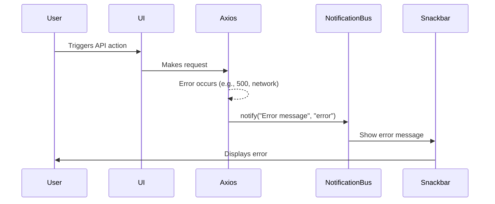
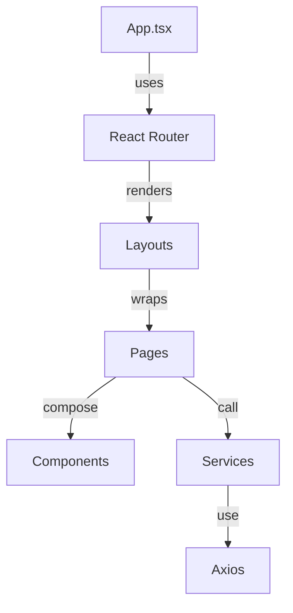
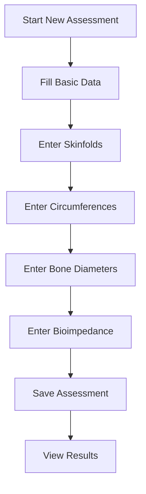
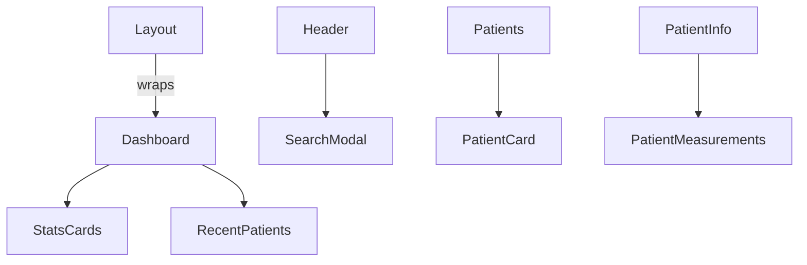

# SmartNutri Frontend Documentation

## Overview

SmartNutri's frontend is a React + TypeScript application, using:

- **Material-UI** for UI components and theming
- **React Query** for server state management and caching
- **React Router** for navigation
- **Axios** for HTTP requests

---

## Global Error Handling & Notifications

### Overview

The application implements a global error handling and notification system to provide clear, user-friendly feedback for API/network errors and other unexpected issues. This system is based on:

- A global Axios interceptor for API error handling
- A Notification Context and MUI Snackbar/Alert for displaying messages
- A notification bus utility for triggering notifications from anywhere (including outside React components)

### How it Works

1. **All API requests** use a single Axios instance (`src/lib/axios.ts`) with interceptors for:
   - Attaching authentication tokens
   - Handling errors globally (network, HTTP, unexpected)
2. **On error**, the interceptor triggers a notification using the notification bus.
3. **NotificationProvider** (`src/context/NotificationContext.tsx`) listens to the bus and manages notification state.
4. **ErrorSnackbar** (`src/components/ErrorHandling/ErrorSnackbar.tsx`) displays the message to the user at the top of the screen.

### Example Error Flow



### Usage

- **To trigger a notification manually** (e.g., in a custom hook or utility):
  ```ts
  import { notify } from "src/utils/notificationBus";
  notify("Custom message", "error");
  ```
- **All API errors** are handled automatically; no need to catch and display errors in each component.

### Benefits

- Consistent, user-friendly error feedback
- No silent failures: all errors are visible to testers and users
- Centralized logic for easy maintenance and future improvements

---

This document provides a comprehensive guide to the architecture, main components, pages, services, flows, and best practices. It also includes onboarding instructions and visual diagrams to help new and existing developers.

---

## Onboarding for New Developers

### 1. Prerequisites

- Node.js (v18+ recommended)
- npm (v9+) or yarn
- Git

### 2. Setup

```bash
git clone https://github.com/your-org/smartnutri.git
cd smartnutri/frontend
npm install
# or
yarn install
```

### 3. Environment

- Copy `.env.example` to `.env` and configure as needed.
- Ensure the backend is running and accessible (see backend documentation).

### 4. Running the App

```bash
npm run dev
# or
yarn dev
```

The app will be available at [http://localhost:5173](http://localhost:5173) (default Vite port).

### 5. Contribution Workflow

- Create a feature branch: `git checkout -b feature/your-feature`
- Follow the [Checklist for New Features](#checklist-for-new-features)
- Open a pull request and request review
- Ensure all tests pass and documentation is updated

---

## Project Structure

```
src/
├── components/     # Reusable UI components
├── layouts/        # Layout components (app-wide or section-wide)
├── pages/          # Main pages and flows
├── services/       # API and business logic
├── lib/            # Shared libraries (e.g., axios instance)
├── theme/          # Theme configuration
├── types/          # TypeScript type definitions
├── assets/         # Static assets
```

---

## Architecture Diagram



---

## Main Layouts

- **Layout**: Root layout, provides app-wide structure (header, footer, main content).
- **PatientLayout**: Specialized layout for patient-related pages, includes sidebar navigation.

---

## Main Pages & Flows

Each page is a directory under `src/pages/` and typically exports a main component.

- **Home**: Landing/dashboard page for the app.
- **Login**: Authentication page for nutritionists.
- **Register**: Nutritionist registration.
- **Dashboard**: System overview, stats, and quick access.
- **Patients**: List, search, and manage patients.
- **PatientForm**: Create/edit patient details.
- **PatientInfo**: View patient profile and contact info.
- **PatientMealPlan**: List meal plans for a patient.
- **MealPlan**: List, create, edit, and delete meal plans.
- **MealPlanDetails**: View and manage details of a specific meal plan.
- **Assessments**: List and manage patient assessments.
- **NewAssessment**: Create a new assessment (complex, multi-section form).
- **Measurements**: List and manage body measurements.
- **ViewAssessment**: View details and evolution of a specific assessment.
- **AssessmentEvolution**: Visualize the evolution of body composition over time through interactive charts.

### AssessmentEvolution Page

The AssessmentEvolution page provides a comprehensive view of a patient's body composition changes over time. It includes:

- **CompositionChart**: A responsive chart component that displays:
  - Total body weight evolution
  - Fat mass and fat-free mass distribution
  - Interactive tooltips with detailed measurements
  - Date-based X-axis with proper timezone handling
  - Custom styling matching the application theme

The chart is built using Recharts and integrates with the application's date formatting utilities to ensure consistent date display across the platform.

### Example: Main Flow - New Assessment



---

## Main Components

Located in `src/components/`:

- **AssessmentButton**: Triggers assessment actions.
- **FoodSearch**: Search and select foods.
- **LoadingBackdrop**: Displays loading overlay.
- **MealPlan**: UI for creating and displaying meal plans.
- **MealPlanButton**: Action button for meal plans.
- **PatientCard**: Displays patient summary.
- **PatientMeasurements**: Modal for entering/viewing measurements.
- **PrivateRoute**: Route guard for authenticated pages.
- **RecentPatients**: List of recently accessed patients.
- **StatsCards**: Dashboard statistics.
- **SearchModal**: Modal de pesquisa global, utilizado no Header para busca de pacientes e planos alimentares. Possui feedback visual aprimorado, estado de carregamento, mensagem de vazio e navegação por teclado.
- **CompositionChart**: Componente responsável por exibir a evolução da composição corporal do paciente ao longo do tempo.
- **PhotoUpload**: Componente para seleção e pré-visualização de fotos de avaliação (Fase 1: apenas seleção local e preview, sem upload real). Permite ao usuário arrastar ou selecionar arquivos de imagem (JPG, JPEG, PNG, até 5MB por padrão), valida o formato/tamanho e exibe a pré-visualização da imagem escolhida. Localização: `src/components/PhotoUpload/`. Interface:

```tsx
<PhotoUpload
  type="front" // ou "back" | "left" | "right"
  assessmentId="123"
  patientId="456"
  onUploadComplete={(photo) => console.log(photo)}
  onUploadError={(err) => console.error(err)}
/>
```

> Limitação atual: não realiza upload real nem integração com backend/Supabase nesta fase inicial. Apenas seleção, validação e preview local.

#### SearchModal

O componente `SearchModal` é responsável por toda a experiência de busca global no sistema. Ele é utilizado diretamente no Header e oferece:

- Campo de busca customizado com botão de limpar
- Feedback visual de carregamento (spinner)
- Mensagem amigável quando não há resultados:
  _"Ops! Não encontramos nada com o termo utilizado. Tente usar outras palavras-chave ou revise sua busca."_
- Resultados exibidos em cards, com indicação de tipo (Paciente/Plano alimentar)
- Navegação por teclado (Enter/Barra de espaço)
- Acessibilidade (ARIA labels)
- Animações suaves e design responsivo

**Uso:**

```tsx
// No Header.tsx
<SearchModal open={searchOpen} onClose={() => setSearchOpen(false)} />
```

**Localização:**
`src/components/SearchModal.tsx`

#### CompositionChart

O componente `CompositionChart` é um gráfico interativo que exibe a evolução da composição corporal do paciente. Características principais:

- **Visualização de Dados**:

  - Linha de evolução do peso total
  - Barras empilhadas mostrando distribuição entre massa gorda e massa livre
  - Tooltips interativos com valores detalhados
  - Eixo X com datas formatadas no padrão brasileiro (dd/MM/yyyy)

- **Integração**:

  - Utiliza a biblioteca Recharts para renderização
  - Integra-se com o sistema de temas do Material-UI
  - Usa utilitários de formatação de data centralizados

- **Responsividade**:

  - Adapta-se automaticamente ao tamanho do container
  - Mantém legibilidade em diferentes tamanhos de tela
  - Suporta interação via mouse e toque

- **Localização**:
  `src/pages/AssessmentEvolution/components/CompositionChart.tsx`

### Component Hierarchy Example



---

## Main Services

Located in `src/services/`:

- **api.ts**: Axios instance with interceptors.
- **authService.ts**: Authentication (login, register, get user, logout).
- **foodService.ts**: Food search, favorites, macro calculations.
- **mealPlanService.ts**: CRUD for meal plans and meals.
- **patientService.ts**: CRUD for patients and measurements.
- **search.service.ts**: Global search.

---

## Expanded Flow Explanations

### New Assessment (src/pages/NewAssessment)

- Multi-section form for anthropometric data.
- Handles basic data, skinfolds, circumferences, bone diameters, and bioimpedance.
- Uses React state and controlled components for each section.
- Validates and calculates results before saving.
- On save, persists data and shows results with charts.

### Meal Plan Management

- Users can create, edit, and delete meal plans for patients.
- Each plan contains multiple meals, each with foods and macros.
- UI supports drag-and-drop, toggling, and inline editing.

### Patient Management

- List, search, and filter patients.
- Create/edit via PatientForm.
- View details and measurements in PatientInfo and PatientMeasurements.

---

## Development Standards

### Components

- Use functional components and TypeScript.
- Follow componentization principles.
- Document props with JSDoc.
- Keep components small and focused.

### State & Data

- Use React Query for server data.
- Use Context API for global state.
- Use local state for UI.
- Extract reusable logic into custom hooks.

### Styling

- Use Material-UI and theme.
- Maintain visual consistency.
- Use styled-components if needed.

### Forms

- Use React Hook Form.
- Validate with Yup.
- Provide clear feedback and error handling.

---

## Checklist for New Features

### Planning

- [ ] Review existing documentation
- [ ] Identify similar components
- [ ] Plan data structure and user flow

### Development

- [ ] Define TypeScript types
- [ ] Implement components
- [ ] Add tests
- [ ] Document props and functions

### Integration

- [ ] Integrate with API
- [ ] Handle errors and loading states
- [ ] Test on multiple devices

### Documentation

- [ ] Update this document
- [ ] Document new components and usage
- [ ] Update global types

---

## Best Practices

### Performance

- Use lazy loading for routes/components.
- Optimize re-renders and memoize where needed.
- Minimize bundle size.

### Accessibility

- Use ARIA roles and labels.
- Support keyboard navigation.
- Ensure color contrast.
- Test with screen readers.

### Testing

- Write unit and integration tests.
- Test main flows and accessibility.

### Code Quality

- Follow ESLint and Prettier.
- Keep code clean and well-documented.

---

## Maintenance

### Updates

- Keep dependencies up to date.
- Remove unused code.
- Optimize performance.
- Update documentation regularly.

### Debugging

- Use React DevTools and browser tools.
- Implement logging and error monitoring.
- Test across browsers.

---

## References

- [Material-UI](https://mui.com/)
- [React Query](https://react-query.tanstack.com/)
- [React Router](https://reactrouter.com/)
- [TypeScript](https://www.typescriptlang.org/)

---

## Contact & Support

For questions or suggestions, contact the development team.

## Login Page

### Authentication Integration

The login page now includes enhanced authentication features:

1. **Form Validation**

   - Client-side validation for email and password fields
   - Real-time error feedback
   - Clear error messages when user starts typing
   - Password strength requirements (minimum 6 characters)

2. **Security Features**

   - Password visibility toggle
   - Proper autocomplete attributes for form fields
   - Secure password handling
   - Protected route redirection

3. **User Experience**

   - Visual feedback for form errors
   - Loading state during authentication
   - Success/error messages with animations
   - Smooth transitions between states

4. **Navigation**
   - Smart redirection after login
   - Support for protected route redirects
   - Maintains navigation history

### Component Structure

```typescript
interface LoginCredentials {
  email: string;
  password: string;
}

interface LocationState {
  message?: string;
  from?: string;
}
```

### Key Features

1. **Form Handling**

   - Centralized state management for credentials
   - Type-safe form handling
   - Reusable validation logic

2. **Error Handling**

   - Comprehensive error messages
   - API error handling
   - Form validation errors
   - User-friendly error display

3. **Security**

   - Secure password handling
   - Token storage
   - Protected routes
   - Session management

4. **Accessibility**
   - ARIA labels for interactive elements
   - Keyboard navigation support
   - Screen reader compatibility
   - Focus management

### Best Practices

1. **Form Validation**

   - Validate before submission
   - Clear error messages
   - Real-time feedback
   - Prevent invalid submissions

2. **Security**

   - Never store sensitive data
   - Use secure storage methods
   - Implement proper token handling
   - Follow security best practices

3. **User Experience**

   - Provide clear feedback
   - Maintain state consistency
   - Handle edge cases
   - Ensure smooth transitions

4. **Performance**
   - Optimize re-renders
   - Use proper loading states
   - Implement efficient validation
   - Maintain responsive design
