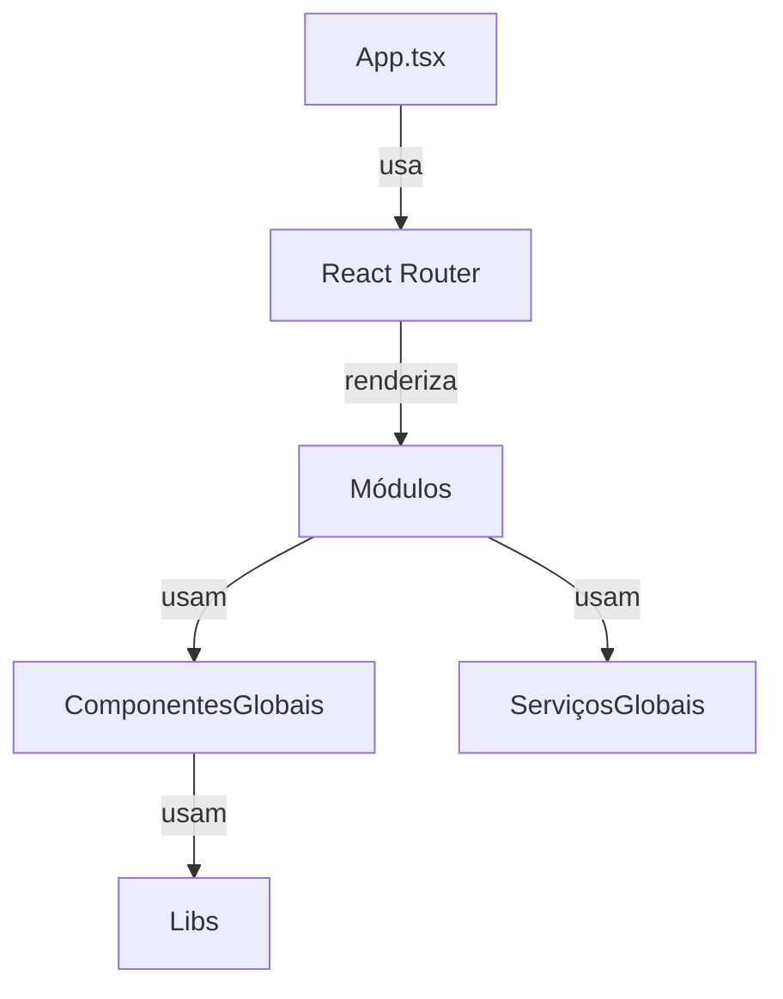

# SmartNutri Frontend Documentation

## Overview

SmartNutri's frontend is a React + TypeScript application, using:

- **Material-UI** for UI components and theming
- **React Query** for server state management and caching
- **React Router** for navigation
- **Axios** for HTTP requests

---

## Estrutura do Projeto

A estrutura do frontend é **modularizada**. Cada domínio funcional possui seu próprio módulo em `src/modules/`, contendo páginas, serviços e lógica específica. Não existe mais `src/pages` ou `src/services` globais para novas features.

```
src/
├── modules/        # Módulos de domínio (auth, patients, meal-plan, assessments, home, etc)
│   └── {modulo}/
│       ├── pages/         # Páginas do módulo
│       ├── services/      # Serviços e tipos do módulo
│       ├── components/    # Componentes específicos do módulo (opcional)
│       └── calcs/         # Utilitários/cálculos do módulo (opcional)
├── components/     # Componentes globais reutilizáveis (UI, botões, modais, etc)
├── layouts/        # Layouts globais (header, sidebar, etc)
├── lib/            # Bibliotecas utilitárias (axios, notificationBus, etc)
├── theme/          # Configuração de tema
├── types/          # Tipos TypeScript globais
├── assets/         # Assets estáticos (imagens, etc)
```

> **Padrão:** Toda nova feature deve ser criada dentro de um módulo em `src/modules/{modulo}`.

---

## Diagrama de Arquitetura



---

## Onboarding para Novos Devs

1. **Pré-requisitos**

   - Node.js (v18+ recomendado)
   - npm (v9+) ou yarn
   - Git

2. **Setup**

   ```bash
   git clone https://github.com/your-org/smartnutri.git
   cd smartnutri/frontend
   npm install
   # ou
   yarn install
   ```

3. **Ambiente**

   - Copie `.env.example` para `.env` e configure conforme necessário.
   - Certifique-se de que o backend está rodando e acessível.

4. **Rodando o App**

   ```bash
   npm run dev
   # ou
   yarn dev
   ```

   O app estará disponível em [http://localhost:5173](http://localhost:5173).

5. **Workflow de Contribuição**
   - Crie uma branch: `git checkout -b feature/sua-feature`
   - Siga o [Checklist para Novas Features](#checklist-para-novas-features)
   - Abra um pull request e solicite revisão
   - Garanta que todos os testes passam e a documentação está atualizada

---

## Padrão de Módulos

Cada módulo em `src/modules/{modulo}` deve conter:

- `pages/`: Páginas principais do fluxo do domínio
- `services/`: Serviços de API, tipos e lógica de dados
- `components/`: Componentes específicos do domínio (opcional)
- `calcs/`: Utilitários/cálculos do domínio (opcional)

**Exemplo:**

```
src/modules/patient/
├── pages/Patients/PatientsPage.tsx
├── pages/PatientInfo/PatientInfoPage.tsx
├── services/patientService.ts
├── components/PatientsTable.tsx
```

---

## Componentes Globais

Componentes reutilizáveis (UI, botões, modais, etc) ficam em `src/components/`.

- Exemplo: `src/components/StatsCards.tsx`, `src/components/PatientForm/PatientFormModal.tsx`
- Use sempre os **aliases** para importar:
  ```ts
  import { StatsCards } from "@components/StatsCards";
  import { PatientFormModal } from "@components/PatientForm/PatientFormModal";
  ```

---

## Importação com Aliases (IMPORTANTE)

> **Todos os imports internos devem usar aliases definidos em `tsconfig.app.json` e `vite.config.ts`.**

- `@modules/*` para módulos de domínio
- `@components/*` para componentes globais
- `@services/*` para serviços globais (legado ou compartilhado)
- `@lib/*` para libs utilitárias
- `@types/*` para tipos globais
- `@utils/*` para utilitários globais

**Exemplo:**

```ts
import { patientService } from "@modules/patient/services/patientService";
import { MealPlan } from "@modules/meal-plan/services/mealPlanService";
import { StatsCards } from "@components/StatsCards";
```

---

## Padrão de Nomenclatura de Páginas

- O diretório da página deve ser criado em `src/modules/{modulo}/pages/NomeDaFeature/`.
- O arquivo principal da página deve ser nomeado como `NomeDaFeaturePage.tsx`.
- Exemplo:
  ```
  src/modules/patient/pages/Patients/PatientsPage.tsx
  src/modules/assessment/pages/NewAssessment/NewAssessmentPage.tsx
  ```

---

## Exemplos de Módulos

### Módulo de Pacientes (`src/modules/patient`)

- Gerenciamento de pacientes, listagem, edição, visualização, etc.
- Serviços: `services/patientService.ts`
- Páginas: `pages/Patients/PatientsPage.tsx`, `pages/PatientInfo/PatientInfoPage.tsx`
- Componentes: `components/PatientsTable.tsx`, etc.

### Módulo de Avaliações (`src/modules/assessment`)

- Avaliações antropométricas, evolução corporal, cálculos, etc.
- Serviços: `services/assessmentService.ts` (se houver)
- Páginas: `pages/NewAssessment/NewAssessmentPage.tsx`, `pages/AssessmentEvolution/AssessmentEvolutionPage.tsx`
- Utilitários: `calcs/anthropometricCalculations.ts`

### Módulo de Planos Alimentares (`src/modules/meal-plan`)

- Criação, edição e visualização de planos alimentares.
- Serviços: `services/mealPlanService.ts`
- Páginas: `pages/MealPlanPage.tsx`, `pages/MealPlanDetails/MealPlanDetailsPage.tsx`

### Módulo Home (`src/modules/home`)

- Dashboard e visão geral do sistema.
- Páginas: `pages/HomePage.tsx`

### Módulo Auth (`src/modules/auth`)

- Login, registro e autenticação.
- Serviços: `services/authService.ts`
- Páginas: `pages/Login/LoginPage.tsx`, `pages/Register/RegisterPage.tsx`

---

## Boas Práticas e Padrões

- Sempre use **aliases** para imports.
- Crie novos domínios como módulos em `src/modules/`.
- Componentes globais devem ser genéricos e reutilizáveis.
- Serviços e lógica de domínio devem ficar dentro do módulo correspondente.
- Siga o padrão de nomenclatura de páginas e arquivos.
- Atualize a documentação sempre que criar ou alterar módulos.

---

## Checklist para Novas Features

- [ ] Criei a feature dentro de um módulo em `src/modules/`
- [ ] Usei aliases para todos os imports
- [ ] Segui o padrão de nomenclatura de páginas
- [ ] Atualizei a documentação
- [ ] Testei o fluxo principal da feature

---

## Busca de Alimentos (Food Database)

A busca de alimentos é realizada **localmente** a partir de um arquivo `alimentos.json` hospedado no Supabase Storage. O fluxo é o seguinte:

- O serviço [`foodDbService.ts`](src/services/foodDbService.ts) é responsável por baixar o arquivo JSON diretamente do Supabase Storage, utilizando as variáveis de ambiente `VITE_SUPABASE_URL` e o bucket configurado (`alimentos`).
  - Função principal: `fetchFoodDb()`
- O hook [`useFoodDb`](src/services/useFoodDb.ts) utiliza o React Query para fazer o preload e cache do arquivo de alimentos, evitando múltiplos downloads e melhorando a performance.
  - O cache é válido por 1 hora (`staleTime`) e pode ser reutilizado por até 6 horas (`cacheTime`).
- O serviço [`foodService.ts`](src/services/foodService.ts) implementa a função de busca local, filtrando os alimentos já baixados e em cache, sem chamadas adicionais à API.
  - Função principal: `searchFoods(query, foodDb)`
  - O filtro é feito por substring no nome do alimento, ignorando acentuação e caixa (case/diacrítico insensitive), e priorizando resultados mais relevantes.

**Como atualizar a base de alimentos:**

- Basta substituir o arquivo `alimentos.json` no Supabase Storage (bucket `alimentos`). Não é necessário deploy do frontend.

**Quando o preload ocorre:**

- O preload do arquivo é feito automaticamente ao acessar funcionalidades que dependem da base de alimentos (ex: ao clicar em "Planos Alimentares" no menu do paciente), aproveitando o cache do React Query.

**Resumo dos arquivos envolvidos:**

- `src/services/foodDbService.ts` → Download do JSON do Supabase
- `src/services/useFoodDb.ts` → Hook de preload/cache com React Query
- `src/services/foodService.ts` → Busca local e utilitários de alimentos

> **Importante:**
>
> - Não há mais busca de alimentos via API REST. Todo o filtro é feito localmente, após o download do arquivo.
> - Para garantir performance, sempre utilize o hook `useFoodDb` para acessar a base de alimentos nas telas.

---

## Padrão visual da tabela de alimentos em refeições

A partir de 2024-06, a visualização dos alimentos de cada refeição (MealCard) utiliza uma tabela Material-UI (`<Table>`), responsiva, com as seguintes colunas:

- **Qtde**
- **Unidade**
- **Alimento**
- **Calorias**

Esse padrão segue o visual de `PrescribedFoodsSection`, garantindo alinhamento, espaçamento e responsividade. O cabeçalho é destacado e há scroll horizontal em telas pequenas. Chips e tooltips são usados para detalhamento de calorias.

Essa tabela é usada apenas para visualização dos alimentos prescritos em cada refeição do plano alimentar.

---

## Referências

- [Material-UI](https://mui.com/)
- [React Query](https://react-query.tanstack.com/)
- [React Router](https://reactrouter.com/)
- [TypeScript](https://www.typescriptlang.org/)

---

## Suporte

Em caso de dúvidas, consulte este documento ou entre em contato com o time de desenvolvimento.
