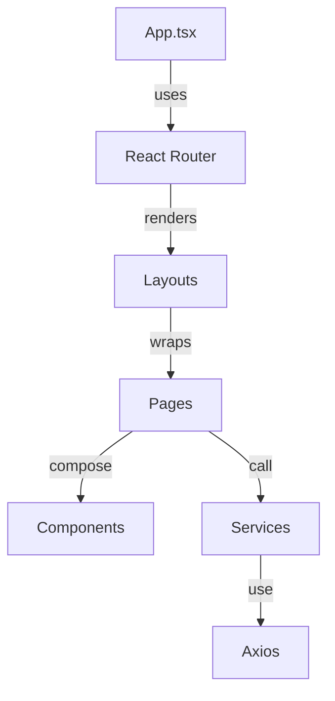
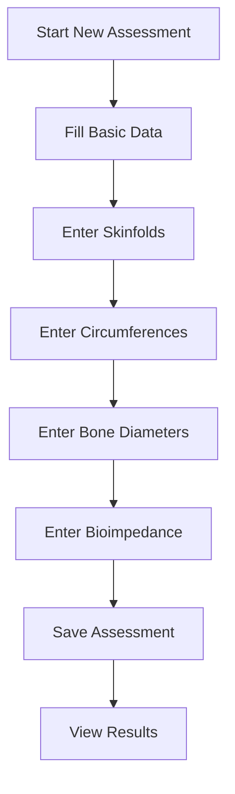
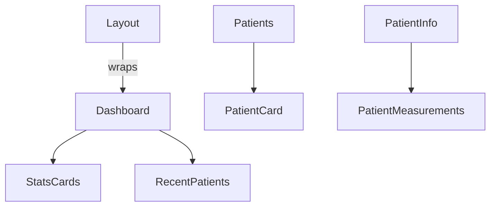

# SmartNutri Frontend Documentation

## Overview

SmartNutri's frontend is a React + TypeScript application, using:

- **Material-UI** for UI components and theming
- **React Query** for server state management and caching
- **React Router** for navigation
- **Axios** for HTTP requests

This document provides a comprehensive guide to the architecture, main components, pages, services, flows, and best practices. It also includes onboarding instructions and visual diagrams to help new and existing developers.

---

## Onboarding for New Developers

### 1. Prerequisites

- Node.js (v18+ recommended)
- npm (v9+) or yarn
- Git

### 2. Setup

```bash
git clone https://github.com/your-org/smartnutri.git
cd smartnutri/frontend
npm install
# or
yarn install
```

### 3. Environment

- Copy `.env.example` to `.env` and configure as needed.
- Ensure the backend is running and accessible (see backend documentation).

### 4. Running the App

```bash
npm run dev
# or
yarn dev
```

The app will be available at [http://localhost:5173](http://localhost:5173) (default Vite port).

### 5. Contribution Workflow

- Create a feature branch: `git checkout -b feature/your-feature`
- Follow the [Checklist for New Features](#checklist-for-new-features)
- Open a pull request and request review
- Ensure all tests pass and documentation is updated

---

## Project Structure

```
src/
├── components/     # Reusable UI components
├── layouts/        # Layout components (app-wide or section-wide)
├── pages/          # Main pages and flows
├── services/       # API and business logic
├── lib/            # Shared libraries (e.g., axios instance)
├── theme/          # Theme configuration
├── types/          # TypeScript type definitions
├── assets/         # Static assets
```

---

## Architecture Diagram



---

## Main Layouts

- **Layout**: Root layout, provides app-wide structure (header, footer, main content).
- **PatientLayout**: Specialized layout for patient-related pages, includes sidebar navigation.

---

## Main Pages & Flows

Each page is a directory under `src/pages/` and typically exports a main component.

- **Home**: Landing/dashboard page for the app.
- **Login**: Authentication page for nutritionists.
- **Register**: Nutritionist registration.
- **Dashboard**: System overview, stats, and quick access.
- **Patients**: List, search, and manage patients.
- **PatientForm**: Create/edit patient details.
- **PatientInfo**: View patient profile and contact info.
- **PatientMealPlan**: List meal plans for a patient.
- **MealPlan**: List, create, edit, and delete meal plans.
- **MealPlanDetails**: View and manage details of a specific meal plan.
- **Assessments**: List and manage patient assessments.
- **NewAssessment**: Create a new assessment (complex, multi-section form).
- **Measurements**: List and manage body measurements.
- **ViewAssessment**: View details and evolution of a specific assessment.

### Example: Main Flow - New Assessment



---

## Main Components

Located in `src/components/`:

- **AssessmentButton**: Triggers assessment actions.
- **FoodSearch**: Search and select foods.
- **LoadingBackdrop**: Displays loading overlay.
- **MealPlan**: UI for creating and displaying meal plans.
- **MealPlanButton**: Action button for meal plans.
- **PatientCard**: Displays patient summary.
- **PatientMeasurements**: Modal for entering/viewing measurements.
- **PrivateRoute**: Route guard for authenticated pages.
- **RecentPatients**: List of recently accessed patients.
- **StatsCards**: Dashboard statistics.

### Component Hierarchy Example



---

## Main Services

Located in `src/services/`:

- **api.ts**: Axios instance with interceptors.
- **authService.ts**: Authentication (login, register, get user, logout).
- **foodService.ts**: Food search, favorites, macro calculations.
- **mealPlanService.ts**: CRUD for meal plans and meals.
- **patientService.ts**: CRUD for patients and measurements.
- **search.service.ts**: Global search.

---

## Expanded Flow Explanations

### New Assessment (src/pages/NewAssessment)

- Multi-section form for anthropometric data.
- Handles basic data, skinfolds, circumferences, bone diameters, and bioimpedance.
- Uses React state and controlled components for each section.
- Validates and calculates results before saving.
- On save, persists data and shows results with charts.

### Meal Plan Management

- Users can create, edit, and delete meal plans for patients.
- Each plan contains multiple meals, each with foods and macros.
- UI supports drag-and-drop, toggling, and inline editing.

### Patient Management

- List, search, and filter patients.
- Create/edit via PatientForm.
- View details and measurements in PatientInfo and PatientMeasurements.

---

## Development Standards

### Components

- Use functional components and TypeScript.
- Follow componentization principles.
- Document props with JSDoc.
- Keep components small and focused.

### State & Data

- Use React Query for server data.
- Use Context API for global state.
- Use local state for UI.
- Extract reusable logic into custom hooks.

### Styling

- Use Material-UI and theme.
- Maintain visual consistency.
- Use styled-components if needed.

### Forms

- Use React Hook Form.
- Validate with Yup.
- Provide clear feedback and error handling.

---

## Checklist for New Features

### Planning

- [ ] Review existing documentation
- [ ] Identify similar components
- [ ] Plan data structure and user flow

### Development

- [ ] Define TypeScript types
- [ ] Implement components
- [ ] Add tests
- [ ] Document props and functions

### Integration

- [ ] Integrate with API
- [ ] Handle errors and loading states
- [ ] Test on multiple devices

### Documentation

- [ ] Update this document
- [ ] Document new components and usage
- [ ] Update global types

---

## Best Practices

### Performance

- Use lazy loading for routes/components.
- Optimize re-renders and memoize where needed.
- Minimize bundle size.

### Accessibility

- Use ARIA roles and labels.
- Support keyboard navigation.
- Ensure color contrast.
- Test with screen readers.

### Testing

- Write unit and integration tests.
- Test main flows and accessibility.

### Code Quality

- Follow ESLint and Prettier.
- Keep code clean and well-documented.

---

## Maintenance

### Updates

- Keep dependencies up to date.
- Remove unused code.
- Optimize performance.
- Update documentation regularly.

### Debugging

- Use React DevTools and browser tools.
- Implement logging and error monitoring.
- Test across browsers.

---

## References

- [Material-UI](https://mui.com/)
- [React Query](https://react-query.tanstack.com/)
- [React Router](https://reactrouter.com/)
- [TypeScript](https://www.typescriptlang.org/)

---

## Contact & Support

For questions or suggestions, contact the development team.
