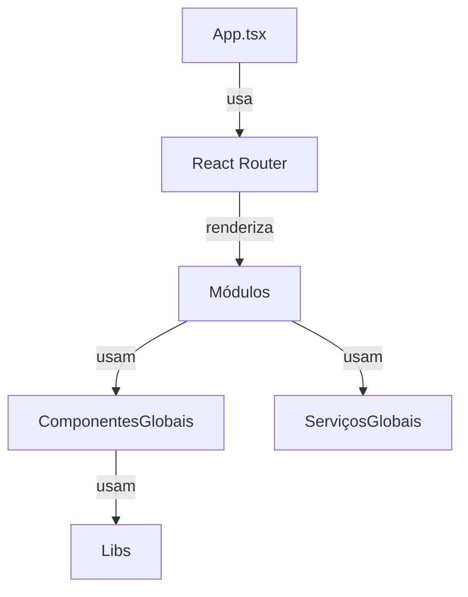

# SmartNutri Frontend Documentation

## Overview

SmartNutri's frontend is a React + TypeScript application, using:

- **Material-UI** for UI components and theming
- **React Query** for server state management and caching
- **React Router** for navigation
- **Axios** for HTTP requests

---

## Estrutura do Projeto

A estrutura do frontend é **modularizada**. Cada domínio funcional possui seu próprio módulo em `src/modules/`, contendo páginas, serviços e lógica específica. Não existe mais `src/pages` ou `src/services` globais para novas features.

```
src/
├── modules/        # Módulos de domínio (auth, patients, meal-plan, assessments, home, etc)
│   └── {modulo}/
│       ├── pages/         # Páginas do módulo
│       ├── services/      # Serviços e tipos do módulo
│       ├── components/    # Componentes específicos do módulo (opcional)
│       └── calcs/         # Utilitários/cálculos do módulo (opcional)
├── components/     # Componentes globais reutilizáveis (UI, botões, modais, etc)
├── layouts/        # Layouts globais (header, sidebar, etc)
├── lib/            # Bibliotecas utilitárias (axios, notificationBus, etc)
├── theme/          # Configuração de tema
├── types/          # Tipos TypeScript globais
├── assets/         # Assets estáticos (imagens, etc)
```

> **Padrão:** Toda nova feature deve ser criada dentro de um módulo em `src/modules/{modulo}`.

---

## Diagrama de Arquitetura



---

## Onboarding para Novos Devs

1. **Pré-requisitos**

   - Node.js (v18+ recomendado)
   - npm (v9+) ou yarn
   - Git

2. **Setup**

   ```bash
   git clone https://github.com/your-org/smartnutri.git
   cd smartnutri/frontend
   npm install
   # ou
   yarn install
   ```

3. **Ambiente**

   - Copie `.env.example` para `.env` e configure conforme necessário.
   - Certifique-se de que o backend está rodando e acessível.

4. **Rodando o App**

   ```bash
   npm run dev
   # ou
   yarn dev
   ```

   O app estará disponível em [http://localhost:5173](http://localhost:5173).

5. **Workflow de Contribuição**
   - Crie uma branch: `git checkout -b feature/sua-feature`
   - Siga o [Checklist para Novas Features](#checklist-para-novas-features)
   - Abra um pull request e solicite revisão
   - Garanta que todos os testes passam e a documentação está atualizada

---

## Padrão de Módulos

Cada módulo em `src/modules/{modulo}` deve conter:

- `pages/`: Páginas principais do fluxo do domínio
- `services/`: Serviços de API, tipos e lógica de dados
- `components/`: Componentes específicos do domínio (opcional)
- `calcs/`: Utilitários/cálculos do domínio (opcional)

**Exemplo:**

```
src/modules/patient/
├── pages/Patients/PatientsPage.tsx
├── pages/PatientInfo/PatientInfoPage.tsx
├── services/patientService.ts
├── components/PatientsTable.tsx
```

---

## Componentes Globais

Componentes reutilizáveis (UI, botões, modais, etc) ficam em `src/components/`.

- Exemplo: `src/components/StatsCards.tsx`, `src/components/PatientForm/PatientFormModal.tsx`
- Use sempre os **aliases** para importar:
  ```ts
  import { StatsCards } from "@components/StatsCards";
  import { PatientFormModal } from "@components/PatientForm/PatientFormModal";
  ```

## Design System

O SmartNutri possui um design system consistente e reutilizável, disponível através de componentes pré-configurados.

### Componentes Base

#### Tipografia

| Componente   | Variante | Uso                          |
| ------------ | -------- | ---------------------------- |
| PageTitle    | h4       | Títulos principais de página |
| SectionTitle | h5       | Títulos de seções            |
| CardTitle    | h6       | Títulos de cards             |
| BodyText     | body1    | Texto principal              |
| Caption      | caption  | Textos secundários           |

Exemplo de uso:

```tsx
<DesignSystemTypography variant="pageTitle">
  Título da Página
</DesignSystemTypography>
```

#### Botões

| Variante  | Uso               | Ícones |
| --------- | ----------------- | ------ |
| Primary   | Ações principais  | ✅     |
| Secondary | Ações secundárias | ✅     |
| Text      | Ações terciárias  | ✅     |
| Icon      | Ações com ícone   | ✅     |

Exemplo de uso:

```tsx
// Botão básico
<DesignSystemButton variant="primary">Botão Principal</DesignSystemButton>

// Botão com ícone no início
<DesignSystemButton
  variant="primary"
  startIcon={<AddIcon />}
>
  Novo Item
</DesignSystemButton>

// Botão com ícone no final
<DesignSystemButton
  variant="secondary"
  endIcon={<ArrowForwardIcon />}
>
  Próximo
</DesignSystemButton>

// Botão apenas com ícone
<DesignSystemButton variant="icon">
  <SearchIcon />
</DesignSystemButton>
```

#### Cards

O design system inclui um componente de Card padronizado com diferentes variantes e suporte a título, subtítulo e ações.

| Variante | Descrição                    |
| -------- | ---------------------------- |
| default  | Card padrão com sombra suave |
| elevated | Card com sombra pronunciada  |
| outlined | Card com borda, sem sombra   |

Exemplo de uso:

```tsx
// Card básico
<DesignSystemCard variant="default">
  <DesignSystemTypography variant="cardTitle">
    Título do Card
  </DesignSystemTypography>
  <DesignSystemTypography variant="bodyText">
    Conteúdo do card
  </DesignSystemTypography>
</DesignSystemCard>

// Card com título, subtítulo e ações
<DesignSystemCard
  variant="default"
  title={
    <DesignSystemTypography variant="cardTitle">
      Título do Card
    </DesignSystemTypography>
  }
  subtitle={
    <DesignSystemTypography variant="caption">
      Subtítulo do card
    </DesignSystemTypography>
  }
  actions={
    <>
      <DesignSystemButton variant="icon">
        <EditIcon />
      </DesignSystemButton>
      <DesignSystemButton variant="icon">
        <DeleteIcon />
      </DesignSystemButton>
    </>
  }
>
  <DesignSystemTypography variant="bodyText">
    Conteúdo do card
  </DesignSystemTypography>
</DesignSystemCard>
```

#### Formulários

##### Input

O componente `DesignSystemInput` é uma extensão do TextField do Material-UI com estilos padronizados.

| Variante | Descrição                  |
| -------- | -------------------------- |
| default  | Input com borda suave      |
| filled   | Input com fundo preenchido |
| outlined | Input com borda definida   |

Exemplo de uso:

```tsx
// Input básico
<DesignSystemInput
  label="Nome"
  placeholder="Digite seu nome"
/>

// Input com ícone
<DesignSystemInput
  label="Buscar"
  placeholder="Digite para buscar..."
  startIcon={<SearchIcon />}
/>

// Input com variante
<DesignSystemInput
  variant="filled"
  label="Email"
  placeholder="Digite seu email"
/>
```

##### Select

O componente `DesignSystemSelect` é uma extensão do Select do Material-UI com estilos padronizados.

| Variante | Descrição                   |
| -------- | --------------------------- |
| default  | Select com borda suave      |
| filled   | Select com fundo preenchido |
| outlined | Select com borda definida   |

Exemplo de uso:

```tsx
// Select básico
<DesignSystemSelect
  label="Selecione uma opção"
  options={[
    { value: "1", label: "Opção 1" },
    { value: "2", label: "Opção 2" },
    { value: "3", label: "Opção 3" },
  ]}
/>

// Select com variante
<DesignSystemSelect
  variant="filled"
  label="Selecione uma opção"
  options={[
    { value: "1", label: "Opção 1" },
    { value: "2", label: "Opção 2" },
    { value: "3", label: "Opção 3" },
  ]}
/>
```

#### Feedback

##### Snackbar

O componente `DesignSystemSnackbar` é uma extensão do Snackbar do Material-UI com estilos padronizados.

| Variante | Descrição                      |
| -------- | ------------------------------ |
| default  | Snackbar com fundo padrão      |
| success  | Snackbar com cor de sucesso    |
| error    | Snackbar com cor de erro       |
| warning  | Snackbar com cor de alerta     |
| info     | Snackbar com cor de informação |

Exemplo de uso:

```tsx
// Snackbar básico
<DesignSystemSnackbar
  open={open}
  message="Operação realizada com sucesso!"
  onClose={() => setOpen(false)}
/>

// Snackbar com variante e severidade
<DesignSystemSnackbar
  variant="success"
  severity="success"
  open={open}
  message="Operação realizada com sucesso!"
  onClose={() => setOpen(false)}
  autoHideDuration={3000}
/>
```

### Preview do Design System

O preview do design system está disponível no modal de configurações do nutricionista, na aba "Design System". Lá você pode:

1. Visualizar todos os componentes disponíveis
2. Testar diferentes variantes
3. Ver exemplos de uso
4. Verificar a consistência visual

### Boas Práticas

1. **Sempre use os componentes do design system**

   - Evite criar novos componentes semelhantes
   - Mantenha a consistência visual

2. **Tipografia**

   - Use as variantes apropriadas para cada contexto
   - Mantenha a hierarquia visual
   - Evite estilos customizados

3. **Botões**

   - Use a variante correta para cada ação
   - Mantenha a consistência de interação
   - Evite customizações desnecessárias

4. **Formulários**

   - Use os componentes de input e select padronizados
   - Mantenha a consistência visual entre campos
   - Utilize ícones quando apropriado

5. **Feedback**
   - Use o Snackbar para mensagens temporárias
   - Escolha a variante apropriada para cada tipo de mensagem
   - Mantenha mensagens claras e concisas

### Exemplos de Uso

```tsx
// Página com título e seções
<DesignSystemTypography variant="pageTitle">
  Meus Pacientes
</DesignSystemTypography>

<DesignSystemTypography variant="sectionTitle">
  Pacientes Recentes
</DesignSystemTypography>

<DesignSystemTypography variant="bodyText">
  Lista de pacientes atendidos recentemente.
</DesignSystemTypography>

// Ações
<DesignSystemButton variant="primary">
  Novo Paciente
</DesignSystemButton>

<DesignSystemButton variant="secondary">
  Editar
</DesignSystemButton>

<DesignSystemButton variant="text">
  Cancelar
</DesignSystemButton>

// Formulário
<DesignSystemInput
  label="Nome do Paciente"
  placeholder="Digite o nome"
/>

<DesignSystemSelect
  label="Tipo de Avaliação"
  options={[
    { value: "anthropometric", label: "Antropométrica" },
    { value: "nutritional", label: "Nutricional" },
  ]}
/>

// Feedback
<DesignSystemSnackbar
  variant="success"
  message="Paciente cadastrado com sucesso!"
  open={open}
  onClose={() => setOpen(false)}
/>
```

---

## Importação com Aliases (IMPORTANTE)

> **Todos os imports internos devem usar aliases definidos em `tsconfig.app.json` e `vite.config.ts`.**

- `@modules/*` para módulos de domínio
- `@components/*` para componentes globais
- `@services/*` para serviços globais (legado ou compartilhado)
- `@lib/*` para libs utilitárias
- `@types/*` para tipos globais
- `@utils/*` para utilitários globais

**Exemplo:**

```ts
import { patientService } from "@modules/patient/services/patientService";
import { MealPlan } from "@modules/meal-plan/services/mealPlanService";
import { StatsCards } from "@components/StatsCards";
```

---

## Padrão de Nomenclatura de Páginas

- O diretório da página deve ser criado em `src/modules/{modulo}/pages/NomeDaFeature/`.
- O arquivo principal da página deve ser nomeado como `NomeDaFeaturePage.tsx`.
- Exemplo:
  ```
  src/modules/patient/pages/Patients/PatientsPage.tsx
  src/modules/assessment/pages/NewAssessment/NewAssessmentPage.tsx
  ```

---

## Exemplos de Módulos

### Módulo de Pacientes (`src/modules/patient`)

- Gerenciamento de pacientes, listagem, edição, visualização, etc.
- Serviços: `services/patientService.ts`
- Páginas: `pages/Patients/PatientsPage.tsx`, `pages/PatientInfo/PatientInfoPage.tsx`
- Componentes: `components/PatientsTable.tsx`, etc.

### Módulo de Avaliações (`src/modules/assessment`)

- Avaliações antropométricas, evolução corporal, cálculos, etc.
- Serviços: `services/assessmentService.ts` (se houver)
- Páginas: `pages/NewAssessment/NewAssessmentPage.tsx`, `pages/AssessmentEvolution/AssessmentEvolutionPage.tsx`
- Utilitários: `calcs/anthropometricCalculations.ts`

### Módulo de Planos Alimentares (`src/modules/meal-plan`)

- Criação, edição e visualização de planos alimentares.
- Serviços: `services/mealPlanService.ts`
- Páginas: `pages/MealPlanPage.tsx`, `pages/MealPlanDetails/MealPlanDetailsPage.tsx`

### Módulo Home (`src/modules/home`)

- Dashboard e visão geral do sistema.
- Páginas: `pages/HomePage.tsx`

### Módulo Auth (`src/modules/auth`)

- Login, registro e autenticação.
- Serviços: `services/authService.ts`
- Páginas: `pages/Login/LoginPage.tsx`, `pages/Register/RegisterPage.tsx`

### Módulo de Planejamento Energético (`src/modules/energy-plan`)

- Criação, edição e visualização de planos energéticos (TMB/GET).
- Serviços: `services/energyPlanService.ts`
- Páginas: `pages/EnergyPlanPage.tsx`
- Componentes: (futuros componentes específicos)
- Utilitários: (futuros cálculos em `calcs/`)

**Padrão visual atualizado (2024-06):**

- Os boxes de "Atividade física" e "Fator clínico" agora usam o tom de verde do tema (`primary.main` e `primary.light`), com borda verde, para alinhar ao botão "Criar Novo Plano".
- Os boxes de TMB e GET não possuem mais borda, têm fonte menor e visual mais compacto.
- A fórmula utilizada recebe destaque maior, com fonte aumentada e peso maior.

---

## Boas Práticas e Padrões

- Sempre use **aliases** para imports.
- Crie novos domínios como módulos em `src/modules/`.
- Componentes globais devem ser genéricos e reutilizáveis.
- Serviços e lógica de domínio devem ficar dentro do módulo correspondente.
- Siga o padrão de nomenclatura de páginas e arquivos.
- Atualize a documentação sempre que criar ou alterar módulos.

---

## Checklist para Novas Features

- [ ] Criei a feature dentro de um módulo em `src/modules/`
- [ ] Usei aliases para todos os imports
- [ ] Segui o padrão de nomenclatura de páginas
- [ ] Atualizei a documentação
- [ ] Testei o fluxo principal da feature

---

## Busca de Alimentos (Food Database)

A busca de alimentos é realizada **localmente** a partir de um arquivo `alimentos.json` hospedado no Supabase Storage. O fluxo é o seguinte:

- O serviço [`foodDbService.ts`](src/services/foodDbService.ts) é responsável por baixar o arquivo JSON diretamente do Supabase Storage, utilizando as variáveis de ambiente `VITE_SUPABASE_URL` e o bucket configurado (`alimentos`).
  - Função principal: `fetchFoodDb()`
- O hook [`useFoodDb`](src/services/useFoodDb.ts) utiliza o React Query para fazer o preload e cache do arquivo de alimentos, evitando múltiplos downloads e melhorando a performance.
  - O cache é válido por 1 hora (`staleTime`) e pode ser reutilizado por até 6 horas (`cacheTime`).
- O serviço [`foodService.ts`](src/services/foodService.ts) implementa a função de busca local, filtrando os alimentos já baixados e em cache, sem chamadas adicionais à API.
  - Função principal: `searchFoods(query, foodDb)`
  - O filtro é feito por substring no nome do alimento, ignorando acentuação e caixa (case/diacrítico insensitive), e priorizando resultados mais relevantes.

**Como atualizar a base de alimentos:**

- Basta substituir o arquivo `alimentos.json` no Supabase Storage (bucket `alimentos`). Não é necessário deploy do frontend.

**Quando o preload ocorre:**

- O preload do arquivo é feito automaticamente ao acessar funcionalidades que dependem da base de alimentos (ex: ao clicar em "Planos Alimentares" no menu do paciente), aproveitando o cache do React Query.

**Resumo dos arquivos envolvidos:**

- `src/services/foodDbService.ts` → Download do JSON do Supabase
- `src/services/useFoodDb.ts` → Hook de preload/cache com React Query
- `src/services/foodService.ts` → Busca local e utilitários de alimentos

> **Importante:**
>
> - Não há mais busca de alimentos via API REST. Todo o filtro é feito localmente, após o download do arquivo.
> - Para garantir performance, sempre utilize o hook `useFoodDb` para acessar a base de alimentos nas telas.

---

## Padrão visual da tabela de alimentos em refeições

A partir de 2024-06, a visualização dos alimentos de cada refeição (MealCard) utiliza uma tabela Material-UI (`<Table>`), responsiva, com as seguintes colunas:

- **Qtde**
- **Unidade**
- **Alimento**
- **Calorias**

Esse padrão segue o visual de `PrescribedFoodsSection`, garantindo alinhamento, espaçamento e responsividade. O cabeçalho é destacado e há scroll horizontal em telas pequenas. Chips e tooltips são usados para detalhamento de calorias.

Essa tabela é usada apenas para visualização dos alimentos prescritos em cada refeição do plano alimentar.

---

## Padrão de Grid

Para layouts responsivos, utilize CSS Grid nativo ao invés do componente Grid do MUI. Isso evita problemas de tipagem e warnings com o MUI Grid v2, além de oferecer melhor performance.

### Exemplo de Implementação

```tsx
<Box
  sx={{
    display: "grid",
    gap: 3, // Espaçamento entre os itens
    gridTemplateColumns: {
      xs: "1fr", // 1 coluna em mobile
      sm: "repeat(2, 1fr)", // 2 colunas em tablet
      md: "repeat(4, 1fr)", // 4 colunas em desktop
    },
  }}
>
  {items.map((item) => (
    <Box key={item.id}>{/* Conteúdo do item */}</Box>
  ))}
</Box>
```

### Breakpoints Padrão

- `xs`: 0px - 599px (mobile)
- `sm`: 600px - 899px (tablet)
- `md`: 900px - 1199px (desktop pequeno)
- `lg`: 1200px - 1535px (desktop)
- `xl`: 1536px+ (desktop grande)

### Vantagens

1. **Performance**: CSS Grid nativo é mais performático que o Grid do MUI
2. **Sem Warnings**: Evita problemas de tipagem e warnings do MUI Grid v2
3. **Flexibilidade**: Mais controle sobre o layout e responsividade
4. **Manutenção**: Código mais limpo e fácil de manter

### Quando Usar

- Layouts responsivos com múltiplas colunas
- Grids de cards ou itens
- Layouts que precisam de controle preciso sobre o espaçamento
- Quando precisar evitar problemas com o MUI Grid v2

### Exemplo Real (StatsCards)

```tsx
// Exemplo do componente StatsCards
<Box
  sx={{
    display: "grid",
    gap: 3,
    gridTemplateColumns: {
      xs: "1fr", // 1 card por linha em mobile
      sm: "repeat(2, 1fr)", // 2 cards por linha em tablet
      md: "repeat(4, 1fr)", // 4 cards por linha em desktop
    },
  }}
>
  {cards.map((card) => (
    <Box key={card.title}>
      <Card>{/* Conteúdo do card */}</Card>
    </Box>
  ))}
</Box>
```

---

## Referências

- [Material-UI](https://mui.com/)
- [React Query](https://react-query.tanstack.com/)
- [React Router](https://reactrouter.com/)
- [TypeScript](https://www.typescriptlang.org/)

---

## Suporte

Em caso de dúvidas, consulte este documento ou entre em contato com o time de desenvolvimento.

# Guia de Tema e Estilização

## 🎨 Sistema de Cores

### Cores Personalizáveis

O tema da aplicação possui 3 cores principais que podem ser personalizadas pelo nutricionista:

```typescript
customColors = {
  primary: { main, light, dark }, // Cor principal
  secondary: { main, light, dark }, // Cor secundária
  accent: { main, light, dark }, // Cor de destaque
};
```

### Cores do Sistema (Não Personalizáveis)

```typescript
systemColors = {
  error: { main, light, dark },    // Erros e alertas
  warning: { main, light, dark },  // Avisos
  info: { main, light, dark },     // Informações
  success: { main, light, dark },  // Sucesso
  grey: { 50-900 }                 // Tons de cinza
}
```

## 📝 Como Usar o Tema

### 1. Cores

#### ❌ NUNCA FAÇA ISSO:

```typescript
// ❌ Cores hardcoded
sx={{ color: "#FF0000" }}
sx={{ backgroundColor: "rgb(0, 0, 0)" }}

// ❌ Referências antigas
sx={{ color: "custom.main" }}
sx={{ bgcolor: "custom.light" }}
```

#### ✅ FAÇA ASSIM:

```typescript
// ✅ Cores principais
sx={{ color: "primary.main" }}
sx={{ bgcolor: "primary.light" }}
sx={{ borderColor: "primary.dark" }}

// ✅ Cores do sistema
sx={{ color: "success.main" }}
sx={{ bgcolor: "error.light" }}
sx={{ borderColor: "warning.dark" }}

// ✅ Cores de texto
sx={{ color: "text.primary" }}
sx={{ color: "text.secondary" }}

// ✅ Cores de fundo
sx={{ bgcolor: "background.paper" }}
sx={{ bgcolor: "background.default" }}
```

### 2. Tipografia

#### ❌ NUNCA FAÇA ISSO:

```typescript
// ❌ Fontes hardcoded
sx={{ fontFamily: "Arial" }}
sx={{ fontSize: "16px" }}
sx={{ fontWeight: "bold" }}
```

#### ✅ FAÇA ASSIM:

```typescript
// ✅ Usando variantes do tema
<Typography variant="h1">Título</Typography>
<Typography variant="body1">Texto</Typography>

// ✅ Customizando variantes
sx={{
  typography: {
    fontFamily: "theme.typography.fontFamily",
    fontSize: "theme.typography.h6.fontSize",
    fontWeight: "theme.typography.h6.fontWeight"
  }
}}
```

### 3. Sombras e Opacidade

#### ❌ NUNCA FAÇA ISSO:

```typescript
// ❌ Valores hardcoded
sx={{ boxShadow: "0px 2px 4px rgba(0,0,0,0.1)" }}
sx={{ opacity: 0.5 }}
```

#### ✅ FAÇA ASSIM:

```typescript
// ✅ Usando alpha para opacidade
sx={{
  boxShadow: (theme) =>
    `0px 2px 4px ${alpha(theme.palette.primary.main, 0.1)}`
}}

// ✅ Usando valores do tema
sx={{
  boxShadow: 1, // 1-24 para diferentes níveis de sombra
  opacity: 0.8
}}
```

## 🔍 Checklist de Refatoração

Ao trabalhar em uma nova tela ou componente, verifique:

1. **Cores**

   - [ ] Substituir cores hexadecimais por referências do tema
   - [ ] Usar `primary`, `secondary` ou `accent` para elementos principais
   - [ ] Usar cores do sistema para estados (success, error, etc)
   - [ ] Verificar hover states usando variantes light/dark

2. **Tipografia**

   - [ ] Usar componentes Typography com variantes apropriadas
   - [ ] Evitar definições diretas de fonte
   - [ ] Manter consistência com o sistema de tipografia

3. **Espaçamento**

   - [ ] Usar o sistema de spacing do tema (theme.spacing)
   - [ ] Manter consistência nos gaps e margins

4. **Bordas e Sombras**
   - [ ] Usar o sistema de elevação do Material-UI
   - [ ] Aplicar opacidade usando alpha()
   - [ ] Manter consistência nos border-radius

## 📚 Exemplos Comuns

### Botões

```typescript
// Botão Primário
<Button
  variant="contained"
  sx={{
    bgcolor: "primary.main",
    color: "primary.contrastText",
    "&:hover": {
      bgcolor: "primary.dark"
    }
  }}
>
  Botão
</Button>

// Botão Secundário
<Button
  variant="outlined"
  sx={{
    borderColor: "secondary.main",
    color: "secondary.main",
    "&:hover": {
      borderColor: "secondary.dark",
      bgcolor: "secondary.light"
    }
  }}
>
  Botão
</Button>
```

### Cards

O design system inclui um componente de Card padronizado com diferentes variantes e suporte a título, subtítulo e ações.

#### Variantes de Card

| Variante | Descrição                    |
| -------- | ---------------------------- |
| default  | Card padrão com sombra suave |
| elevated | Card com sombra pronunciada  |
| outlined | Card com borda, sem sombra   |

#### Exemplo de Uso

```tsx
// Card básico
<DesignSystemCard variant="default">
  <DesignSystemTypography variant="cardTitle">
    Título do Card
  </DesignSystemTypography>
  <DesignSystemTypography variant="bodyText">
    Conteúdo do card
  </DesignSystemTypography>
</DesignSystemCard>

// Card com título, subtítulo e ações
<DesignSystemCard
  variant="default"
  title={
    <DesignSystemTypography variant="cardTitle">
      Título do Card
    </DesignSystemTypography>
  }
  subtitle={
    <DesignSystemTypography variant="caption">
      Subtítulo do card
    </DesignSystemTypography>
  }
  actions={
    <>
      <DesignSystemButton variant="icon">
        <EditIcon />
      </DesignSystemButton>
      <DesignSystemButton variant="icon">
        <DeleteIcon />
      </DesignSystemButton>
    </>
  }
>
  <DesignSystemTypography variant="bodyText">
    Conteúdo do card
  </DesignSystemTypography>
</DesignSystemCard>
```

### Inputs

```typescript
<TextField
  sx={{
    "& .MuiOutlinedInput-root": {
      "&.Mui-focused .MuiOutlinedInput-notchedOutline": {
        borderColor: "primary.main",
      },
    },
    "& .MuiInputLabel-root.Mui-focused": {
      color: "primary.main",
    },
  }}
/>
```

## 🚨 Lembre-se

- SEMPRE use as cores do tema
- NUNCA use cores hardcoded
- Mantenha consistência visual em toda a aplicação
- Use as variantes de cor apropriadas (main, light, dark)
- Documente qualquer exceção ao padrão
- Teste a aplicação com diferentes temas

## 🔧 Ferramentas Úteis

- Use o DevTools do navegador para inspecionar elementos
- Utilize o ThemeProvider do Material-UI para testar diferentes temas
- Consulte a documentação do Material-UI para mais detalhes

## 💡 Alteração de Cores (Live Preview)

- Ao selecionar uma nova cor no modal de configurações, a alteração é aplicada imediatamente em toda a aplicação (live preview).
- O botão **Salvar** apenas fecha o modal e exibe uma mensagem de sucesso, pois as cores já foram atualizadas.
- Não há necessidade de clicar em salvar para ver o efeito das novas cores.

## Gerenciamento de Logo

O sistema possui um gerenciamento global do logo da clínica, permitindo sua personalização e persistência entre sessões.

### Contexto do Logo

O logo é gerenciado através do `LogoContext`, que fornece:

```typescript
interface LogoContextType {
  logoUrl: string; // URL do logo atual
  updateLogo: (url: string) => void; // Função para atualizar o logo
}
```

### Como Funciona

1. **Persistência**

   - O logo é armazenado no localStorage do navegador
   - Chave de armazenamento: `@smartnutri:logo`
   - Logo padrão: `/images/logo.png`

2. **Atualização**

   - O logo pode ser atualizado através do modal de configurações do nutricionista
   - A atualização é refletida imediatamente em toda a aplicação
   - O novo logo é persistido automaticamente no localStorage

3. **Uso em Componentes**

   ```typescript
   import { useLogo } from "@contexts/LogoContext";

   function MeuComponente() {
     const { logoUrl } = useLogo();

     return ;
   }
   ```

### Fluxo de Atualização

1. Usuário faz upload do novo logo no modal de configurações
2. O `LogoContext` atualiza o estado e o localStorage
3. Todos os componentes que usam o `useLogo` são atualizados automaticamente
4. O logo persiste mesmo após recarregar a página

### Boas Práticas

- Sempre use o `useLogo` hook para acessar o logo
- Evite referências diretas ao arquivo `/images/logo.png`
- Mantenha a consistência do tamanho e proporção do logo em todos os lugares
- Valide o formato e tamanho do arquivo antes do upload (PNG ou SVG, até 2MB)
