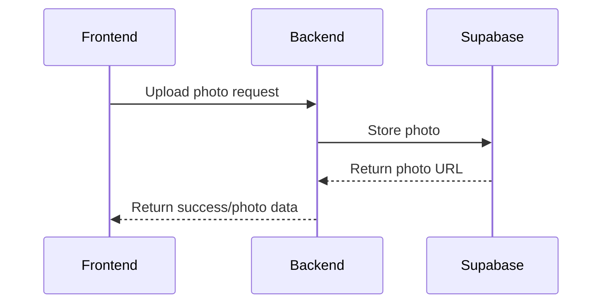

# Photo Evolution Implementation Plan

## Overview

This document outlines the implementation plan for the photo evolution feature in the SmartNutri frontend application. The feature will allow users to upload and manage 4 types of photos (front, back, left side, right side) for each patient assessment.

## 1. Backend Integration



### 1.1 Data Structure

```typescript
interface AssessmentPhoto {
  id: string;
  type: "front" | "back" | "left" | "right";
  url: string;
  assessmentId: string;
  createdAt: Date;
  updatedAt: Date;
}
```

## 2. Frontend Implementation Steps

### 2.1 Photo Upload Component

1. Create new component `PhotoUpload.tsx` in `src/components/`
   - Handle file selection
   - Show preview
   - Support drag & drop
   - Display upload progress
   - Show success/error states

### 2.2 Photo Grid Layout

1. Create `PhotoGrid.tsx` component to display:
   - 2x2 grid layout for the 4 photo types
   - Upload button/preview for each position
   - Labels for each photo type
   - Loading states
   - Error handling

### 2.3 Integration with NewAssessment Page

1. Update the "Evolução fotográfica" accordion section:
   - Add PhotoGrid component
   - Handle photo data in form state
   - Connect to save functionality
   - Update TypeScript types

### 2.4 Photo Preview Modal

1. Create `PhotoPreviewModal.tsx`:
   - Larger photo preview
   - Navigation between photos
   - Delete functionality
   - Zoom controls

## 3. Implementation Order

1. **Phase 1: Basic Structure**

   - Create PhotoUpload component
   - Implement file selection
   - Add basic styling
   - Setup TypeScript types

2. **Phase 2: Supabase Integration**

   - Configure upload to Supabase
   - Handle response data
   - Error handling
   - Progress tracking

3. **Phase 3: UI Enhancement**

   - Implement PhotoGrid layout
   - Add preview functionality
   - Style improvements
   - Loading states

4. **Phase 4: Feature Integration**
   - Connect to NewAssessment form
   - Update save functionality
   - Add validation
   - Testing

## 4. File Structure

```
src/
  components/
    PhotoUpload/
      index.tsx
      styles.ts
      types.ts
    PhotoGrid/
      index.tsx
      styles.ts
      types.ts
    PhotoPreviewModal/
      index.tsx
      styles.ts
      types.ts
  services/
    photoService.ts
  hooks/
    usePhotoUpload.ts
```

## 5. Technical Considerations

### 5.1 Photo Upload

- Max file size: 5MB
- Accepted formats: .jpg, .jpeg, .png
- Auto compression if needed
- Unique filename generation

### 5.2 Storage

- Supabase bucket structure:
  ```
  photos/
    {patientId}/
      {assessmentId}/
        front.jpg
        back.jpg
        left.jpg
        right.jpg
  ```

### 5.3 Security

- Validate file types
- Secure URL generation
- Access control via Supabase policies

### 5.4 Performance

- Image optimization
- Lazy loading
- Caching strategy

## 6. Error Handling

1. Upload errors
   - File size
   - Format
   - Network issues
2. Storage errors
   - Space limits
   - Permissions
3. User feedback
   - Clear error messages
   - Retry options
   - Fallback states

## 7. Testing Checklist

- [ ] File selection works
- [ ] Upload progress shows
- [ ] Preview displays correctly
- [ ] All 4 photo types can be uploaded
- [ ] Error states handled
- [ ] Integration with form works
- [ ] Supabase storage works
- [ ] Mobile responsiveness
- [ ] Accessibility compliance

## 8. Dependencies

- Material-UI (already in project)
- React Query (already in project)
- Supabase Client (already in project)

## 9. Next Steps

1. Review this implementation plan with the team
2. Set up Supabase storage configuration
3. Begin component development
4. Integration testing
5. User acceptance testing

## 10. Questions & Considerations

- Should we implement a photo editing/cropping feature?
- Do we need to store the original photo alongside a compressed version?
- Should we implement batch upload functionality?
- What are the specific photo quality requirements?
