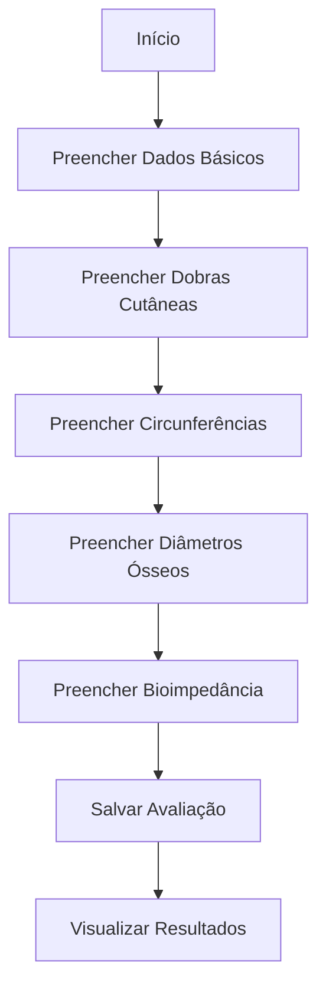
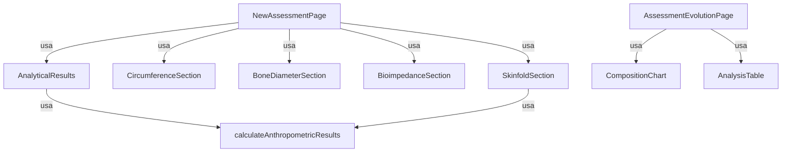

# Módulo de Avaliações (`src/modules/assessment`)

Este módulo centraliza toda a lógica, páginas, componentes e utilitários relacionados a avaliações antropométricas e evolução corporal dos pacientes.

---

## 📁 Estrutura do Módulo

```
src/modules/assessment/
├── pages/
│   ├── NewAssessment/                # Página de criação/edição de avaliação
│   │   └── NewAssessmentPage.tsx
│   ├── AssessmentEvolution/          # Página de evolução corporal
│   │   └── AssessmentEvolutionPage.tsx
│   └── AssessentsPage.tsx            # Listagem de avaliações do paciente
├── services/
│   └── assessmentService.ts          # Funções de API e tipos (se houver)
├── calcs/
│   └── anthropometricCalculations.ts # Funções utilitárias de cálculos antropométricos
├── components/                       # Componentes específicos do domínio (opcional)
```

---

## 🧩 Principais Componentes

- **Componentes de Seção**: Cada etapa do formulário de avaliação (dados básicos, dobras cutâneas, circunferências, etc) possui seu próprio componente em `pages/NewAssessment/components/`.
- **CompositionChart**: Gráfico de evolução corporal (usado em AssessmentEvolution).
- **AnalysisTable**: Tabela de análises detalhadas das avaliações.

---

## 🗂️ Serviços

- **assessmentService.ts** (se houver):  
  Funções de integração com a API de avaliações (CRUD, listagem, etc) e tipos TypeScript do domínio.

---

## 🖥️ Páginas

- **NewAssessmentPage.tsx**:  
  Página de criação/edição de avaliação antropométrica, multi-seção, com validação e cálculo automático.

- **AssessmentEvolutionPage.tsx**:  
  Página de evolução corporal do paciente, com gráficos e tabelas interativas.

- **AssessentsPage.tsx**:  
  Listagem de todas as avaliações do paciente, com ações de editar, excluir e visualizar evolução.

---

## 🛠️ Como usar/importar

Sempre utilize os **aliases** do projeto:

```ts
import { calculateAnthropometricResults } from "@modules/assessments/calcs/anthropometricCalculations";
import { AssessmentPhoto } from "@services/photoService";
```

Para componentes de seção:

```ts
import { SkinfoldSection } from "@modules/assessments/pages/NewAssessment/components/SkinfoldSection";
```

---

## 💡 Exemplos de Código

### 1. Uso de um serviço (buscando avaliações de um paciente)

```ts
import { assessmentService } from "@modules/assessments/services/assessmentService";

const { data: assessments } = useQuery({
  queryKey: ["assessments", patientId],
  queryFn: () => assessmentService.getByPatientId(patientId),
  enabled: !!patientId,
});
```

### 2. Uso de um componente de seção no formulário

```tsx
import { SkinfoldSection } from "@modules/assessments/pages/NewAssessment/components/SkinfoldSection";

<SkinfoldSection
  values={skinfolds}
  onChange={setSkinfolds}
  errors={formErrors}
/>;
```

### 3. Uso de cálculo antropométrico

```ts
import { calculateAnthropometricResults } from "@modules/assessments/calcs/anthropometricCalculations";

const results = calculateAnthropometricResults({
  gender: "F",
  age: 30,
  weight: 65,
  height: 165,
  skinfolds: {
    /* ... */
  },
  circumferences: {
    /* ... */
  },
  boneDiameters: {
    /* ... */
  },
  bioimpedance: {
    /* ... */
  },
  skinfoldFormula: "pollock3",
});
```

---

## 🔎 Diagrama de Fluxo - Nova Avaliação



---

## 🔎 Diagrama de Arquitetura do Módulo



---

## 🚦 Fluxos e Padrões

- **Criação/Edição**: Sempre via `NewAssessmentPage`, multi-seção, com validação e feedback.
- **Evolução**: Visualização gráfica e tabular da evolução corporal do paciente.
- **Cálculos**: Todos os cálculos antropométricos centralizados em `calcs/anthropometricCalculations.ts`.
- **Ações**: Editar, excluir e visualizar avaliações diretamente nas páginas do módulo.

---

## 🧑‍💻 Boas Práticas

- Use sempre os aliases para imports.
- Siga o padrão de nomenclatura de páginas e componentes.
- Componentes do módulo devem ser específicos do domínio de avaliações.
- Tipos e integrações de API ficam em `services/assessmentService.ts` (se houver).
- Atualize este README sempre que adicionar ou alterar funcionalidades relevantes.

---

## 📝 Checklist para contribuir

- [ ] Criei/editei arquivos dentro de `src/modules/assessments/`
- [ ] Usei aliases para todos os imports
- [ ] Segui o padrão de nomenclatura de páginas/componentes
- [ ] Testei o fluxo principal (criação, edição, evolução, exclusão)
- [ ] Atualizei este README se necessário

---

## 📚 Referências

- [Documentação geral do frontend](../../FRONTEND_DOCUMENTATION.md)
- [Material-UI](https://mui.com/)
- [React Query](https://react-query.tanstack.com/)
