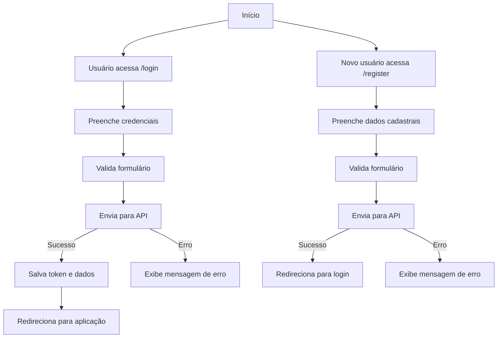
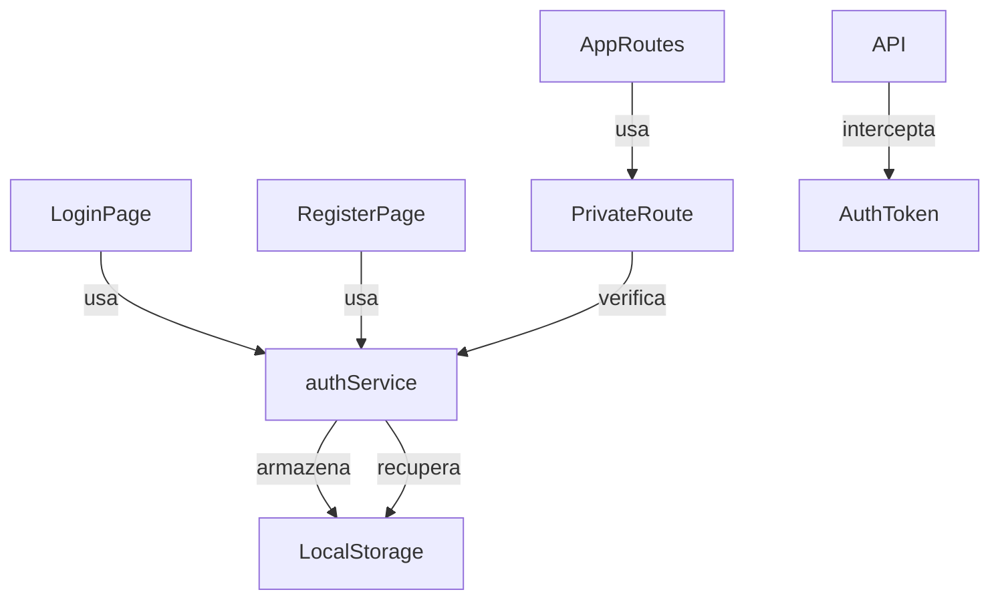

# Módulo de Autenticação (`src/modules/auth`)

Este módulo centraliza toda a lógica, páginas, serviços e funcionalidades relacionadas à autenticação e gerenciamento de usuários (nutricionistas) da aplicação.

---

## 📁 Estrutura do Módulo

```
src/modules/auth/
├── pages/
│   ├── Login/
│   │   └── LoginPage.tsx         # Página de login de usuários
│   └── Register/
│       └── RegisterPage.tsx      # Página de cadastro de nutricionistas
├── services/
│   └── authService.ts            # Funções de API e tipos para autenticação
```

---

## 🧩 Principais Componentes

- **LoginPage**: Página responsável por autenticar usuários existentes.
- **RegisterPage**: Página para cadastro de novos nutricionistas no sistema.
- **PrivateRoute** (em `src/components/`): Componente de rota protegida que verifica autenticação.

---

## 🗂️ Serviços

- **authService.ts**:  
  Funções de integração com a API de autenticação (login, registro, verificação), gerenciamento de tokens e informações do usuário local (localStorage).

---

## 🖥️ Páginas

- **LoginPage.tsx**:  
  Página de login com validação de formulário, tratamento de erros, e redirecionamento após autenticação bem-sucedida.

- **RegisterPage.tsx**:  
  Página de cadastro de novos nutricionistas com validação de formulário e integração com o serviço de registro.

---

## 🛠️ Como usar/importar

Sempre utilize os **aliases** do projeto:

```ts
import { authService } from "@modules/auth/services/authService";
```

Para acessar páginas do módulo:

```ts
import { Login } from "@modules/auth/pages/Login/LoginPage";
import { Register } from "@modules/auth/pages/Register/RegisterPage";
```

Para usar o componente de rota protegida:

```tsx
import { PrivateRoute } from "@components/PrivateRoute";

<PrivateRoute>
  <ComponenteProtegido />
</PrivateRoute>;
```

---

## 💡 Exemplos de Código

### 1. Verificar se o usuário está autenticado

```ts
import { authService } from "@modules/auth/services/authService";

const isLoggedIn = authService.isAuthenticated();
if (!isLoggedIn) {
  // Redirecionar para login
  navigate("/login");
}
```

### 2. Obter informações do usuário logado

```ts
import { authService } from "@modules/auth/services/authService";

const currentUser = authService.getUser();
if (currentUser) {
  console.log(`Usuário logado: ${currentUser.name}`);
}
```

### 3. Efetuar logout do usuário

```ts
import { authService } from "@modules/auth/services/authService";

const handleLogout = () => {
  authService.logout();
  // O redirecionamento para a página de login é automático
};
```

### 4. Criação de login com validação de formulário

```tsx
// Validação de formulário
const validateForm = (): boolean => {
  const errors: Partial<LoginCredentials> = {};
  let isValid = true;

  if (!credentials.email) {
    errors.email = "Email é obrigatório";
    isValid = false;
  } else if (!/\S+@\S+\.\S+/.test(credentials.email)) {
    errors.email = "Email inválido";
    isValid = false;
  }

  if (!credentials.password) {
    errors.password = "Senha é obrigatória";
    isValid = false;
  } else if (credentials.password.length < 6) {
    errors.password = "Senha deve ter no mínimo 6 caracteres";
    isValid = false;
  }

  setFormErrors(errors);
  return isValid;
};

// Envio do formulário
const handleSubmit = async (e: React.FormEvent) => {
  e.preventDefault();
  if (!validateForm()) return;

  try {
    const response = await authService.login(credentials);
    // Armazenar token e dados do usuário
    localStorage.setItem("@smartnutri:token", response.access_token);
    localStorage.setItem(
      "@smartnutri:user",
      JSON.stringify(response.nutritionist)
    );
    navigate("/");
  } catch (err) {
    // Tratar erro
  }
};
```

---

## 🔎 Diagrama de Fluxo - Autenticação



---

## 🔎 Diagrama de Arquitetura do Módulo



---

## 🚦 Fluxos e Padrões

- **Autenticação**: Login via email/senha, armazenamento de token JWT.
- **Registro**: Cadastro de novos nutricionistas com validação de dados.
- **Proteção de Rotas**: Componente `PrivateRoute` para proteger rotas que requerem autenticação.
- **Token**: Interceptor de requisições adiciona automaticamente o token em todas as chamadas de API.
- **Persistência**: Token e dados do usuário armazenados em localStorage.
- **Logout**: Remove dados da sessão e redireciona para a página de login.

---

## 🧑‍💻 Boas Práticas

- Use sempre os aliases para imports.
- Siga o padrão de nomenclatura de páginas e componentes.
- Não armazene informações sensíveis além do token JWT no localStorage.
- Implemente validação de formulários tanto no cliente quanto no servidor.
- Sempre trate os erros de autenticação adequadamente.
- Utilize o Axios Interceptor para incluir o token em todas as requisições.
- Mantenha a lógica de autenticação centralizada no authService.

---

## 📝 Checklist para contribuir

- [ ] Criei/editei arquivos dentro de `src/modules/auth/`
- [ ] Usei aliases para todos os imports
- [ ] Segui o padrão de nomenclatura de páginas/componentes
- [ ] Testei o fluxo principal (login, registro, proteção de rotas)
- [ ] Atualizei este README se necessário

---

## 📚 Referências

- [Documentação geral do frontend](../../FRONTEND_DOCUMENTATION.md)
- [Material-UI](https://mui.com/)
- [React Router](https://reactrouter.com/)
- [JWT (JSON Web Tokens)](https://jwt.io/)
