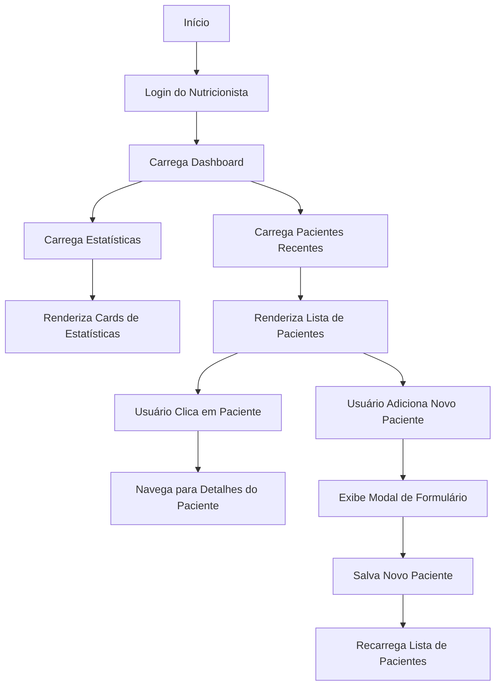
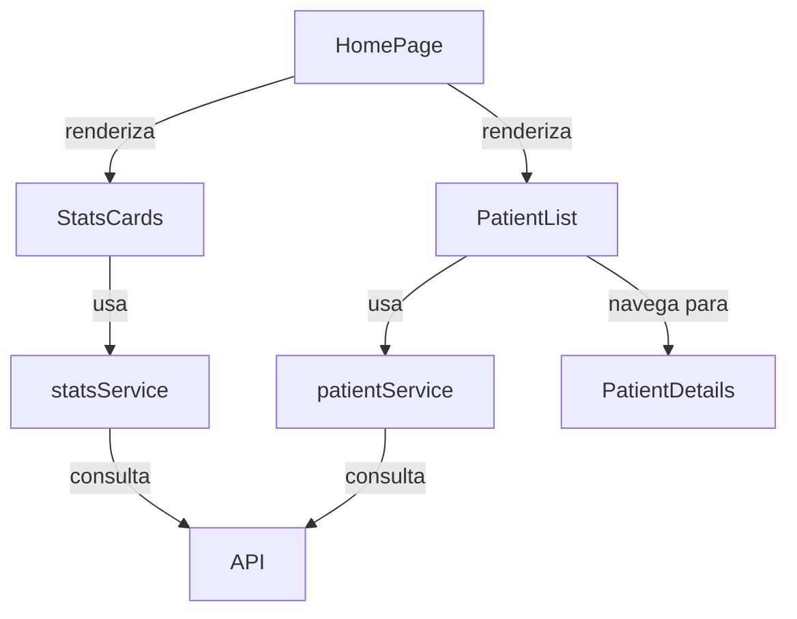

# Módulo Home (`src/modules/home`)

Este módulo centraliza a página principal da aplicação, responsável por exibir o dashboard com estatísticas gerais e informações resumidas para o nutricionista logado.

---

## 📁 Estrutura do Módulo

```
src/modules/home/
├── pages/
│   └── HomePage.tsx             # Página principal de dashboard
└── services/                    # Diretório para serviços (atualmente vazio)
```

O módulo também utiliza componentes externos importantes:

```
src/components/
├── StatsCards.tsx               # Cards de estatísticas do dashboard
└── RecentPatients.tsx           # Lista de pacientes recentes
```

---

## 🧩 Principais Componentes

- **HomePage**: Página principal do dashboard, que exibe visão geral da aplicação.
- **StatsCards** (em `src/components/`): Exibe cartões com estatísticas sobre pacientes, planos alimentares, avaliações e documentos.
- **PatientList** (em `src/components/RecentPatients.tsx`): Exibe lista dos pacientes mais recentemente atualizados.

---

## 🗂️ Serviços

- **statsService** (em `src/components/StatsCards.tsx`):  
  Funções de integração com a API para obter estatísticas gerais da conta do nutricionista.

---

## 🖥️ Páginas

- **HomePage.tsx**:  
  Página principal do dashboard, que integra os diferentes componentes (estatísticas e lista de pacientes recentes) e fornece o layout inicial da aplicação.

---

## 🛠️ Como usar/importar

Sempre utilize os **aliases** do projeto:

```ts
import { Home } from "@modules/home/pages/HomePage";
```

Para componentes utilizados no dashboard:

```ts
import { StatsCards } from "@components/StatsCards";
import { PatientList } from "@components/RecentPatients";
```

---

## 💡 Exemplos de Código

### 1. Importação da página Home no sistema de rotas

```tsx
import { Home } from "@modules/home/pages/HomePage";

const router = createBrowserRouter([
  {
    path: "/",
    element: (
      <PrivateRoute>
        <Layout />
      </PrivateRoute>
    ),
    children: [
      {
        index: true,
        element: <Home />,
      },
      // outras rotas...
    ],
  },
]);
```

### 2. Uso do serviço de estatísticas

```tsx
// De dentro do componente StatsCards
const { data: stats, isLoading } = useQuery({
  queryKey: ["stats"],
  queryFn: statsService.getStats,
});

// Exibindo uma estatística específica
<Typography variant="h4" component="div">
  {stats?.totalPatients.toLocaleString()}
</Typography>;
```

### 3. Exibição condicional baseada em dados

```tsx
// De dentro do componente PatientList
{
  filteredPatients.length === 0 ? (
    <EmptyState /> // Componente para quando não há pacientes
  ) : (
    <List>
      {filteredPatients.map((patient) => (
        <ListItem
          key={patient.id}
          component="div"
          onClick={() => navigate(`/patient/${patient.id}`)}
          // Outros props...
        >
          {/* Conteúdo do item */}
        </ListItem>
      ))}
    </List>
  );
}
```

---

## 🔎 Diagrama de Fluxo - Navegação no Dashboard



---

## 🔎 Diagrama de Arquitetura do Módulo



---

## 🚦 Fluxos e Padrões

- **Dashboard**: Página inicial após login, exibe visão consolidada dos dados.
- **Estatísticas**: Cards com totalizadores e percentuais de crescimento.
- **Pacientes Recentes**: Lista de pacientes ordenados por data de atualização.
- **Navegação**: Permite acessar detalhes de pacientes ou a lista completa.
- **Criação Rápida**: Permite adicionar novos pacientes diretamente do dashboard.

---

## 🧑‍💻 Boas Práticas

- Use sempre os aliases para imports.
- Siga o padrão de nomenclatura de páginas e componentes.
- Mantenha os componentes do dashboard o mais leves possível para carregamento rápido.
- Use React Query para gerenciamento de estado e cache dos dados das APIs.
- Implemente estados de carregamento (skeletons) e estados vazios para melhor UX.
- Considere implementar prefetch de dados comuns para melhorar a experiência inicial.

---

## 📝 Checklist para contribuir

- [ ] Criei/editei arquivos dentro de `src/modules/home/`
- [ ] Usei aliases para todos os imports
- [ ] Segui o padrão de nomenclatura de páginas/componentes
- [ ] Testei o fluxo principal (carregamento do dashboard, navegação)
- [ ] Atualizei este README se necessário

---

## 📚 Referências

- [Documentação geral do frontend](../../FRONTEND_DOCUMENTATION.md)
- [Material-UI](https://mui.com/)
- [React Query](https://react-query.tanstack.com/)
- [React Router](https://reactrouter.com/)
