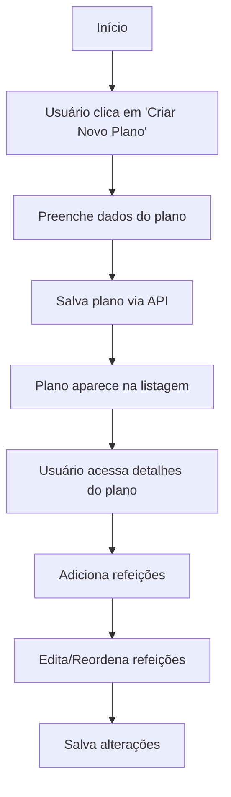
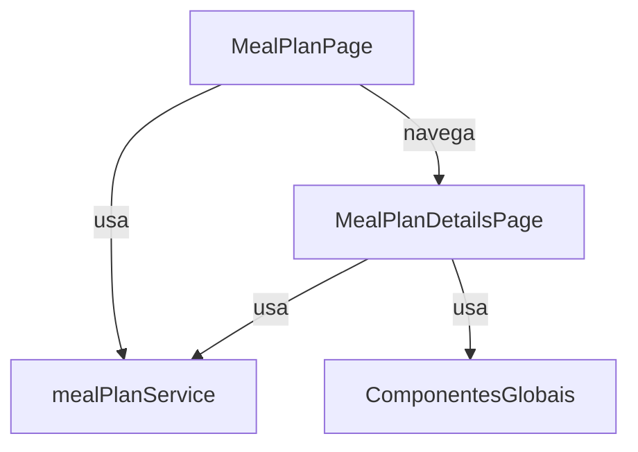

# Módulo de Planos Alimentares (`src/modules/meal-plan`)

Este módulo centraliza toda a lógica, páginas, componentes e integrações relacionadas à criação, edição e visualização de planos alimentares dos pacientes.

---

## 📁 Estrutura do Módulo

```
src/modules/meal-plan/
├── pages/
│   ├── MealPlanPage.tsx                  # Página de listagem e criação de planos alimentares
│   └── MealPlanDetails/
│       └── MealPlanDetailsPage.tsx       # Página de detalhes e edição de um plano alimentar
├── services/
│   └── mealPlanService.ts                # Funções de API e tipos de planos alimentares
```

---

## 🧩 Principais Componentes

- **MealPlanPage**: Página principal para listar, criar e excluir planos alimentares de um paciente.
- **MealPlanDetailsPage**: Página para visualizar, editar e gerenciar refeições de um plano alimentar.
- **Componentes de UI**: Utiliza componentes globais (ex: botões, diálogos) de `src/components`.

---

## 🗂️ Serviços

- **mealPlanService.ts**:  
  Funções de integração com a API de planos alimentares (CRUD, adicionar/remover refeições, etc) e tipos TypeScript do domínio.

---

## 🖥️ Páginas

- **MealPlanPage.tsx**:  
  Página de listagem, criação e exclusão de planos alimentares. Permite criar novos planos, visualizar detalhes e remover planos existentes.

- **MealPlanDetailsPage.tsx**:  
  Página de detalhes de um plano alimentar, permite adicionar, editar, excluir e reordenar refeições.

---

## 🛠️ Como usar/importar

Sempre utilize os **aliases** do projeto:

```ts
import { mealPlanService } from "@services/mealPlanService";
```

Para acessar páginas do módulo:

```ts
import { MealPlan } from "@modules/meal-plan/pages/MealPlanPage";
```

---

## 💡 Exemplos de Código

### 1. Buscar planos alimentares de um paciente

```ts
import { mealPlanService } from "@services/mealPlanService";

const { data: mealPlans } = useQuery({
  queryKey: ["mealPlans", patientId],
  queryFn: () => mealPlanService.getPatientPlans(patientId),
  enabled: !!patientId,
});
```

### 2. Criar um novo plano alimentar

```ts
createPlanMutation.mutate({
  name: "Plano personalizado",
  type: "alimentos",
  patientId,
  status: "draft",
  startDate: "2024-06-01",
  endDate: "2024-06-30",
  meals: [],
});
```

### 3. Adicionar uma nova refeição ao plano

```ts
addMealMutation.mutate({
  name: "Café da manhã",
  time: "07:00",
  notes: "",
  mealFoods: [],
});
```

---

## 🔎 Diagrama de Fluxo - Criação de Plano Alimentar



---

## 🔎 Diagrama de Arquitetura do Módulo



---

## 🚦 Fluxos e Padrões

- **Criação/Edição**: Sempre via páginas do módulo, com formulários e feedback visual.
- **Refeições**: Adição, edição, exclusão e reordenação de refeições diretamente na página de detalhes.
- **Atualização instantânea**: Após qualquer alteração, a lista e os detalhes são atualizados automaticamente via React Query.
- **Ações**: Todas as ações (criar, editar, excluir) são acessíveis via botões e menus contextuais.

---

## 🧑‍💻 Boas Práticas

- Use sempre os aliases para imports.
- Siga o padrão de nomenclatura de páginas e componentes.
- Componentes do módulo devem ser específicos do domínio de planos alimentares.
- Tipos e integrações de API ficam em `services/mealPlanService.ts`.
- Atualize este README sempre que adicionar ou alterar funcionalidades relevantes.

---

## 📝 Checklist para contribuir

- [ ] Criei/editei arquivos dentro de `src/modules/meal-plan/`
- [ ] Usei aliases para todos os imports
- [ ] Segui o padrão de nomenclatura de páginas/componentes
- [ ] Testei o fluxo principal (criação, edição, exclusão, adição de refeições)
- [ ] Atualizei este README se necessário

---

## 📚 Referências

- [Documentação geral do frontend](../../FRONTEND_DOCUMENTATION.md)
- [Material-UI](https://mui.com/)
- [React Query](https://react-query.tanstack.com/)
