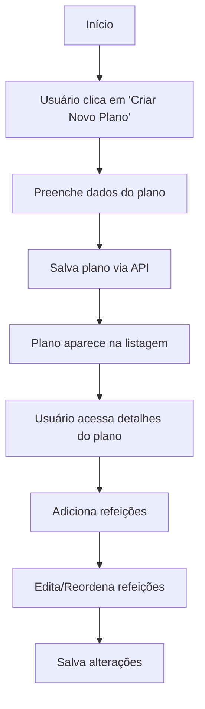
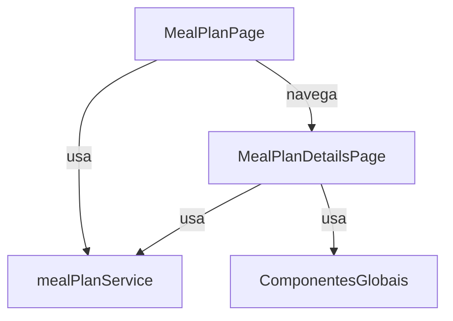

# Módulo de Planos Alimentares (`src/modules/meal-plan`)

Este módulo centraliza toda a lógica, páginas, componentes e integrações relacionadas à criação, edição e visualização de planos alimentares dos pacientes.

---

## 📁 Estrutura do Módulo

```
src/modules/meal-plan/
├── pages/
│   ├── MealPlanPage.tsx                  # Página de listagem e criação de planos alimentares
│   └── MealPlanDetails/
│       └── MealPlanDetailsPage.tsx       # Página de detalhes e edição de um plano alimentar
├── components/
│   ├── AddFoodToMealModal.tsx            # Modal para adicionar alimentos a uma refeição
│   ├── MealCard.tsx                      # Card de refeição com controle de inclusão nos cálculos
│   ├── MealPlan.tsx                      # Componente principal do plano alimentar
│   └── MealPlanButton.tsx                # Botão de ação para planos alimentares
├── services/
│   └── mealPlanService.ts                # Funções de API e tipos de planos alimentares
```

---

## 🧩 Principais Componentes

- **MealPlanPage**: Página principal para listar, criar e excluir planos alimentares de um paciente.
- **MealPlanDetailsPage**: Página para visualizar, editar e gerenciar refeições de um plano alimentar.
- **MealCard**: Componente que representa uma refeição individual, com controles para:
  - Expandir/recolher detalhes da refeição
  - Ativar/desativar inclusão nos cálculos nutricionais
  - Adicionar/editar alimentos
  - Acessar menu de ações
- **AddFoodToMealModal**: Modal centralizado para busca, seleção e prescrição de alimentos em uma refeição. Toda a lógica de busca, seleção, análise de nutrientes e observações está encapsulada neste componente, que é utilizado pelo `MealPlanDetailsPage`.
- **Componentes de UI**: Utiliza componentes globais (ex: botões, diálogos) de `src/components`.

---

## 🔎 Busca e Prescrição de Alimentos

A busca e prescrição de alimentos neste módulo utiliza um fluxo totalmente local, baseado em um arquivo `alimentos.json` hospedado no Supabase Storage. O processo é o seguinte:

- O serviço [`foodDbService.ts`](../../../services/foodDbService.ts) faz o download do arquivo JSON do Supabase Storage, usando as variáveis de ambiente do projeto.
- O hook [`useFoodDb`](../../../services/useFoodDb.ts) utiliza o React Query para fazer preload e cache do arquivo de alimentos, evitando múltiplos downloads e melhorando a performance.
- O componente [`AddFoodToMealModal.tsx`](components/AddFoodToMealModal.tsx) utiliza o hook `useFoodDb` para acessar a base de alimentos e faz a busca local usando os utilitários do [`foodService.ts`](../../../services/foodService.ts).
- O filtro de alimentos é feito localmente, sem chamadas à API, considerando acentuação e caixa (case/diacrítico insensitive) e priorizando resultados mais relevantes.

**Como atualizar a base de alimentos:**

- Basta substituir o arquivo `alimentos.json` no Supabase Storage (bucket `alimentos`). Não é necessário deploy do frontend.

**Quando o preload ocorre:**

- O preload do arquivo é feito automaticamente ao abrir o modal de prescrição de alimentos (`AddFoodToMealModal`), aproveitando o cache do React Query.

**Resumo dos arquivos envolvidos:**

- `src/services/foodDbService.ts` → Download do JSON do Supabase
- `src/services/useFoodDb.ts` → Hook de preload/cache com React Query
- `src/services/foodService.ts` → Busca local e utilitários de alimentos
- `src/modules/meal-plan/components/AddFoodToMealModal.tsx` → Modal de busca e prescrição

> **Importante:**
>
> - Não há mais busca de alimentos via API REST. Todo o filtro é feito localmente, após o download do arquivo.
> - Para garantir performance, sempre utilize o hook `useFoodDb` para acessar a base de alimentos nas telas/modais.

Para mais detalhes, consulte também a seção "Busca de Alimentos (Food Database)" na [documentação geral do frontend](../../FRONTEND_DOCUMENTATION.md).

---

## 🧩 Novo componente: NutrientAnalysis

- **NutrientAnalysis.tsx**: Componente visual para análise de nutrientes de uma refeição. Exibe lista de macronutrientes, barra de densidade calórica, classificação visual e gráfico de pizza para distribuição calórica dos macros. Utiliza Material-UI e Recharts para visualização. Recebe as props:
  - `protein: number`
  - `fat: number`
  - `carbohydrates: number`
  - `calories: number`
  - `totalWeight: number`

> **Uso:**
> Integrado ao `AddFoodToMealModal` para exibir a análise nutricional da refeição conforme alimentos prescritos.

---

## 🧩 Componente MealCard

O componente `MealCard` é responsável por exibir e gerenciar uma refeição individual dentro do plano alimentar. Suas principais características incluem:

### Visual e Interação

- Borda direita colorida indicando status de inclusão nos cálculos:
  - Cor de destaque quando ativo
  - Cinza quando inativo
- Cabeçalho com:
  - Ícone de expansão
  - Horário da refeição
  - Nome da refeição
  - Badge com quantidade de alimentos
  - Switch para controle de inclusão nos cálculos
  - Menu de ações

### Funcionalidades

- **Controle de Cálculos**: Switch com tooltip explicativo:
  - Ativo: "Esta refeição está incluída nos cálculos. Clique para remover."
  - Inativo: "Esta refeição não está incluída nos cálculos. Clique para incluir."
- **Expansão**: Mostra detalhes da refeição:
  - Lista de alimentos
  - Resumo nutricional
  - Notas da refeição
- **Ações**:
  - Adicionar/editar alimentos
  - Reordenar refeições
  - Excluir refeição

### Props

```typescript
interface MealCardProps {
  meal: Meal;
  foodDb: Alimento[];
  expanded: boolean;
  onExpand: (mealId: string) => void;
  onAddFood: (mealId: string) => void;
  onOpenMenu: (event: React.MouseEvent<HTMLElement>, mealId: string) => void;
  onToggleCalculation: (mealId: string, isActive: boolean) => void;
  renderFoodItem: (mealFood: MealFood) => React.ReactNode;
}
```

---

## 🗂️ Serviços

- **mealPlanService.ts**:  
  Funções de integração com a API de planos alimentares (CRUD, adicionar/remover refeições, etc) e tipos TypeScript do domínio.

---

## 🖥️ Páginas

- **MealPlanPage.tsx**:  
  Página de listagem, criação e exclusão de planos alimentares. Permite criar novos planos, visualizar detalhes e remover planos existentes.

- **MealPlanDetailsPage.tsx**:  
  Página de detalhes de um plano alimentar, permite adicionar, editar, excluir e reordenar refeições.

---

## 🛠️ Como usar/importar

Sempre utilize os **aliases** do projeto:

```ts
import { mealPlanService } from "@services/mealPlanService";
import AddFoodToMealModal from "@/modules/meal-plan/components/AddFoodToMealModal";
```

Para acessar páginas do módulo:

```ts
import { MealPlan } from "@modules/meal-plan/pages/MealPlanPage";
```

---

## 💡 Exemplos de Código

### 1. Buscar planos alimentares de um paciente

```ts
import { mealPlanService } from "@services/mealPlanService";

const { data: mealPlans } = useQuery({
  queryKey: ["mealPlans", patientId],
  queryFn: () => mealPlanService.getPatientPlans(patientId),
  enabled: !!patientId,
});
```

### 2. Criar um novo plano alimentar

```ts
createPlanMutation.mutate({
  name: "Plano personalizado",
  type: "alimentos",
  patientId,
  status: "draft",
  startDate: "2024-06-01",
  endDate: "2024-06-30",
  meals: [],
});
```

### 3. Adicionar uma nova refeição ao plano

```ts
addMealMutation.mutate({
  name: "Café da manhã",
  time: "07:00",
  notes: "",
  mealFoods: [],
});
```

### 4. Adicionar alimentos a uma refeição (via modal)

```tsx
<AddFoodToMealModal
  open={openAddFoodModal}
  onClose={() => setOpenAddFoodModal(false)}
  mealName={selectedMealName}
/>
```

---

## 🔎 Diagrama de Fluxo - Criação de Plano Alimentar



---

## 🔎 Diagrama de Arquitetura do Módulo



---

## 🚦 Fluxos e Padrões

- **Criação/Edição**: Sempre via páginas do módulo, com formulários e feedback visual.
- **Refeições**: Adição, edição, exclusão e reordenação de refeições diretamente na página de detalhes.
- **Prescrição de alimentos**: Utilizar o modal `AddFoodToMealModal` para busca, seleção e análise de alimentos antes de prescrever.
- **Atualização instantânea**: Após qualquer alteração, a lista e os detalhes são atualizados automaticamente via React Query.
- **Ações**: Todas as ações (criar, editar, excluir) são acessíveis via botões e menus contextuais.

---

## 🧑‍💻 Boas Práticas

- Use sempre os aliases para imports.
- Siga o padrão de nomenclatura de páginas e componentes.
- Componentes do módulo devem ser específicos do domínio de planos alimentares.
- Tipos e integrações de API ficam em `services/mealPlanService.ts`.
- Atualize este README sempre que adicionar ou alterar funcionalidades relevantes.

---

## 📝 Checklist para contribuir

- [ ] Criei/editei arquivos dentro de `src/modules/meal-plan/`
- [ ] Usei aliases para todos os imports
- [ ] Segui o padrão de nomenclatura de páginas/componentes
- [ ] Testei o fluxo principal (criação, edição, exclusão, adição de refeições e prescrição de alimentos)
- [ ] Atualizei este README se necessário

---

## 📚 Referências

- [Documentação geral do frontend](../../FRONTEND_DOCUMENTATION.md)
- [Material-UI](https://mui.com/)
- [React Query](https://react-query.tanstack.com/)

---

## ℹ️ Observação sobre o campo de quantidade

O campo de quantidade do alimento (na tabela de prescrição) foi ajustado para suportar valores maiores sem quebrar o layout, aumentando sua largura. A unidade ao lado do input foi removida, pois a medida caseira já indica a unidade de referência, evitando redundância visual.

**Atualização 2024-06:**
A coluna de quantidade na tabela de alimentos prescritos agora exibe apenas um texto (não editável), semelhante às colunas de proteína, lipídios, carboidratos e calorias. O valor exibido corresponde à quantidade calculada para a medida caseira selecionada, sem campo de input.

**Atualização 2024-06:**
A coluna "Medida caseira" agora permite edição direta: possui dois campos de input, um para o valor (peso) e outro para a unidade (ex: "unidade", "gramas", "colher"). O usuário pode ajustar ambos conforme necessário para cada alimento prescrito.

---

## 🆕 Padrão de Input Numérico para Quantidade de Alimento

- O campo de quantidade no componente `PrescribedFoodItem` agora utiliza um `<TextField type="number" step="any" min="0.01" />` com `InputAdornment` à direita exibindo a unidade (ex: "g", "unid.").
- Permite casas decimais e valores pequenos sem quebrar o layout.
- O adornment é dinâmico conforme a unidade selecionada.
- Padrão visual segue o Material-UI, mantendo responsividade e alinhamento.

## Integração de Alimentos Externos

- O frontend utiliza uma base local de alimentos (ex: TACO, TBCA) com IDs próprios.
- Ao prescrever um alimento, o frontend envia:
  - `foodId`: o ID da base local
  - `source`: a origem do alimento (ex: `"taco"`, `"tbca"`, `"personalizado"`), proveniente do campo `origem` do objeto Alimento. Se não houver, usar fallback `"taco"`.
- Para alimentos personalizados, o frontend gera um novo ID (ex: UUID) e define `source: "personalizado"`.
- O frontend não precisa se preocupar com UUIDs do backend para alimentos de base externa.
- O modal de prescrição de alimentos deve garantir que sempre envia o campo `source` no payload.

### Exemplo de payload enviado ao backend

```json
{
  "mealFoods": [
    {
      "foodId": "3344",
      "source": "taco",
      "amount": 80,
      "unit": "Pedaço(s) médio(s)"
    },
    {
      "foodId": "uuid-personalizado-123",
      "source": "personalizado",
      "amount": 100,
      "unit": "g"
    }
  ]
}
```

1. Fluxo de Criação de Plano Alimentar
   Início do Fluxo
   O nutricionista acessa a página MealPlanPage.tsx
   Clica no botão "Criar Novo Plano"
   Preenche os dados básicos do plano:
   Nome do plano
   Tipo (alimentos)
   Data de início
   Data de término
   Status (rascunho)
   Salvamento do Plano
   Os dados são enviados via mealPlanService.ts para a API
   O plano é salvo e aparece na listagem principal
   Utiliza React Query para gerenciar o cache e atualizações
2. Fluxo de Gerenciamento de Refeições
   Acesso aos Detalhes
   Nutricionista clica em um plano na listagem
   É redirecionado para MealPlanDetailsPage.tsx
   Adição de Refeições
   Pode adicionar novas refeições com:
   Nome da refeição
   Horário
   Observações
   As refeições são salvas via API através do mealPlanService.ts
   Edição de Refeições
   Pode reordenar refeições
   Editar detalhes existentes
   Excluir refeições
3. Fluxo de Prescrição de Alimentos
   Acesso à Base de Alimentos
   A base de alimentos é local, armazenada em alimentos.json no Supabase Storage
   O arquivo é baixado via foodDbService.ts
   Utiliza o hook useFoodDb para cache e performance
   Busca de Alimentos
   Nutricionista abre o AddFoodToMealModal
   A busca é feita localmente usando foodService.ts
   Filtragem considera:
   Acentuação
   Case insensitive
   Priorização de resultados relevantes
   Prescrição do Alimento
   Ao selecionar um alimento, o nutricionista:
   Define a quantidade
   Seleciona a medida caseira
   Pode adicionar observações
   O alimento é adicionado à refeição com:
   ID do alimento
   Fonte (taco, tbca, personalizado)
   Quantidade
   Unidade
   Análise Nutricional
   O componente NutrientAnalysis mostra:
   Macronutrientes
   Densidade calórica
   Classificação visual
   Gráfico de distribuição calórica
4. Fluxo de Atualização da Base de Alimentos
   Processo de Atualização
   A base é atualizada substituindo o arquivo alimentos.json no Supabase Storage
   Não requer deploy do frontend
   O cache é atualizado automaticamente via React Query
5. Fluxo de Dados e Integração
   Comunicação com Backend
   Todas as operações CRUD usam o mealPlanService.ts
   Dados são enviados em formato JSON
   Exemplo de payload para alimentos:
   Apply
   }
   Cache e Performance
   React Query gerencia o cache de:
   Planos alimentares
   Base de alimentos
   Detalhes do plano
   Atualizações são automáticas após mutações
6. Fluxo de Interface do Usuário
   Componentes Principais
   MealPlanPage: Listagem e criação
   MealPlanDetailsPage: Detalhes e edição
   AddFoodToMealModal: Prescrição de alimentos
   NutrientAnalysis: Análise nutricional
   Interações
   Botões de ação para todas as operações
   Menus contextuais para ações secundárias
   Feedback visual imediato após operações
   Campos numéricos com validação e formatação
