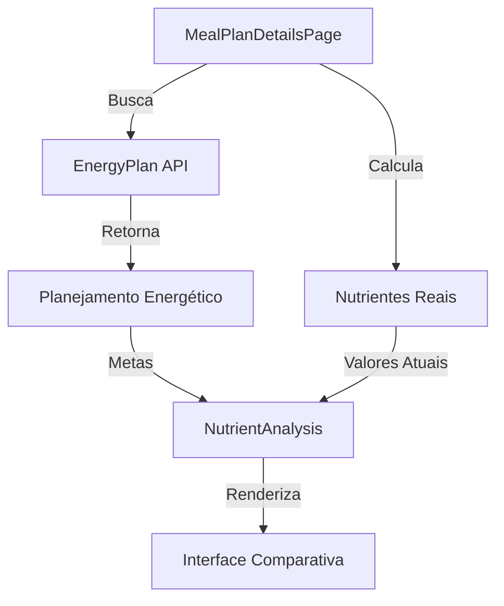

# Integração do Planejamento Energético com Análise de Nutrientes

## 📋 Visão Geral

Transformar a seção "Análise de Nutrientes" em um "Painel Comparativo: Plano Alimentar vs. Metas Energéticas", permitindo uma comparação visual e numérica clara entre os nutrientes calculados para o Plano Alimentar prescrito e as metas definidas no Plano Energético do paciente.

## 🎯 Objetivos

1. Comparar calorias totais do plano com GET do planejamento
2. Comparar distribuição de macronutrientes com metas
3. Fornecer feedback visual da aderência às metas
4. Manter interface intuitiva e informativa
5. Facilitar ajustes finos no plano alimentar para atingir objetivos nutricionais

## 📦 Dependências

- `@tanstack/react-query` para busca de dados
- `recharts` para visualizações
- `@mui/material` para componentes UI
- Serviço de planejamento energético

## 🔄 Fluxo de Dados



## 📊 Origem dos Dados

### Plano Alimentar (Prescrito)

- `calorias_prescritas_total`: Soma das calorias de todos os alimentos/refeições
- `proteinas_prescritas_g`: Soma das gramas de proteínas
- `carboidratos_prescritos_g`: Soma das gramas de carboidratos
- `lipidios_prescritos_g`: Soma das gramas de lipídios
- `proteinas_prescritas_vet_perc`: (proteinas*prescritas_g * 4) / calorias*prescritas_total * 100
- `carboidratos_prescritos_vet_perc`: (carboidratos*prescritos_g * 4) / calorias*prescritas_total * 100
- `lipidios_prescritos_vet_perc`: (lipidios*prescritos_g * 9) / calorias*prescritas_total * 100
- `densidade_calorica`: calorias_prescritas_total / peso_total_alimentos_g

### Plano Energético (Metas)

- `meta_calorica_get`: Gasto Energético Total (GET) calculado
- `meta_proteinas_perc`: Percentual de proteínas definido para o VET
- `meta_carboidratos_perc`: Percentual de carboidratos definido para o VET
- `meta_lipidios_perc`: Percentual de lipídios definido para o VET
- `meta_proteinas_g`: (meta_proteinas_perc / 100) \* meta_calorica_get / 4
- `meta_carboidratos_g`: (meta_carboidratos_perc / 100) \* meta_calorica_get / 4
- `meta_lipidios_g`: (meta_lipidios_perc / 100) \* meta_calorica_get / 9

## 📝 Etapas de Implementação

### 1. Preparação e Estrutura Base

1. **Criar Hook de Planejamento Energético**

   ```typescript
   // hooks/useEnergyPlan.ts
   export const useEnergyPlan = (patientId: string) => {
     return useQuery({
       queryKey: ["energyPlan", patientId],
       queryFn: () => energyPlanService.getLatestByPatient(patientId),
       enabled: !!patientId,
     });
   };
   ```

2. **Atualizar Interface do NutrientAnalysis**

   ```typescript
   interface NutrientAnalysisProps {
     // Props existentes
     protein: number;
     fat: number;
     carbohydrates: number;
     calories: number;
     totalWeight: number;

     // Novas props
     targetCalories?: number;
     targetProtein?: number;
     targetFat?: number;
     targetCarbohydrates?: number;
     tmb?: number;

     // Novas props para percentuais
     targetProteinPercentage?: number;
     targetFatPercentage?: number;
     targetCarbohydratesPercentage?: number;
   }
   ```

### 2. Implementação da Lógica de Comparação

1. **Criar Utilitários de Cálculo**

   ```typescript
   // utils/nutrientComparison.ts
   export const calculateMacronutrientTargets = (getKcal: number) => ({
     protein: (getKcal * 0.25) / 4,
     fat: (getKcal * 0.3) / 9,
     carbohydrates: (getKcal * 0.45) / 4,
   });

   export const calculateAdherence = (current: number, target: number) => {
     const difference = ((current - target) / target) * 100;
     return {
       percentage: difference,
       status: difference > 5 ? "above" : difference < -5 ? "below" : "within",
     };
   };

   export const getAdherenceColor = (difference: number) => {
     if (Math.abs(difference) <= 5) return "success";
     if (Math.abs(difference) <= 10) return "warning";
     return "error";
   };
   ```

### 3. Componentes Visuais

1. **Card: Resumo Calórico**

   ```typescript
   const CalorieSummaryCard = ({ current, target }) => {
     const difference = current - target;
     const percentage = (current / target) * 100;
     const adherenceColor = getAdherenceColor(difference);

     return (
       <Box>
         <Typography variant="h6">Balanço Calórico Total</Typography>
         <Stack spacing={1}>
           <Typography>Calorias Prescritas: {current} Kcal</Typography>
           <Typography>Meta Calórica (GET): {target} Kcal</Typography>
           <Typography color={adherenceColor}>
             Diferença: {difference > 0 ? "+" : ""}
             {difference} Kcal
           </Typography>
           <LinearProgress
             variant="determinate"
             value={Math.min(percentage, 100)}
             color={adherenceColor}
           />
           <Typography>{percentage.toFixed(1)}% da meta</Typography>
         </Stack>
       </Box>
     );
   };
   ```

2. **Card: Comparativo de Macronutrientes**

   ```typescript
   const MacronutrientComparisonCard = ({
     current,
     target,
     label,
     unit = "g",
     referenceRanges,
   }) => {
     const adherence = calculateAdherence(current, target);

     return (
       <Box>
         <Typography variant="subtitle1">{label}</Typography>
         <Stack spacing={1}>
           <Typography>
             Prescrito: {current}
             {unit} / Meta: {target}
             {unit}
           </Typography>
           <Box sx={{ position: "relative", height: 24 }}>
             {/* Bullet Graph */}
             <Box
               sx={{
                 position: "absolute",
                 left: 0,
                 top: 0,
                 height: "100%",
                 width: `${(current / target) * 100}%`,
                 bgcolor: getAdherenceColor(adherence.percentage),
               }}
             />
             {/* Target Line */}
             <Box
               sx={{
                 position: "absolute",
                 left: `${(target / target) * 100}%`,
                 top: 0,
                 height: "100%",
                 width: 2,
                 bgcolor: "primary.main",
               }}
             />
           </Box>
         </Stack>
       </Box>
     );
   };
   ```

3. **Card: Distribuição Percentual**

   ```typescript
   const MacronutrientDistributionCard = ({ current, target, label }) => {
     const difference = current - target;
     const adherenceColor = getAdherenceColor(difference);

     return (
       <Box>
         <Typography>
           {label}: {current}% (Meta: {target}%)
         </Typography>
         <Box
           sx={{
             display: "flex",
             alignItems: "center",
             gap: 1,
           }}
         >
           <Box
             sx={{
               width: 8,
               height: 8,
               borderRadius: "50%",
               bgcolor: adherenceColor,
             }}
           />
           <Typography variant="caption" color={adherenceColor}>
             {difference > 0 ? "+" : ""}
             {difference}%
           </Typography>
         </Box>
       </Box>
     );
   };
   ```

### 4. Integração no MealPlanDetailsPage

1. **Atualizar Componente Principal**

   ```typescript
   const MealPlanDetailsPage = () => {
     const { data: energyPlan } = useEnergyPlan(patientId);
     const nutrients = calculateTotalNutrients();
     const targets = calculateMacronutrientTargets(
       Number(energyPlan?.calculatedGetKcal)
     );

     return (
       <NutrientAnalysis
         {...nutrients}
         targetCalories={Number(energyPlan?.calculatedGetKcal)}
         tmb={Number(energyPlan?.calculatedTmbKcal)}
         {...targets}
         targetProteinPercentage={
           energyPlan?.macronutrientDistribution?.protein
         }
         targetFatPercentage={energyPlan?.macronutrientDistribution?.fat}
         targetCarbohydratesPercentage={
           energyPlan?.macronutrientDistribution?.carbohydrates
         }
       />
     );
   };
   ```

## 🎨 Considerações de Design

1. **Cores e Indicadores**

   - Verde: Dentro da meta (±5%)
   - Amarelo: Acima da meta (>5%)
   - Vermelho: Abaixo da meta (<5%)

2. **Layout**

   - Manter seções existentes
   - Adicionar nova seção de comparação
   - Garantir responsividade

3. **Feedback Visual**
   - Tooltips informativos
   - Indicadores de progresso
   - Mensagens de status

## 📊 Ordem de Implementação

1. **Fase 1: Estrutura Base**

   - [ ] Criar hook useEnergyPlan
   - [ ] Atualizar interface NutrientAnalysis
   - [ ] Implementar utilitários de cálculo

2. **Fase 2: Componentes Visuais**

   - [ ] Implementar CalorieSummaryCard
   - [ ] Implementar MacronutrientComparisonCard
   - [ ] Implementar MacronutrientDistributionCard
   - [ ] Adicionar tooltips e legendas

3. **Fase 3: Integração**

   - [ ] Integrar no MealPlanDetailsPage
   - [ ] Implementar lógica de comparação
   - [ ] Adicionar feedback visual

4. **Fase 4: Testes e Refinamento**
   - [ ] Implementar testes unitários
   - [ ] Realizar testes de integração
   - [ ] Refinar UI/UX

## 🚦 Tratamento de Casos Especiais

1. **Plano Energético não preenchido**

   - Exibir mensagem: "Complete o Plano Energético para ver a análise comparativa"
   - Manter visualização atual dos nutrientes

2. **Dados Ausentes**
   - Ocultar comparação para itens sem meta
   - Exibir "N/A" quando apropriado

## 📈 Métricas de Sucesso

1. **Técnicas**

   - Cobertura de testes > 80%
   - Performance sem degradação
   - Código limpo e documentado

2. **UX**
   - Feedback claro e intuitivo
   - Interface responsiva
   - Fácil compreensão das comparações

## 🔄 Manutenção

1. **Documentação**

   - Atualizar documentação do componente
   - Documentar novas props
   - Manter exemplos atualizados

2. **Monitoramento**
   - Observar performance
   - Coletar feedback dos usuários
   - Identificar pontos de melhoria

## 📚 Referências

- [Documentação do Módulo de Planos Alimentares](./MEAL_PLAN_MODULE_DOCUMENTATION.md)
- [Documentação do Módulo de Planejamento Energético](../energy-plan/ENERGY_PLAN_MODULE_FRONTEND_DOC.md)
- [Material-UI Documentation](https://mui.com/)
- [React Query Documentation](https://tanstack.com/query/latest)
